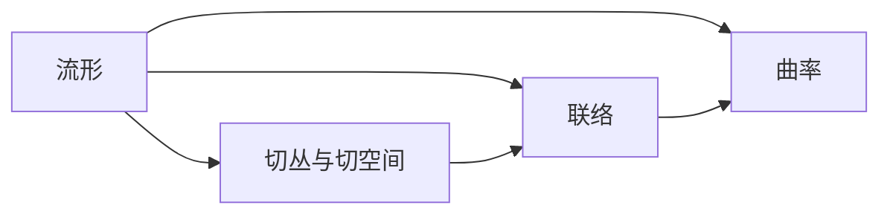

# 微分几何入门与广义相对论：Berty几何相

## 1. 背景介绍
### 1.1 微分几何的发展历史
#### 1.1.1 欧几里得几何与非欧几何
#### 1.1.2 黎曼几何的诞生
#### 1.1.3 现代微分几何的形成
### 1.2 广义相对论的诞生
#### 1.2.1 牛顿力学的局限性
#### 1.2.2 狭义相对论
#### 1.2.3 广义相对论的提出
### 1.3 微分几何在广义相对论中的应用
#### 1.3.1 时空几何
#### 1.3.2 引力场方程
#### 1.3.3 黑洞与宇宙学

## 2. 核心概念与联系
### 2.1 流形
#### 2.1.1 拓扑流形
#### 2.1.2 微分流形
#### 2.1.3 黎曼流形
### 2.2 切丛与切空间
#### 2.2.1 切向量
#### 2.2.2 切丛
#### 2.2.3 切映射
### 2.3 联络
#### 2.3.1 仿射联络
#### 2.3.2 黎曼联络
#### 2.3.3 测地线
### 2.4 曲率
#### 2.4.1 黎曼曲率张量
#### 2.4.2 里奇曲率
#### 2.4.3 标量曲率

## 3. 核心算法原理具体操作步骤
### 3.1 求解测地线方程
#### 3.1.1 克氏符方程
#### 3.1.2 欧拉-拉格朗日方程
#### 3.1.3 测地线射线追踪
### 3.2 曲率计算
#### 3.2.1 黎曼曲率张量计算
#### 3.2.2 里奇张量计算
#### 3.2.3 标量曲率计算
### 3.3 爱因斯坦场方程求解
#### 3.3.1 真空场方程
#### 3.3.2 带物质场方程
#### 3.3.3 宇宙学方程

## 4. 数学模型和公式详细讲解举例说明
### 4.1 黎曼度量
#### 4.1.1 第一基本形式
#### 4.1.2 第二基本形式  
### 4.2 克氏符
#### 4.2.1 克氏符定义
#### 4.2.2 克氏符性质
### 4.3 黎曼曲率张量
#### 4.3.1 黎曼曲率张量定义
$$ R^i_{jkl} = \partial_k\Gamma^i_{jl} - \partial_l\Gamma^i_{jk} + \Gamma^i_{mk}\Gamma^m_{jl} - \Gamma^i_{ml}\Gamma^m_{jk} $$
#### 4.3.2 对称性与反对称性
### 4.4 爱因斯坦场方程  
$$ R_{\mu\nu} - \frac{1}{2}Rg_{\mu\nu} = \frac{8\pi G}{c^4}T_{\mu\nu} $$

## 5. 项目实践：代码实例和详细解释说明
### 5.1 流形数值模拟
#### 5.1.1 球面
#### 5.1.2 双曲面
#### 5.1.3 环面
### 5.2 测地线求解
#### 5.2.1 欧拉法
#### 5.2.2 龙格-库塔法
#### 5.2.3 测地线射线追踪
### 5.3 曲率计算
#### 5.3.1 数值微分
#### 5.3.2 符号计算
### 5.4 广义相对论数值模拟
#### 5.4.1 史瓦西时空
#### 5.4.2 克尔黑洞
#### 5.4.3 弯曲时空中的粒子运动

## 6. 实际应用场景
### 6.1 卫星导航
#### 6.1.1 广义相对论效应修正
#### 6.1.2 地球重力场建模
### 6.2 引力波探测
#### 6.2.1 引力波基本概念
#### 6.2.2 引力波探测原理
#### 6.2.3 引力波天文学
### 6.3 宇宙学研究
#### 6.3.1 宇宙学参数测量
#### 6.3.2 宇宙大尺度结构
#### 6.3.3 早期宇宙与暴涨理论

## 7. 工具和资源推荐
### 7.1 数学软件
#### 7.1.1 Mathematica
#### 7.1.2 MATLAB
#### 7.1.3 Maple
### 7.2 几何建模软件
#### 7.2.1 GeoGebra
#### 7.2.2 Rhinoceros
#### 7.2.3 Blender
### 7.3 开源库与框架
#### 7.3.1 GeometryGym
#### 7.3.2 Geomstats
#### 7.3.3 TensorFlow

## 8. 总结：未来发展趋势与挑战
### 8.1 微分几何的前沿研究
#### 8.1.1 非交换几何
#### 8.1.2 分数阶微分几何
#### 8.1.3 随机微分几何
### 8.2 广义相对论的未解之谜
#### 8.2.1 奇点问题
#### 8.2.2 量子引力
#### 8.2.3 宇宙学常数问题
### 8.3 交叉学科的融合与创新
#### 8.3.1 计算微分几何
#### 8.3.2 机器学习与微分几何
#### 8.3.3 几何深度学习

## 9. 附录：常见问题与解答
### 9.1 为什么要学习微分几何？
### 9.2 微分几何与广义相对论有何联系？
### 9.3 学习微分几何需要哪些数学基础？
### 9.4 微分几何在计算机科学中有哪些应用？
### 9.5 广义相对论与量子力学是否矛盾？

作者：禅与计算机程序设计艺术 / Zen and the Art of Computer Programming