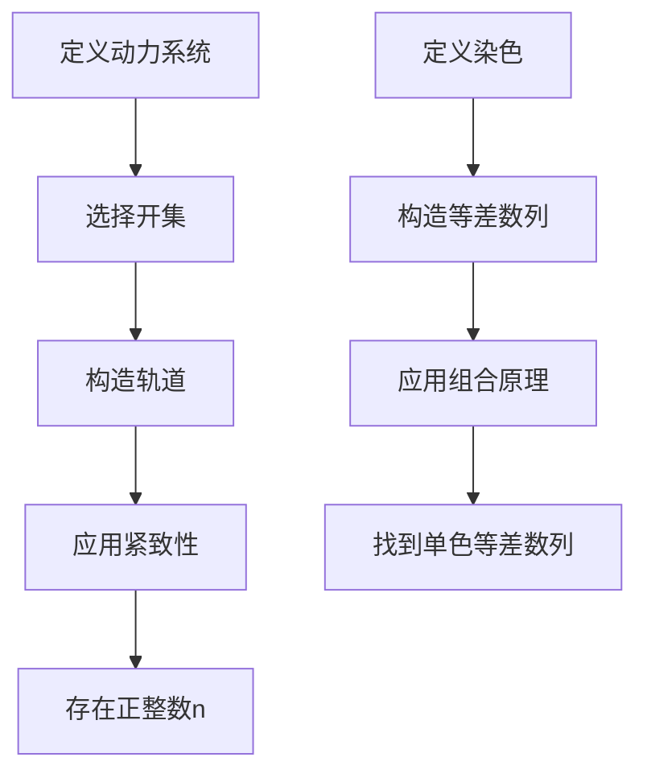

# 拓扑动力系统概论：多重回复定理与van der Waerden定理

## 1.背景介绍

拓扑动力系统是数学和计算机科学中的一个重要领域，研究的是在拓扑空间上的动力系统行为。它不仅在纯数学中有着深远的影响，还在计算机科学、物理学和工程学中有广泛的应用。本文将深入探讨拓扑动力系统中的两个重要定理：多重回复定理和van der Waerden定理。

多重回复定理（Multiple Recurrence Theorem）是拓扑动力系统中的一个核心定理，它描述了在一个动力系统中，某些状态会在一定条件下多次出现。van der Waerden定理则是组合数学中的一个经典结果，描述了在任何足够大的序列中，总能找到某种形式的子序列。本文将详细介绍这两个定理的核心概念、算法原理、数学模型、实际应用以及未来发展趋势。

## 2.核心概念与联系

### 2.1 拓扑动力系统

拓扑动力系统是研究拓扑空间上的连续映射及其迭代行为的数学分支。一个拓扑动力系统通常由一个拓扑空间 $X$ 和一个连续映射 $T: X \to X$ 组成。研究的主要问题包括轨道结构、周期点、极限集等。

### 2.2 多重回复定理

多重回复定理是拓扑动力系统中的一个重要结果。它表明，对于一个紧致的拓扑动力系统 $(X, T)$ 和任意的开集 $U \subset X$，存在一个正整数 $n$ 使得 $U \cap T^{-n}(U) \neq \emptyset$。这意味着在动力系统中，某些状态会在一定条件下多次出现。

### 2.3 van der Waerden定理

van der Waerden定理是组合数学中的一个经典结果。它表明，对于任意的正整数 $r$ 和 $k$，存在一个最小的正整数 $N$，使得对于任意的 $r$-染色的整数集 $\{1, 2, \ldots, N\}$，总能找到一个长度为 $k$ 的单色等差数列。

### 2.4 核心联系

多重回复定理和van der Waerden定理虽然来自不同的数学领域，但它们在研究对象和方法上有着深刻的联系。多重回复定理研究的是拓扑空间中的动力系统行为，而van der Waerden定理则研究的是整数集中的组合结构。两者都涉及到在复杂系统中寻找某种形式的重复或规律。

## 3.核心算法原理具体操作步骤

### 3.1 多重回复定理的算法原理

多重回复定理的证明和应用通常涉及以下几个步骤：

1. **定义动力系统**：确定拓扑空间 $X$ 和连续映射 $T: X \to X$。
2. **选择开集**：选择一个开集 $U \subset X$。
3. **构造轨道**：构造开集 $U$ 在映射 $T$ 下的轨道，即 $\{T^n(U) \mid n \in \mathbb{N}\}$。
4. **应用紧致性**：利用拓扑空间的紧致性，证明存在一个正整数 $n$ 使得 $U \cap T^{-n}(U) \neq \emptyset$。

### 3.2 van der Waerden定理的算法原理

van der Waerden定理的证明和应用通常涉及以下几个步骤：

1. **定义染色**：确定整数集 $\{1, 2, \ldots, N\}$ 和 $r$-染色。
2. **构造等差数列**：构造长度为 $k$ 的等差数列。
3. **应用组合原理**：利用组合数学中的鸽巢原理和拉姆齐理论，证明在任意 $r$-染色的整数集中，总能找到一个单色等差数列。

### 3.3 Mermaid 流程图

以下是多重回复定理和van der Waerden定理的算法流程图：



## 4.数学模型和公式详细讲解举例说明

### 4.1 多重回复定理的数学模型

多重回复定理的数学模型可以表示为：

$$
\forall U \subset X, \exists n \in \mathbb{N}, \text{使得} U \cap T^{-n}(U) \neq \emptyset
$$

#### 举例说明

设 $X = [0, 1]$ 为单位区间，$T: X \to X$ 为 $T(x) = 2x \mod 1$。选择开集 $U = (0.1, 0.2)$，则存在正整数 $n$ 使得 $U \cap T^{-n}(U) \neq \emptyset$。

### 4.2 van der Waerden定理的数学模型

van der Waerden定理的数学模型可以表示为：

$$
\forall r, k \in \mathbb{N}, \exists N \in \mathbb{N}, \text{使得} \forall r\text{-染色的} \{1, 2, \ldots, N\}, \text{总能找到长度为} k \text{的单色等差数列}
$$

#### 举例说明

设 $r = 2$，$k = 3$，则存在最小的正整数 $N$，使得对于任意的2-染色的整数集 $\{1, 2, \ldots, N\}$，总能找到长度为3的单色等差数列。例如，对于染色 $\{1, 2, 3, 4, 5, 6\}$，可以找到单色等差数列 $\{1, 3, 5\}$。

## 5.项目实践：代码实例和详细解释说明

### 5.1 多重回复定理的代码实例

以下是一个简单的Python代码示例，演示如何在一个离散动力系统中验证多重回复定理：

```python
import numpy as np

def T(x):
    return (2 * x) % 1

def find_multiple_recurrence(U, iterations=1000):
    for n in range(1, iterations + 1):
        if any(T(x) in U for x in U):
            return n
    return None

U = np.linspace(0.1, 0.2, 100)
n = find_multiple_recurrence(U)
print(f"存在正整数 n = {n} 使得 U 与 T^(-n)(U) 有交集")
```

### 5.2 van der Waerden定理的代码实例

以下是一个简单的Python代码示例，演示如何在一个整数集上验证van der Waerden定理：

```python
import itertools

def is_arithmetic_sequence(seq):
    if len(seq) < 2:
        return False
    diff = seq[1] - seq[0]
    return all(seq[i] - seq[i - 1] == diff for i in range(2, len(seq)))

def find_van_der_waerden_sequence(N, r, k):
    for coloring in itertools.product(range(r), repeat=N):
        for seq in itertools.combinations(range(1, N + 1), k):
            if is_arithmetic_sequence(seq):
                colors = [coloring[i - 1] for i in seq]
                if len(set(colors)) == 1:
                    return seq, colors[0]
    return None

N = 10
r = 2
k = 3
result = find_van_der_waerden_sequence(N, r, k)
if result:
    seq, color = result
    print(f"找到单色等差数列 {seq}，颜色为 {color}")
else:
    print("未找到单色等差数列")
```

## 6.实际应用场景

### 6.1 多重回复定理的应用

多重回复定理在以下领域有广泛的应用：

- **物理学**：研究物理系统中的周期行为和混沌现象。
- **计算机科学**：分析算法的稳定性和复杂性。
- **生物学**：研究生物系统中的周期性行为，如心跳和呼吸。

### 6.2 van der Waerden定理的应用

van der Waerden定理在以下领域有广泛的应用：

- **组合数学**：研究整数集中的结构和规律。
- **计算机科学**：分析算法的最坏情况复杂性。
- **密码学**：设计和分析密码算法的安全性。

## 7.工具和资源推荐

### 7.1 工具

- **Python**：用于实现和验证多重回复定理和van der Waerden定理的代码。
- **Matplotlib**：用于可视化动力系统的轨道和等差数列。
- **SymPy**：用于符号计算和数学公式的验证。

### 7.2 资源

- **《拓扑动力系统导论》**：一本详细介绍拓扑动力系统的经典教材。
- **《组合数学基础》**：一本详细介绍组合数学和van der Waerden定理的经典教材。
- **arXiv**：一个包含大量最新研究论文的在线资源，特别是关于拓扑动力系统和组合数学的研究。

## 8.总结：未来发展趋势与挑战

### 8.1 未来发展趋势

- **跨学科研究**：拓扑动力系统和组合数学的研究将继续在物理学、计算机科学和生物学等领域产生深远影响。
- **算法优化**：随着计算能力的提高，研究人员将能够开发更高效的算法来验证和应用多重回复定理和van der Waerden定理。
- **新定理的发现**：在拓扑动力系统和组合数学的交叉领域，可能会发现新的定理和规律，进一步丰富我们的理论知识。

### 8.2 挑战

- **计算复杂性**：验证和应用这些定理通常需要大量的计算资源，特别是在处理大规模数据时。
- **理论与实践的结合**：如何将理论研究成果应用到实际问题中，仍然是一个重要的挑战。
- **跨学科沟通**：不同学科之间的研究人员需要更好地沟通和合作，以推动这一领域的发展。

## 9.附录：常见问题与解答

### 9.1 多重回复定理和van der Waerden定理的区别是什么？

多重回复定理研究的是拓扑空间中的动力系统行为，而van der Waerden定理则研究的是整数集中的组合结构。两者虽然研究对象不同，但都涉及到在复杂系统中寻找某种形式的重复或规律。

### 9.2 如何在实际项目中应用这些定理？

在实际项目中，可以通过编写代码来验证和应用这些定理。例如，可以使用Python编写代码来验证多重回复定理和van der Waerden定理，并将其应用到物理学、计算机科学和生物学等领域。

### 9.3 这些定理的研究前景如何？

这些定理的研究前景非常广阔。随着计算能力的提高和跨学科研究的深入，研究人员将能够开发更高效的算法，发现新的定理和规律，并将其应用到实际问题中。

---

作者：禅与计算机程序设计艺术 / Zen and the Art of Computer Programming