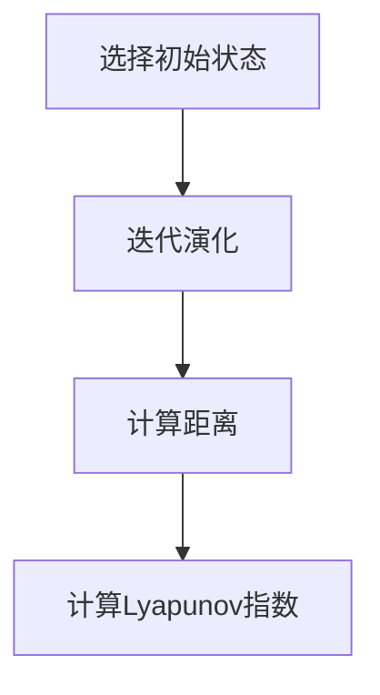

# 拓扑动力系统概论：混沌的定义

## 1.背景介绍

拓扑动力系统是数学和计算机科学中的一个重要分支，研究的是系统在时间演化过程中其状态的变化。混沌理论作为拓扑动力系统中的一个核心概念，描述了系统在初始条件微小变化下所导致的巨大差异。混沌现象广泛存在于自然界和工程系统中，如天气预报、金融市场、生态系统等。

## 2.核心概念与联系

### 2.1 拓扑动力系统

拓扑动力系统是由一个拓扑空间和一个连续映射组成的二元组。设 $(X, T)$ 是一个拓扑动力系统，其中 $X$ 是一个拓扑空间，$T: X \to X$ 是一个连续映射。系统的状态随时间演化可以表示为 $T^n(x)$，其中 $n$ 是时间步数，$x$ 是初始状态。

### 2.2 混沌的定义

混沌系统具有以下三个主要特征：
1. **敏感依赖初始条件**：初始条件的微小变化会导致系统状态的巨大差异。
2. **拓扑混合性**：系统状态在时间演化过程中会遍历整个状态空间。
3. **周期点的稠密性**：系统中存在无穷多个周期点，并且这些周期点在状态空间中是稠密的。

### 2.3 核心联系

混沌现象在拓扑动力系统中是普遍存在的。通过研究混沌现象，可以更好地理解系统的复杂行为和不可预测性。

## 3.核心算法原理具体操作步骤

### 3.1 Lyapunov指数

Lyapunov指数是衡量系统对初始条件敏感性的一个重要指标。设 $x_0$ 是系统的初始状态，$T$ 是系统的演化映射，$d(x, y)$ 表示状态 $x$ 和 $y$ 之间的距离。Lyapunov指数 $\lambda$ 定义为：

$$
\lambda = \lim_{n \to \infty} \frac{1}{n} \log \frac{d(T^n(x_0), T^n(y_0))}{d(x_0, y_0)}
$$

### 3.2 计算步骤

1. **选择初始状态**：选择系统的初始状态 $x_0$ 和 $y_0$，其中 $d(x_0, y_0)$ 很小。
2. **迭代演化**：计算 $T^n(x_0)$ 和 $T^n(y_0)$，其中 $n$ 是时间步数。
3. **计算距离**：计算 $d(T^n(x_0), T^n(y_0))$。
4. **计算Lyapunov指数**：根据公式计算Lyapunov指数 $\lambda$。

### 3.3 Mermaid 流程图



## 4.数学模型和公式详细讲解举例说明

### 4.1 Logistic 映射

Logistic 映射是研究混沌现象的一个经典模型。其定义为：

$$
x_{n+1} = r x_n (1 - x_n)
$$

其中，$r$ 是系统参数，$x_n$ 是第 $n$ 步的状态。

### 4.2 混沌行为

当 $r$ 在某些特定范围内时，Logistic 映射会表现出混沌行为。例如，当 $r = 3.9$ 时，系统表现出明显的混沌现象。

### 4.3 数学推导

设 $x_0$ 是初始状态，$x_1 = r x_0 (1 - x_0)$，$x_2 = r x_1 (1 - x_1)$，依此类推。通过迭代计算，可以观察到系统状态的复杂变化。

## 5.项目实践：代码实例和详细解释说明

### 5.1 Python 实现

以下是一个使用 Python 实现 Logistic 映射的示例代码：

```python
import matplotlib.pyplot as plt

def logistic_map(r, x, n):
    result = []
    for _ in range(n):
        x = r * x * (1 - x)
        result.append(x)
    return result

# 参数设置
r = 3.9
x0 = 0.5
n = 100

# 计算Logistic映射
result = logistic_map(r, x0, n)

# 绘制结果
plt.plot(result)
plt.xlabel('Time step')
plt.ylabel('State')
plt.title('Logistic Map')
plt.show()
```

### 5.2 代码解释

1. **logistic_map 函数**：该函数实现了 Logistic 映射的迭代计算。
2. **参数设置**：设置系统参数 $r$、初始状态 $x_0$ 和迭代步数 $n$。
3. **计算结果**：调用 logistic_map 函数计算系统状态的演化。
4. **绘制结果**：使用 matplotlib 绘制系统状态随时间变化的图像。

## 6.实际应用场景

### 6.1 天气预报

混沌理论在天气预报中有重要应用。由于天气系统对初始条件非常敏感，混沌理论可以帮助理解和预测天气变化。

### 6.2 金融市场

金融市场中的价格波动也表现出混沌现象。通过研究混沌理论，可以更好地理解市场行为和风险管理。

### 6.3 生态系统

生态系统中的种群动态也具有混沌特性。混沌理论可以帮助研究生态系统的稳定性和可持续性。

## 7.工具和资源推荐

### 7.1 软件工具

1. **Python**：Python 是一个强大的编程语言，适用于实现和研究混沌系统。
2. **Matplotlib**：Matplotlib 是一个用于绘制图形的 Python 库，适用于可视化混沌系统的演化过程。

### 7.2 资源推荐

1. **《混沌：开创新科学》**：这本书是混沌理论的经典著作，适合初学者阅读。
2. **Coursera 课程**：Coursera 上有许多关于混沌理论和拓扑动力系统的在线课程，适合深入学习。

## 8.总结：未来发展趋势与挑战

混沌理论在科学和工程中的应用前景广阔。随着计算能力的提升和数据分析技术的发展，混沌理论将会在更多领域中发挥重要作用。然而，混沌系统的不可预测性和复杂性也带来了巨大的挑战，需要进一步的研究和探索。

## 9.附录：常见问题与解答

### 9.1 什么是混沌系统？

混沌系统是指对初始条件极其敏感、具有复杂动态行为的系统。

### 9.2 如何判断一个系统是否是混沌系统？

可以通过计算 Lyapunov 指数、观察系统的拓扑混合性和周期点的稠密性来判断一个系统是否是混沌系统。

### 9.3 混沌理论有哪些实际应用？

混沌理论在天气预报、金融市场、生态系统等领域有广泛应用。

### 9.4 如何学习混沌理论？

可以通过阅读相关书籍、参加在线课程和进行实际项目实践来学习混沌理论。

---

作者：禅与计算机程序设计艺术 / Zen and the Art of Computer Programming