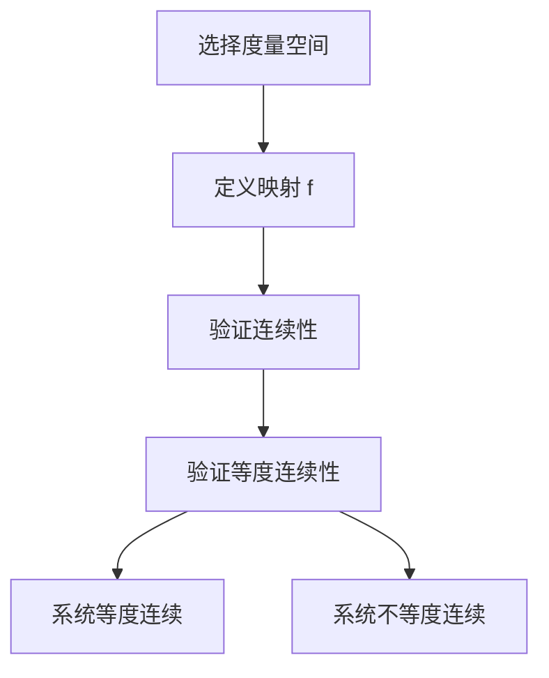

# 拓扑动力系统概论：等度连续性

## 1.背景介绍

拓扑动力系统是数学和计算机科学中的一个重要研究领域，涉及到系统在时间演化中的行为。等度连续性是拓扑动力系统中的一个关键概念，它描述了系统在不同时间点上的一致性行为。理解等度连续性对于研究系统的长期行为、稳定性和混沌特性具有重要意义。

在这篇文章中，我们将深入探讨拓扑动力系统中的等度连续性，从核心概念到数学模型，再到实际应用和代码实例，力求为读者提供一个全面而深入的理解。

## 2.核心概念与联系

### 2.1 拓扑动力系统

拓扑动力系统是由一个拓扑空间和一个连续映射组成的二元组 $(X, f)$，其中 $X$ 是一个拓扑空间，$f: X \to X$ 是一个连续映射。这个系统描述了点在空间中的演化过程。

### 2.2 连续性与等度连续性

- **连续性**：一个映射 $f: X \to X$ 是连续的，如果对于任意的 $\epsilon > 0$，存在 $\delta > 0$ 使得对于所有的 $x, y \in X$，如果 $d(x, y) < \delta$，则 $d(f(x), f(y)) < \epsilon$。
- **等度连续性**：一个映射 $f: X \to X$ 是等度连续的，如果对于任意的 $\epsilon > 0$，存在 $\delta > 0$ 使得对于所有的 $x, y \in X$ 和所有的 $n \in \mathbb{N}$，如果 $d(x, y) < \delta$，则 $d(f^n(x), f^n(y)) < \epsilon$。

等度连续性比普通的连续性更强，它要求在所有时间点上都保持一致的连续性。

### 2.3 等度连续性与系统稳定性

等度连续性在拓扑动力系统中具有重要的意义，它通常与系统的稳定性和可预测性相关。一个等度连续的系统通常表现出较少的混沌行为，更容易进行长期预测。

## 3.核心算法原理具体操作步骤

### 3.1 等度连续性的判定

判定一个系统是否等度连续通常需要以下步骤：

1. **选择合适的度量空间**：确定系统所在的拓扑空间 $X$ 和度量 $d$。
2. **定义映射 $f$**：明确系统的演化规则，即映射 $f: X \to X$。
3. **验证连续性**：首先验证 $f$ 的连续性。
4. **验证等度连续性**：对于任意的 $\epsilon > 0$，找到一个 $\delta > 0$，使得对于所有的 $x, y \in X$ 和所有的 $n \in \mathbb{N}$，如果 $d(x, y) < \delta$，则 $d(f^n(x), f^n(y)) < \epsilon$。

### 3.2 算法流程图

以下是等度连续性判定的算法流程图：



## 4.数学模型和公式详细讲解举例说明

### 4.1 数学模型

考虑一个简单的拓扑动力系统 $(X, f)$，其中 $X = [0, 1]$ 是单位区间，$f: X \to X$ 是一个连续映射。我们希望验证 $f$ 是否等度连续。

### 4.2 公式推导

假设 $f(x) = x^2$，我们需要验证对于任意的 $\epsilon > 0$，是否存在 $\delta > 0$ 使得对于所有的 $x, y \in [0, 1]$ 和所有的 $n \in \mathbb{N}$，如果 $|x - y| < \delta$，则 $|f^n(x) - f^n(y)| < \epsilon$。

1. **连续性验证**：首先验证 $f$ 的连续性。对于任意的 $\epsilon > 0$，存在 $\delta > 0$ 使得如果 $|x - y| < \delta$，则 $|x^2 - y^2| < \epsilon$。由于 $|x^2 - y^2| = |x - y||x + y|$，我们可以选择 $\delta = \frac{\epsilon}{2}$。

2. **等度连续性验证**：对于等度连续性，我们需要验证对于所有的 $n \in \mathbb{N}$，是否存在一个统一的 $\delta$ 使得 $|f^n(x) - f^n(y)| < \epsilon$。由于 $f(x) = x^2$ 的迭代会迅速收敛到 0，因此我们可以选择一个足够小的 $\delta$ 使得 $|x - y| < \delta$ 时，$|f^n(x) - f^n(y)|$ 也会迅速变小。

### 4.3 举例说明

考虑 $f(x) = x^2$，对于 $\epsilon = 0.1$，我们选择 $\delta = 0.05$。对于任意的 $x, y \in [0, 1]$，如果 $|x - y| < 0.05$，则 $|f(x) - f(y)| = |x^2 - y^2| = |x - y||x + y| < 0.1$。由于 $x, y \in [0, 1]$，$|x + y| \leq 2$，因此 $|x - y| < 0.05$ 是足够的。

## 5.项目实践：代码实例和详细解释说明

### 5.1 Python代码实例

以下是一个简单的Python代码示例，用于验证一个系统的等度连续性：

```python
import numpy as np

def f(x):
    return x**2

def is_equicontinuous(f, epsilon, delta, n_iter=100):
    for x in np.linspace(0, 1, 100):
        for y in np.linspace(0, 1, 100):
            if abs(x - y) < delta:
                for n in range(n_iter):
                    x_n = x
                    y_n = y
                    for _ in range(n):
                        x_n = f(x_n)
                        y_n = f(y_n)
                    if abs(x_n - y_n) >= epsilon:
                        return False
    return True

epsilon = 0.1
delta = 0.05
print(is_equicontinuous(f, epsilon, delta))
```

### 5.2 代码解释

- **函数定义**：定义了一个函数 $f(x) = x^2$。
- **等度连续性验证函数**：`is_equicontinuous` 函数用于验证给定的映射 $f$ 是否等度连续。它通过迭代计算 $f^n(x)$ 和 $f^n(y)$，并检查它们之间的距离是否小于 $\epsilon$。
- **参数设置**：设置 $\epsilon = 0.1$ 和 $\delta = 0.05$，并调用 `is_equicontinuous` 函数进行验证。

## 6.实际应用场景

### 6.1 混沌系统分析

等度连续性在混沌系统分析中具有重要应用。混沌系统通常表现出高度敏感的初始条件，而等度连续性可以帮助我们识别和分析这些系统的稳定性。

### 6.2 控制系统设计

在控制系统设计中，等度连续性可以用于确保系统在不同操作条件下的稳定性。通过验证系统的等度连续性，我们可以设计出更为可靠和稳定的控制系统。

### 6.3 数据流处理

在大规模数据流处理系统中，等度连续性可以帮助我们确保数据处理过程的一致性和稳定性。通过验证数据处理算法的等度连续性，我们可以提高系统的可靠性和性能。

## 7.工具和资源推荐

### 7.1 数学软件

- **Mathematica**：强大的数学计算软件，适用于复杂的数学模型和公式推导。
- **MATLAB**：广泛应用于工程和科学计算领域，适用于数值计算和仿真。

### 7.2 编程语言

- **Python**：具有丰富的数学和科学计算库，如 NumPy 和 SciPy，适用于快速原型和验证。
- **Julia**：高性能的编程语言，适用于数值计算和科学研究。

### 7.3 在线资源

- **arXiv**：提供大量的数学和计算机科学论文，适用于深入研究和学习。
- **Stack Overflow**：编程问答社区，适用于解决实际编程问题。

## 8.总结：未来发展趋势与挑战

等度连续性在拓扑动力系统中的研究具有重要意义，它不仅帮助我们理解系统的长期行为和稳定性，还在混沌系统分析、控制系统设计和数据流处理等领域具有广泛应用。未来，随着计算能力的提升和算法的改进，我们可以更深入地研究复杂系统的等度连续性，并应用于更多实际场景。

然而，等度连续性的验证和应用也面临一些挑战。首先，复杂系统的等度连续性验证通常需要大量的计算资源和时间。其次，等度连续性的定义和判定在不同的应用场景中可能需要进行调整和优化。因此，未来的研究需要在理论和实践之间找到平衡，开发出更高效和可靠的验证方法。

## 9.附录：常见问题与解答

### 9.1 什么是等度连续性？

等度连续性是拓扑动力系统中的一个概念，描述了系统在不同时间点上的一致性行为。一个映射 $f: X \to X$ 是等度连续的，如果对于任意的 $\epsilon > 0$，存在 $\delta > 0$ 使得对于所有的 $x, y \in X$ 和所有的 $n \in \mathbb{N}$，如果 $d(x, y) < \delta$，则 $d(f^n(x), f^n(y)) < \epsilon$。

### 9.2 如何验证一个系统的等度连续性？

验证一个系统的等度连续性通常需要以下步骤：
1. 选择合适的度量空间。
2. 定义映射 $f$。
3. 验证 $f$ 的连续性。
4. 验证等度连续性。

### 9.3 等度连续性在实际应用中有哪些作用？

等度连续性在混沌系统分析、控制系统设计和数据流处理等领域具有广泛应用。它可以帮助我们识别和分析系统的稳定性，设计出更为可靠和稳定的控制系统，并确保数据处理过程的一致性和稳定性。

### 9.4 未来等度连续性研究的挑战是什么？

未来等度连续性研究的挑战包括复杂系统的等度连续性验证需要大量的计算资源和时间，以及在不同应用场景中需要调整和优化等度连续性的定义和判定方法。

---

作者：禅与计算机程序设计艺术 / Zen and the Art of Computer Programming