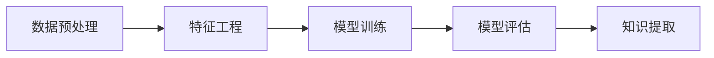

# 数据挖掘 原理与代码实例讲解

## 1. 背景介绍

在信息时代，数据已成为新的石油，数据挖掘则是提炼这种石油的重要技术。数据挖掘是从大量数据中通过算法和统计模型提取知识的过程，它涉及机器学习、统计学和数据库系统等多个领域。随着大数据技术的发展，数据挖掘在商业智能、金融分析、医疗诊断等领域发挥着越来越重要的作用。

## 2. 核心概念与联系

数据挖掘的核心概念包括数据预处理、特征工程、模型训练、模型评估和知识提取。这些概念之间的联系构成了数据挖掘的整体流程。



## 3. 核心算法原理具体操作步骤

数据挖掘的核心算法包括分类、聚类、关联规则学习和异常检测等。以决策树为例，其操作步骤包括特征选择、树的生成和树的剪枝。

## 4. 数学模型和公式详细讲解举例说明

决策树算法中，信息增益是一个重要的概念，其数学公式为：

$$
\text{信息增益}(Gain) = \text{熵}(S) - \sum_{v \in Values(A)} \frac{|S_v|}{|S|} \text{熵}(S_v)
$$

其中，熵是表示数据不确定性的度量，计算公式为：

$$
\text{熵}(S) = -\sum_{i=1}^{n} p_i \log_2 p_i
$$

## 5. 项目实践：代码实例和详细解释说明

以Python语言为例，使用决策树算法进行分类的代码实例：

```python
from sklearn.datasets import load_iris
from sklearn.tree import DecisionTreeClassifier

# 加载数据集
iris = load_iris()
X, y = iris.data, iris.target

# 创建决策树分类器
clf = DecisionTreeClassifier()

# 训练模型
clf.fit(X, y)

# 预测新样本
print(clf.predict([[5.1, 3.5, 1.4, 0.2]]))
```

## 6. 实际应用场景

数据挖掘在零售行业中的市场篮分析、在金融领域中的信用评分、在医疗领域中的疾病预测等场景中有广泛应用。

## 7. 工具和资源推荐

推荐使用Python语言进行数据挖掘，常用的库包括NumPy、Pandas、Scikit-learn等。此外，还可以使用R语言，以及WEKA、RapidMiner等数据挖掘工具。

## 8. 总结：未来发展趋势与挑战

数据挖掘的未来发展趋势包括深度学习的集成、大数据技术的应用和隐私保护的重视。同时，数据质量、算法的可解释性和伦理问题也是未来发展的挑战。

## 9. 附录：常见问题与解答

Q1: 数据挖掘和机器学习的区别是什么？
A1: 机器学习是数据挖掘的一个子集，侧重于算法和模型的开发，而数据挖掘更侧重于从数据中提取有用信息的整个过程。

Q2: 如何评估数据挖掘模型的性能？
A2: 可以通过准确率、召回率、F1分数等指标来评估分类模型的性能，通过轮廓系数、Davies-Bouldin指数等指标来评估聚类模型的性能。

作者：禅与计算机程序设计艺术 / Zen and the Art of Computer Programming