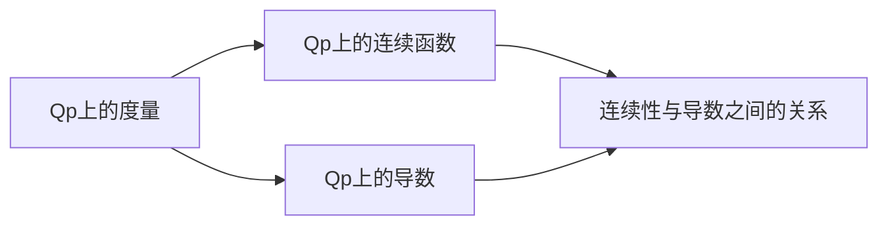

# 模型论基础：Qp.上的连续性和导数

## 1. 背景介绍
### 1.1 模型论的发展历史
#### 1.1.1 早期发展
#### 1.1.2 现代模型论的兴起
#### 1.1.3 模型论在其他数学分支中的应用

### 1.2 Qp的定义与性质
#### 1.2.1 Qp的构造
#### 1.2.2 Qp的基本性质
#### 1.2.3 Qp在数学中的重要地位

### 1.3 连续性与导数的重要性
#### 1.3.1 连续性在分析学中的作用
#### 1.3.2 导数在微积分中的应用
#### 1.3.3 连续性与导数在Qp上的意义

## 2. 核心概念与联系
### 2.1 Qp上的度量
#### 2.1.1 p-adic度量的定义
#### 2.1.2 p-adic度量的性质
#### 2.1.3 p-adic度量与实数度量的区别

### 2.2 Qp上的连续函数
#### 2.2.1 连续函数的定义
#### 2.2.2 连续函数的等价刻画
#### 2.2.3 连续函数的性质

### 2.3 Qp上的导数
#### 2.3.1 导数的定义
#### 2.3.2 导数的性质
#### 2.3.3 高阶导数与Taylor展开

### 2.4 连续性与导数之间的关系
#### 2.4.1 连续函数的可导性
#### 2.4.2 可导函数的连续性
#### 2.4.3 连续不可导函数的例子

## 3. 核心算法原理具体操作步骤
### 3.1 判断Qp上函数连续性的算法
#### 3.1.1 算法描述
#### 3.1.2 算法的正确性证明
#### 3.1.3 算法复杂度分析

### 3.2 计算Qp上函数导数的算法
#### 3.2.1 算法描述 
#### 3.2.2 算法的正确性证明
#### 3.2.3 算法复杂度分析

### 3.3 计算Qp上函数Taylor展开的算法
#### 3.3.1 算法描述
#### 3.3.2 算法的正确性证明 
#### 3.3.3 算法复杂度分析

## 4. 数学模型和公式详细讲解举例说明
### 4.1 连续函数的数学模型
#### 4.1.1 $\varepsilon-\delta$语言下的连续性定义
#### 4.1.2 度量空间中的连续性定义
#### 4.1.3 拓扑空间中的连续性定义

### 4.2 导数的数学模型
#### 4.2.1 差商的概念与导数定义
#### 4.2.2 方向导数与梯度
#### 4.2.3 高阶导数的递归定义

### 4.3 Taylor展开的数学模型
#### 4.3.1 Taylor多项式的定义
#### 4.3.2 Taylor展开式的收敛性
#### 4.3.3 解析函数与Taylor展开

### 4.4 举例说明
#### 4.4.1 Qp上连续函数的例子
#### 4.4.2 Qp上可导函数的例子
#### 4.4.3 Qp上Taylor展开的例子

## 5. 项目实践：代码实例和详细解释说明
### 5.1 判断Qp上函数连续性的代码实现
#### 5.1.1 Python实现
#### 5.1.2 C++实现
#### 5.1.3 代码解释说明

### 5.2 计算Qp上函数导数的代码实现  
#### 5.2.1 Python实现
#### 5.2.2 C++实现
#### 5.2.3 代码解释说明

### 5.3 计算Qp上函数Taylor展开的代码实现
#### 5.3.1 Python实现
#### 5.3.2 C++实现 
#### 5.3.3 代码解释说明

## 6. 实际应用场景
### 6.1 p-adic分析在数论中的应用
#### 6.1.1 Diophantine方程的p-adic解法
#### 6.1.2 p-adic L-函数与Birch-Swinnerton-Dyer猜想
#### 6.1.3 p-adic Hodge理论

### 6.2 p-adic分析在计算机科学中的应用
#### 6.2.1 p-adic数在密码学中的应用
#### 6.2.2 p-adic数在计算机代数中的应用
#### 6.2.3 p-adic数在计算机图形学中的应用

### 6.3 p-adic分析在物理学中的应用
#### 6.3.1 p-adic量子力学
#### 6.3.2 p-adic量子场论
#### 6.3.3 p-adic弦理论

## 7. 工具和资源推荐
### 7.1 学习p-adic分析的书籍推荐
#### 7.1.1 《p-adic Numbers, p-adic Analysis, and Zeta-Functions》
#### 7.1.2 《A Course in p-adic Analysis》
#### 7.1.3 《p-adic Numbers: An Introduction》

### 7.2 学习p-adic分析的在线课程推荐
#### 7.2.1 MIT的p-adic分析课程
#### 7.2.2 Coursera上的p-adic分析课程
#### 7.2.3 edX上的p-adic分析课程

### 7.3 p-adic分析的软件工具推荐
#### 7.3.1 SageMath中的p-adic功能
#### 7.3.2 PARI/GP中的p-adic功能
#### 7.3.3 Magma中的p-adic功能

## 8. 总结：未来发展趋势与挑战
### 8.1 p-adic分析的研究前沿
#### 8.1.1 p-adic微分方程
#### 8.1.2 p-adic动力系统
#### 8.1.3 p-adic几何

### 8.2 p-adic分析面临的挑战
#### 8.2.1 p-adic分析的计算复杂性
#### 8.2.2 p-adic分析在应用中的局限性
#### 8.2.3 p-adic分析的教学与普及

### 8.3 p-adic分析的未来发展方向
#### 8.3.1 p-adic分析与其他数学分支的交叉融合
#### 8.3.2 p-adic分析在计算机科学中的新应用
#### 8.3.3 p-adic分析在物理学中的深入研究

## 9. 附录：常见问题与解答
### 9.1 什么是p-adic数？
### 9.2 p-adic度量与实数度量有何不同？
### 9.3 p-adic分析在数学中有哪些重要应用？
### 9.4 p-adic分析在计算机科学中有哪些应用？
### 9.5 p-adic分析在物理学中有哪些应用？
### 9.6 学习p-adic分析需要什么先修知识？
### 9.7 有哪些学习p-adic分析的好资源？

作者：禅与计算机程序设计艺术 / Zen and the Art of Computer Programming