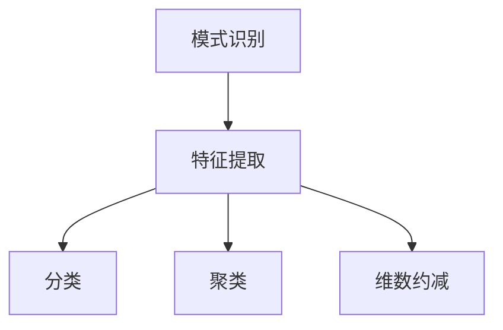

以下是《模式识别 原理与代码实例讲解》的文章正文内容：

# 模式识别 原理与代码实例讲解

## 1.背景介绍

### 1.1 模式识别的概念

模式识别是人工智能领域的一个重要分支,旨在使计算机能够像人类一样识别各种模式。模式可以是图像、声音、文本等任何可以被感知和表示的对象或信号。模式识别广泛应用于计算机视觉、语音识别、自然语言处理、生物信息学等诸多领域。

### 1.2 模式识别的重要性

随着数据的快速增长,模式识别技术变得越来越重要。它可以帮助我们从海量数据中提取有价值的信息,自动化许多任务,提高效率。例如,模式识别可以用于面部识别、手写字符识别、图像分类等应用场景。

### 1.3 模式识别的挑战

尽管模式识别取得了长足的进步,但仍然面临着一些挑战,例如:

- 高维数据处理
- 噪声和变化的鲁棒性
- 计算复杂度
- 标注数据的获取

## 2.核心概念与联系

模式识别包含以下几个核心概念:

### 2.1 特征提取

特征提取是将原始数据转换为适合后续处理的特征向量的过程。良好的特征对于模式识别的性能至关重要。常用的特征提取方法包括:

- 基于统计的方法(PCA、LDA等)
- 基于人工设计的方法(SIFT、HOG等)
- 基于深度学习的方法(卷积神经网络等)

### 2.2 分类

分类是将特征向量映射到预定义的类别上的过程。常用的分类方法包括:

- K近邻(KNN)
- 支持向量机(SVM)
- 决策树
- 朴素贝叶斯
- 神经网络

### 2.3 聚类

聚类是将数据划分为若干个相似的簇的过程,常用于无监督学习场景。常用的聚类算法包括:

- K-Means
-均值漂移
- DBSCAN
- 谱聚类

### 2.4 维数约减

高维数据会导致"维数灾难"问题,因此需要进行维数约减。常用的维数约减方法包括:

- 主成分分析(PCA)
- 线性判别分析(LDA)
- 等向量编码(Isomap)
- t-SNE



## 3.核心算法原理具体操作步骤

### 3.1 K-Means聚类算法

K-Means是一种简单且广泛使用的聚类算法,其基本思想是将n个对象划分为k个簇,使得簇内对象之间的平方误差最小。算法步骤如下:

1. 随机选取k个对象作为初始质心
2. 对于每个对象,计算它与各个质心的距离,将它分配给最近的质心所对应的簇
3. 对于每个簇,重新计算质心
4. 重复步骤2和3,直到质心不再发生变化

$$
J = \sum_{i=1}^{k}\sum_{x \in C_i} \left \| x - \mu_i \right \|^2
$$

其中,$J$是目标函数,$C_i$是第$i$个簇,$\mu_i$是第$i$个簇的质心。

### 3.2 主成分分析(PCA)

PCA是一种常用的无监督线性降维技术,它通过正交变换将原始数据投影到一个低维子空间,使得投影后的数据具有最大方差。算法步骤如下:

1. 对原始数据进行归一化处理
2. 计算数据的协方差矩阵
3. 计算协方差矩阵的特征值和特征向量
4. 选择与最大的k个特征值对应的特征向量作为投影矩阵
5. 将原始数据乘以投影矩阵,得到降维后的数据

### 3.3 支持向量机(SVM)

SVM是一种有监督的机器学习算法,它可以用于分类和回归问题。SVM的基本思想是找到一个超平面,将不同类别的数据分开,且与每个类别的数据距离最远。对于线性可分的情况,算法步骤如下:

1. 构造拉格朗日函数
2. 求解对偶问题,得到最优解$\alpha^*$
3. 计算超平面参数$w^*$和$b^*$
4. 对新数据进行分类:$y = \text{sign}(w^{*T}x + b^*)$

对于非线性情况,可以使用核技巧将数据映射到高维空间,从而使其线性可分。

## 4.数学模型和公式详细讲解举例说明  

### 4.1 K-Means目标函数

$$
J = \sum_{i=1}^{k}\sum_{x \in C_i} \left \| x - \mu_i \right \|^2
$$

其中,$J$是目标函数,$C_i$是第$i$个簇,$\mu_i$是第$i$个簇的质心,$\left \| x - \mu_i \right \|^2$表示对象$x$与质心$\mu_i$的欧几里得距离的平方。目标函数$J$反映了簇内对象与质心的距离和,K-Means算法的目标就是最小化这个目标函数。

例如,假设有以下5个二维数据点:

```
(1, 1), (1, 2), (2, 1), (6, 5), (7, 6)
```

如果我们将它们划分为2个簇,K-Means算法会迭代地更新质心,直到目标函数$J$达到最小值。最终的聚类结果如下:

```
Cluster 1: (1, 1), (1, 2), (2, 1)
Cluster 2: (6, 5), (7, 6)
```

### 4.2 PCA投影矩阵

在PCA算法中,我们需要计算投影矩阵$W$,使得原始数据$X$投影到$W^T$上后,新数据$Y = W^TX$具有最大的方差。

假设$X$是$n \times m$的矩阵,其中$n$是样本数,$m$是特征数。我们需要找到一个$m \times k$的矩阵$W$,使得$Y$的方差最大,即:

$$
\max \limits_{W} \text{var}(Y) = \max \limits_{W} \frac{1}{n} \sum_{i=1}^{n} \left \| y_i - \bar{y} \right \|^2
$$

其中,$y_i$是第$i$个样本的投影向量,$\bar{y}$是所有投影向量的均值向量。

可以证明,最优的投影矩阵$W^*$由$X$的前$k$个主成分组成,即$X$协方差矩阵的前$k$个最大特征值对应的特征向量。

### 4.3 SVM对偶问题

对于线性可分的二分类问题,SVM的目标是找到一个超平面$w^Tx + b = 0$,使得两类数据在该超平面两侧,且距离超平面最近的数据点距离超平面最远。这个目标可以通过求解以下优化问题实现:

$$
\begin{aligned}
\min \limits_{w, b} & \quad \frac{1}{2} \left \| w \right \|^2 \\
\text{s.t.} & \quad y_i(w^Tx_i + b) \geq 1, \quad i = 1, 2, \ldots, n
\end{aligned}
$$

其中,$x_i$是第$i$个样本,$y_i \in \{-1, 1\}$是对应的标签。

通过构造拉格朗日函数并求导,可以得到对偶问题:

$$
\begin{aligned}
\max \limits_{\alpha} & \quad \sum_{i=1}^{n} \alpha_i - \frac{1}{2} \sum_{i=1}^{n} \sum_{j=1}^{n} \alpha_i \alpha_j y_i y_j x_i^T x_j \\
\text{s.t.} & \quad \sum_{i=1}^{n} \alpha_i y_i = 0 \\
& \quad \alpha_i \geq 0, \quad i = 1, 2, \ldots, n
\end{aligned}
$$

求解对偶问题可以得到最优解$\alpha^*$,进而计算出$w^*$和$b^*$,从而得到最优超平面。

例如,对于以下二维数据:

```
Class 1: (1, 1), (2, 1), (1, 2)
Class 2: (2, 3), (3, 2), (3, 3)
```

SVM算法会找到一个超平面将两类数据分开,且距离超平面最近的数据点距离超平面最远。

## 5.项目实践:代码实例和详细解释说明

以下是使用Python实现K-Means聚类算法的代码示例:

```python
import numpy as np

def k_means(X, k, max_iter=100):
    """
    X: 输入数据,n*m矩阵,n为样本数,m为特征数
    k: 簇的个数
    max_iter: 最大迭代次数
    """
    n, m = X.shape
    centers = X[np.random.choice(n, k, replace=False)]  # 随机选取k个初始质心
    
    for _ in range(max_iter):
        clusters = [[] for _ in range(k)]
        for x in X:
            # 计算每个样本与各个质心的距离,将其分配给最近的质心所对应的簇
            distances = [np.linalg.norm(x - center) for center in centers]
            cluster_idx = np.argmin(distances)
            clusters[cluster_idx].append(x)
        
        # 更新质心
        new_centers = []
        for cluster in clusters:
            if cluster:
                new_centers.append(np.mean(cluster, axis=0))
            else:
                new_centers.append(centers[0])  # 如果某个簇为空,保持质心不变
        
        # 如果质心不再发生变化,则终止迭代
        if np.array_equal(new_centers, centers):
            break
        centers = new_centers
    
    return centers, clusters
```

这段代码实现了K-Means聚类算法,包括以下几个步骤:

1. 随机选取k个初始质心
2. 对于每个样本,计算它与各个质心的距离,将它分配给最近的质心所对应的簇
3. 对于每个簇,重新计算质心
4. 重复步骤2和3,直到质心不再发生变化

使用示例:

```python
X = np.array([[1, 1], [1, 2], [2, 1], [6, 5], [7, 6]])
centers, clusters = k_means(X, k=2)
print("Cluster centers:", centers)
print("Clusters:")
for i, cluster in enumerate(clusters):
    print(f"Cluster {i}:", cluster)
```

输出:

```
Cluster centers: [[1.33333333 1.33333333] [6.5        5.5       ]]
Clusters:
Cluster 0: [[1 1] [1 2] [2 1]]
Cluster 1: [[6 5] [7 6]]
```

## 6.实际应用场景

模式识别技术在现实世界中有着广泛的应用,以下是一些典型的应用场景:

### 6.1 计算机视觉

- 人脸识别: 通过检测和识别人脸,可以应用于安全监控、人机交互等领域。
- 目标检测和跟踪: 在视频流中检测和跟踪感兴趣的目标,可以应用于无人驾驶、视频监控等领域。
- 图像分类: 将图像分类到预定义的类别中,可以应用于图像搜索、医学影像诊断等领域。

### 6.2 语音识别

通过识别人类语音,将其转换为文本,可以应用于智能助手、语音输入等场景。

### 6.3 自然语言处理

- 文本分类: 将文本分类到预定义的类别中,可以应用于垃圾邮件过滤、新闻分类等场景。
- 情感分析: 分析文本中表达的情感倾向,可以应用于品牌监测、客户服务等场景。
- 机器翻译: 将一种语言的文本翻译成另一种语言。

### 6.4 生物信息学

- 基因表达谱分析: 通过分析基因表达谱,可以发现与疾病相关的基因模式。
- 蛋白质结构预测: 预测蛋白质的三维结构,有助于药物设计和疾病研究。

### 6.5 金融领域

- 欺诈检测: 通过分析交易数据,识别出可疑的欺诈模式。
- 