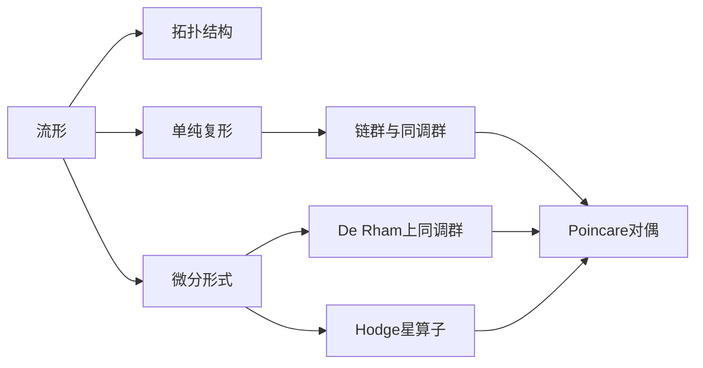

# 流形拓扑学：Poincare对偶

## 1.背景介绍

### 1.1 流形的定义与分类
#### 1.1.1 流形的定义
#### 1.1.2 流形的分类
##### 1.1.2.1 按维数分类  
##### 1.1.2.2 按紧致性分类
##### 1.1.2.3 按定向性分类
### 1.2 流形上的拓扑结构
#### 1.2.1 拓扑空间的定义
#### 1.2.2 流形上的拓扑
#### 1.2.3 同胚与同伦
### 1.3 Poincare对偶的历史渊源
#### 1.3.1 Poincare的贡献 
#### 1.3.2 对偶性的发展历程
#### 1.3.3 Poincare对偶定理的意义

## 2.核心概念与联系

### 2.1 单纯复形与链群
#### 2.1.1 单纯复形的定义
#### 2.1.2 链群的构造
#### 2.1.3 边界算子与同调群
### 2.2 流形上的微分形式
#### 2.2.1 外代数与微分形式
#### 2.2.2 外微分算子
#### 2.2.3 De Rham上同调群
### 2.3 Hodge星算子
#### 2.3.1 内积空间与对偶
#### 2.3.2 Hodge星算子的定义
#### 2.3.3 Hodge对偶与Poincare对偶
### 2.4 上同调与Poincare对偶 
#### 2.4.1 上同调群的定义
#### 2.4.2 Poincare对偶同构
#### 2.4.3 对偶性的几何解释



## 3.核心算法原理具体操作步骤

### 3.1 计算流形的单纯复形
#### 3.1.1 三角剖分算法
#### 3.1.2 构造链群与边界算子 
#### 3.1.3 计算同调群
### 3.2 计算De Rham上同调群
#### 3.2.1 构造微分形式空间
#### 3.2.2 计算上同调群
#### 3.2.3 同调群之间的同构
### 3.3 Poincare对偶同构的构造
#### 3.3.1 Hodge星算子的计算
#### 3.3.2 诱导出的同构映射
#### 3.3.3 对偶基的选取

## 4.数学模型和公式详细讲解举例说明

### 4.1 链群与同调群
- 链群的定义：$C_n(K)=\left\{\sum_{i=1}^{m}a_i\sigma_i^n|a_i\in\mathbb{Z},\sigma_i^n\in K_n \right\}$
- 边界算子：$\partial_n:C_n\to C_{n-1},\ \partial_n\sigma^n=\sum_{i=0}^{n}(-1)^i\sigma^n[v_0,\dots,\hat{v}_i,\dots,v_n]$
- 同调群：$H_n(K)=\mathrm{Ker}\ \partial_n/\mathrm{Im}\ \partial_{n+1}$
### 4.2 De Rham上同调群
- 微分形式：$\Omega^k(M)=\left\{\omega=\sum_{i_1<\dots<i_k}a_{i_1\dots i_k}dx^{i_1}\wedge\dots\wedge dx^{i_k}\right\}$  
- 外微分：$d:\Omega^k(M)\to\Omega^{k+1}(M),\ d\omega=\sum_{j=1}^{n}\sum_{i_1<\dots<i_k}\frac{\partial a_{i_1\dots i_k}}{\partial x^j}dx^j\wedge dx^{i_1}\wedge\dots\wedge dx^{i_k}$
- 上同调群：$H_{dR}^k(M)=\mathrm{Ker}\ d_k/\mathrm{Im}\ d_{k-1}$
### 4.3 Hodge星算子与Poincare对偶
- Hodge星算子：$\star:\Omega^k(M)\to\Omega^{n-k}(M),\ \star(dx^{i_1}\wedge\dots\wedge dx^{i_k})=\mathrm{sgn}(\sigma)dx^{j_1}\wedge\dots\wedge dx^{j_{n-k}}$
- Poincare对偶同构：$\mathcal{P}:H_{dR}^k(M)\to H_{n-k}(M),\ [\omega]\mapsto [\sigma],\ \int_M\omega\wedge\eta=\int_\sigma\eta,\ \forall[\eta]\in H_{dR}^{n-k}(M)$

例如，在2维流形上，1维同调群 $H_1(M)$ 与1维上同调群 $H_{dR}^1(M)$ 之间存在Poincare对偶同构：

$$\mathcal{P}:H_{dR}^1(M)\to H_1(M),\ \mathcal{P}[xdx+ydy]=[\gamma],\ \int_M(xdx+ydy)\wedge\eta=\int_\gamma\eta,\ \forall[\eta]\in H_{dR}^1(M)$$

其中 $\gamma$ 为对偶于 $xdx+ydy$ 的1维闭曲线。

## 5.项目实践：代码实例和详细解释说明

以下是使用Python的Sympy库计算流形上微分形式的外微分和Hodge星算子的示例代码：

```python
from sympy import * 

# 定义坐标变量
x, y, z = symbols('x y z')

# 定义微分形式
omega1 = x*y*dx + y*z*dy + z*x*dz 
omega2 = x*dx*dy + y*dy*dz + z*dz*dx

# 计算外微分
print("omega1的外微分为：")
print(diff(omega1))  
print("omega2的外微分为：") 
print(diff(omega2))

# 定义流形的度量矩阵
g = Matrix([[1, 0, 0], [0, 1, 0], [0, 0, 1]])

# 计算体积元
dV = sqrt(det(g)) * dx*dy*dz

# 计算Hodge星算子
print("omega1的Hodge星算子为：")
print(hodge_star(omega1, g, dV))
print("omega2的Hodge星算子为：")
print(hodge_star(omega2, g, dV))
```

代码解释：

1. 首先定义了坐标变量x,y,z，用于表示流形上的点。

2. 然后定义了两个微分形式omega1和omega2，它们都是1-形式，omega1=x*y*dx + y*z*dy + z*x*dz，omega2=x*dx*dy + y*dy*dz + z*dz*dx。

3. 使用sympy的diff函数计算omega1和omega2的外微分，外微分将k-形式映射到(k+1)-形式。

4. 定义流形上的度量矩阵g，这里假设是欧氏度量，即g为单位矩阵。

5. 根据度量矩阵g计算体积元dV，在欧氏度量下就是dV=dx*dy*dz。

6. 使用hodge_star函数计算omega1和omega2的Hodge星算子，Hodge星算子将k-形式映射到(n-k)-形式，其中n为流形的维数。hodge_star函数的参数包括微分形式、度量矩阵和体积元。

通过以上代码，我们可以方便地计算流形上微分形式的外微分和Hodge星算子，这是计算流形上同调群和研究Poincare对偶的重要工具。

## 6.实际应用场景

### 6.1 物理学中的应用
#### 6.1.1 电磁场论中的微分形式
#### 6.1.2 广义相对论中的流形
#### 6.1.3 量子场论与规范理论
### 6.2 计算机图形学中的应用  
#### 6.2.1 离散微分几何
#### 6.2.2 网格参数化与纹理映射
#### 6.2.3 形状分析与特征提取
### 6.3 机器学习中的应用
#### 6.3.1 流形学习
#### 6.3.2 拓扑数据分析
#### 6.3.3 几何深度学习

## 7.工具和资源推荐

### 7.1 数学软件
- Matlab与Mathtoolbox
- Mathematica
- Maple
- SymPy
### 7.2 开源库
- PyTorch Geometric: 几何深度学习库
- GUDHI: 拓扑数据分析库
- CGAL: 计算几何算法库  
### 7.3 学习资源
- 书籍：《微分流形》、《代数拓扑》
- 课程：MIT 18.965 几何拓扑学
- 论文：Poincare对偶相关文献

## 8.总结：未来发展趋势与挑战

### 8.1 高维流形的研究
#### 8.1.1 高维流形的分类与刻画
#### 8.1.2 高维流形上的微分算子
### 8.2 计算拓扑学的发展
#### 8.2.1 高效同调群计算算法
#### 8.2.2 拓扑数据分析在大数据中的应用
### 8.3 人工智能与拓扑学的结合
#### 8.3.1 拓扑深度学习模型
#### 8.3.2 流形表示学习
#### 8.3.3 拓扑正则化方法

Poincare对偶作为流形拓扑学的核心内容，不仅在数学上具有重要的理论意义，也在物理学、计算机科学等领域有广泛的应用。随着大数据和人工智能技术的飞速发展，流形学习和拓扑数据分析成为了研究热点。如何将古典的拓扑学理论与前沿的机器学习方法相结合，是目前面临的主要挑战之一。此外，对高维流形的研究以及计算拓扑学的算法优化也是未来值得关注的发展方向。相信Poincare对偶思想还将在更多领域绽放异彩。

## 9.附录：常见问题与解答

### Q1：Poincare对偶的直观解释是什么？
A1：可以将Poincare对偶理解为流形上的"阴阳"关系，k维子流形与(n-k)维子流形之间存在着一一对应，它们互为对偶。对偶子流形在同调意义下携带着等价的拓扑信息。

### Q2：同调群和上同调群分别刻画了流形的哪些性质？
A2：同调群刻画了流形中k维"洞"的结构，反映了流形的连通性质。而上同调群则刻画了流形上k维闭形式的等价类，反映了流形上的微分结构。Poincare对偶揭示了这两种对偶的同调理论之间的内在联系。

### Q3：Hodge理论在Poincare对偶中起到什么作用？
A3：Hodge理论通过引入Hodge星算子，给出了微分形式的内积结构，将上同调群嵌入到微分形式空间中。基于此，Hodge理论建立了上同调群与谐形式之间的同构，并最终给出了上同调群与同调群之间的Poincare对偶同构。

### Q4：Poincare对偶在物理学和工程中有哪些应用？
A4：在电磁场论中，Poincare对偶体现为电场强度与磁感应强度的对偶关系。在计算机图形学中，Poincare对偶被用于分析网格模型的拓扑结构，指导网格参数化与纹理映射。在拓扑数据分析中，Poincare对偶则被用于提取数据的拓扑特征。

### Q5：拓扑数据分析与机器学习的结合有哪些研究方向？
A5：目前拓扑数据分析与机器学习的结合主要有以下几个研究方向：1）将拓扑特征作为数据的表示，用于下游的机器学习任务；2）利用拓扑结构设计针对性的神经网络模型，如图神经网络等；3）利用拓扑约束作为正则化手段，如持续同调正则化等。这些研究方向都有望进一步提升机器学习的性能与解释性。

作者：禅与计算机程序设计艺术 / Zen and the Art of Computer Programming