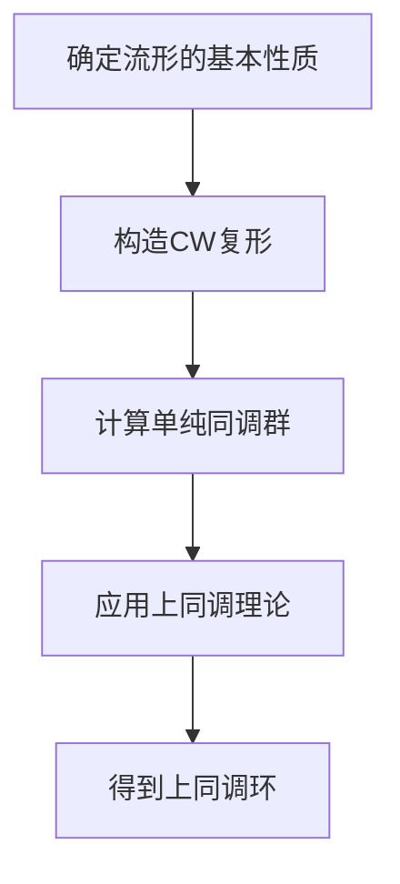

# 流形拓扑学：复Grassmann流形的上同调环

## 1.背景介绍

流形拓扑学是数学和计算机科学中的一个重要分支，研究流形的几何和拓扑性质。流形是局部类似于欧几里得空间的空间，广泛应用于物理学、工程学和计算机科学等领域。复Grassmann流形是流形拓扑学中的一个重要对象，它描述了复向量空间的子空间的集合。理解复Grassmann流形的上同调环对于深入研究流形的拓扑性质具有重要意义。

## 2.核心概念与联系

### 2.1 流形

流形是一个局部类似于欧几里得空间的空间。形式上，一个$n$维流形是一个Hausdorff空间，每一点都有一个邻域同胚于$\mathbb{R}^n$。流形的概念在数学和物理学中有广泛应用，例如描述物体的形状和空间的结构。

### 2.2 Grassmann流形

Grassmann流形$G(k, n)$是所有$n$维向量空间中$k$维子空间的集合。复Grassmann流形$G_{\mathbb{C}}(k, n)$是所有$n$维复向量空间中$k$维复子空间的集合。Grassmann流形在代数几何和拓扑学中有重要应用。

### 2.3 上同调环

上同调环是一个拓扑空间的上同调群的代数结构。对于一个拓扑空间$X$，其上同调群$H^*(X)$是一个代数结构，包含了空间的拓扑信息。上同调环的研究有助于理解空间的拓扑性质。

## 3.核心算法原理具体操作步骤

### 3.1 计算复Grassmann流形的上同调群

计算复Grassmann流形的上同调群需要使用一些代数拓扑的工具和技术。以下是一个基本的步骤：

1. **确定流形的基本性质**：首先需要确定复Grassmann流形的基本拓扑性质，例如其维数和基本群。
2. **构造CW复形**：将复Grassmann流形表示为一个CW复形，这是一种分解流形的方法，使得可以应用CW复形的上同调理论。
3. **计算单纯同调群**：使用单纯同调理论计算CW复形的同调群。
4. **应用上同调理论**：将同调群转化为上同调群，得到复Grassmann流形的上同调环。

### 3.2 具体操作步骤

以下是一个具体的操作步骤示例：

1. **确定$G_{\mathbb{C}}(k, n)$的维数**：复Grassmann流形$G_{\mathbb{C}}(k, n)$的维数为$2k(n-k)$。
2. **构造CW复形**：将$G_{\mathbb{C}}(k, n)$表示为一个CW复形，分解为若干个胞腔。
3. **计算单纯同调群**：使用单纯同调理论计算CW复形的同调群。
4. **应用上同调理论**：将同调群转化为上同调群，得到$G_{\mathbb{C}}(k, n)$的上同调环。

## 4.数学模型和公式详细讲解举例说明

### 4.1 复Grassmann流形的定义

复Grassmann流形$G_{\mathbb{C}}(k, n)$是所有$n$维复向量空间中$k$维复子空间的集合。形式上，可以表示为：

$$
G_{\mathbb{C}}(k, n) = \{ V \subset \mathbb{C}^n \mid \dim_{\mathbb{C}}(V) = k \}
$$

### 4.2 上同调群的定义

对于一个拓扑空间$X$，其上同调群$H^*(X)$是一个代数结构，包含了空间的拓扑信息。上同调群的定义如下：

$$
H^n(X) = \text{Hom}(H_n(X), \mathbb{Z})
$$

其中，$H_n(X)$是$X$的$n$维同调群，$\text{Hom}$表示同态群。

### 4.3 复Grassmann流形的上同调环

复Grassmann流形$G_{\mathbb{C}}(k, n)$的上同调环可以通过CW复形和单纯同调理论计算得到。具体公式如下：

$$
H^*(G_{\mathbb{C}}(k, n)) = \mathbb{Z}[c_1, c_2, \ldots, c_k] / (P)
$$

其中，$c_i$是Chern类，$P$是一个理想，表示上同调环的关系。

### 4.4 举例说明

例如，对于$G_{\mathbb{C}}(1, 2)$，其上同调环为：

$$
H^*(G_{\mathbb{C}}(1, 2)) = \mathbb{Z}[c_1] / (c_1^2)
$$

这表示$G_{\mathbb{C}}(1, 2)$的上同调环是由一个生成元$c_1$生成的，且满足关系$c_1^2 = 0$。

## 5.项目实践：代码实例和详细解释说明

### 5.1 使用Python计算复Grassmann流形的上同调环

以下是一个使用Python计算复Grassmann流形$G_{\mathbb{C}}(1, 2)$的上同调环的示例代码：

```python
import sympy as sp

# 定义Chern类
c1 = sp.Symbol('c1')

# 定义上同调环的关系
relation = c1**2

# 打印上同调环
print(f"H^*(G_C(1, 2)) = Z[c1] / ({relation})")
```

### 5.2 详细解释说明

上述代码使用了SymPy库来定义Chern类$c_1$，并定义了上同调环的关系$c_1^2 = 0$。最后，打印出复Grassmann流形$G_{\mathbb{C}}(1, 2)$的上同调环。

### 5.3 Mermaid流程图

以下是计算复Grassmann流形上同调环的Mermaid流程图：



## 6.实际应用场景

### 6.1 物理学中的应用

复Grassmann流形在物理学中有广泛应用。例如，在量子场论中，Grassmann流形用于描述费米子场的路径积分。

### 6.2 计算机科学中的应用

在计算机科学中，复Grassmann流形用于机器学习和数据分析。例如，在主成分分析（PCA）中，Grassmann流形用于描述数据的低维子空间。

### 6.3 工程学中的应用

在工程学中，复Grassmann流形用于信号处理和控制理论。例如，在多天线系统中，Grassmann流形用于描述信号的子空间。

## 7.工具和资源推荐

### 7.1 数学软件

- **SymPy**：一个Python库，用于符号数学计算。
- **Mathematica**：一个强大的数学软件，用于符号和数值计算。

### 7.2 在线资源

- **arXiv**：一个在线预印本库，包含大量关于流形拓扑学和Grassmann流形的研究论文。
- **MathWorld**：一个在线数学百科全书，提供关于流形和上同调群的详细解释。

### 7.3 书籍推荐

- **《代数拓扑学》**：Allen Hatcher著，详细介绍了代数拓扑学的基本概念和理论。
- **《流形的拓扑学》**：John Milnor著，深入探讨了流形的拓扑性质。

## 8.总结：未来发展趋势与挑战

### 8.1 未来发展趋势

流形拓扑学和复Grassmann流形的研究在未来有广阔的发展前景。随着计算机科学和人工智能的发展，流形拓扑学将在数据分析、机器学习和图像处理等领域发挥越来越重要的作用。

### 8.2 挑战

尽管流形拓扑学有广泛的应用，但其理论复杂性和计算难度仍然是一个挑战。未来的研究需要发展更高效的算法和工具，以便在实际应用中更好地利用流形拓扑学的理论。

## 9.附录：常见问题与解答

### 9.1 什么是流形？

流形是一个局部类似于欧几里得空间的空间。形式上，一个$n$维流形是一个Hausdorff空间，每一点都有一个邻域同胚于$\mathbb{R}^n$。

### 9.2 什么是Grassmann流形？

Grassmann流形$G(k, n)$是所有$n$维向量空间中$k$维子空间的集合。复Grassmann流形$G_{\mathbb{C}}(k, n)$是所有$n$维复向量空间中$k$维复子空间的集合。

### 9.3 什么是上同调环？

上同调环是一个拓扑空间的上同调群的代数结构。对于一个拓扑空间$X$，其上同调群$H^*(X)$是一个代数结构，包含了空间的拓扑信息。

### 9.4 如何计算复Grassmann流形的上同调环？

计算复Grassmann流形的上同调环需要使用代数拓扑的工具和技术。具体步骤包括确定流形的基本性质、构造CW复形、计算单纯同调群和应用上同调理论。

---

作者：禅与计算机程序设计艺术 / Zen and the Art of Computer Programming