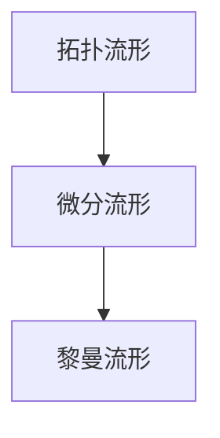

# 流形拓扑学：数学中的一些重要流形

## 1.背景介绍

流形是现代数学中一个基本且重要的概念,它在几何学、拓扑学、微分几何学、李群与李代数理论等数学分支中扮演着核心角色。流形不仅在纯数学领域有着广泛的应用,在物理学、工程学等其他自然科学和应用科学领域也有重要意义。

流形的概念源于对曲线和曲面在更高维度上的推广。在三维欧几里得空间中,平面和球面都是典型的二维流形的例子。一个流形在"整体"上看似是一个整体对象,但在"局部"上却和欧几里得空间中的开集相似。流形的这种"整体-局部"的二重性质赋予了它独特的数学结构。

### 1.1 历史发展

流形概念的发展可以追溯到18世纪,当时数学家开始研究曲线和曲面的内在几何性质。19世纪,高斯、黎曼等人的工作为发展微分几何学和拓扑学奠定了基础。1854年,黎曼首次提出了"多元复函数论"的概念,这为现代流形理论的建立做出了开创性的贡献。

20世纪初,庞加莱、惠更斯等人的工作使得流形概念获得了更加严格的数学定义。1930年代,Whitney将流形理论与代数拓扑学结合,发展了相伴切丛和切空间等概念。1940年代,柯西在流形上引入了李群和李代数的概念,为研究流形的对称性奠定了基础。

### 1.2 重要性和应用

流形理论不仅在纯数学领域具有重要意义,而且在物理学、工程学等许多应用领域也有广泛的应用。例如,在广义相对论中,时空被描述为一个四维流形;在量子场论中,规范场被定义在纤维丛流形上;在控制理论中,系统的状态空间通常被建模为一个流形;在计算机图形学中,几何模型常常是流形的离散表示。

## 2.核心概念与联系

### 2.1 拓扑流形

拓扑流形是流形理论中最基本的概念。一个n维拓扑流形是一个拓扑空间,它在每一点的一个邻域内同胚等价于n维欧几里得空间的一个开集。

形式定义如下:一个拓扑空间M被称为n维拓扑流形,如果对于M中的每一点p,存在p的一个邻域U和一个同胚映射φ:U→Rn,使得φ(U)是Rn中的一个开集。

拓扑流形的关键在于"局部同胚于欧几里得空间"这一性质。这使得流形在局部上具有欧几里得空间的性质,但在整体上可以表现出更加一般和丰富的拓扑结构。

### 2.2 微分流形

微分流形是在拓扑流形的基础上引入了微分结构的概念。一个n维微分流形是一个拓扑流形,它在每一点的一个邻域内同微分同胚等价于n维欧几里得空间的一个开集。

形式定义如下:一个拓扑流形M被称为n维微分流形,如果存在一族坐标邻域{(Uα,φα)},使得φα:Uα→Rn是同胚映射,且在Uα∩Uβ≠∅时,φβ∘φα-1是无穷可微的。

引入微分结构使得流形不仅具有拓扑性质,而且还具有微分几何性质,可以在流形上研究微分方程、测地线等概念。

### 2.3 黎曼流形

黎曼流形是在微分流形的基础上,进一步引入了黎曼度量的概念。一个n维黎曼流形是一个微分流形,在其上赋予了一个平滑变化的内积结构。

形式定义如下:一个n维黎曼流形(M,g)由一个n维微分流形M和一个平滑变化的正定内积g在每一个切空间TpM上构成。

黎曼度量赋予了流形内在的度量概念,使得可以在流形上定义长度、角度、曲率等几何量,并研究流形上的测地线方程等微分方程。黎曼流形是研究广义相对论等现代物理理论的基本数学工具。

### 2.4 概念联系

拓扑流形、微分流形和黎曼流形概念相互包含,体现了从拓扑结构到微分结构,再到度量结构的层层加深。它们之间的关系如下所示:



拓扑流形是最基本和最一般的流形概念,只要求局部同胚于欧几里得空间;微分流形在此基础上增加了微分结构;黎曼流形进一步在微分流形上赋予了度量结构。

这些概念的逐步引入,使得流形理论能够更好地描述和研究几何对象,并为相关数学分支和应用领域提供强有力的工具。

## 3.核心算法原理具体操作步骤

虽然流形理论主要是一个数学概念体系,但在实际计算和构造流形时,也存在一些核心算法和具体操作步骤,下面将对其进行介绍。

### 3.1 拓扑流形的构造

构造一个拓扑流形的基本步骤如下:

1. 确定流形的维数n。
2. 选取一组适当的拓扑空间作为流形的"局部片"。
3. 在这些局部片之间建立同胚映射,使得它们在重叠区域内"缝合"得到一个整体拓扑空间。
4. 验证所构造的拓扑空间在每一点的邻域内同胚于n维欧几里得空间的开集。

常见的拓扑流形构造方法包括:

- 利用有限个拓扑空间的不交并,如球面S^2是两个开球盘的不交并。
- 利用等价关系将一个大的拓扑空间"缩成"一个流形,如投影流形的构造。
- 利用乘积拓扑将低维流形的乘积空间构造为高维流形,如环面是圆的自乘积。

### 3.2 微分流形的构造

构造一个微分流形的基本步骤如下:

1. 先构造一个作为基础的拓扑流形M。
2. 在M上选取一组坐标邻域{(Uα,φα)},使得φα:Uα→Rn是同胚映射。
3. 验证在Uα∩Uβ≠∅时,φβ∘φα-1是无穷可微的。
4. 验证所选取的坐标邻域覆盖了M的每一点。

常见的微分流形构造方法包括:

- 利用已知的微分结构,如欧几里得空间Rn、球面Sn等。
- 利用乘积结构将低维微分流形的乘积空间构造为高维微分流形。
- 利用商空间构造,将一个大的微分流形"缩成"一个小的微分流形。

### 3.3 黎曼流形的构造

构造一个黎曼流形的基本步骤如下:

1. 先构造一个作为基础的微分流形M。
2. 在M上选取一组坐标邻域{(Uα,φα)}。
3. 在每个坐标邻域Uα上,定义一个正定内积gα,使得在重叠区域Uα∩Uβ上,gα和gβ是可微同胚的。
4. 验证所选取的坐标邻域和内积覆盖了M的每一点。

常见的黎曼流形构造方法包括:

- 利用已知的黎曼度量,如欧几里得空间Rn、球面Sn等。
- 利用乘积结构将低维黎曼流形的乘积空间构造为高维黎曼流形。
- 利用商空间构造,将一个大的黎曼流形"缩成"一个小的黎曼流形。

无论是拓扑流形、微分流形还是黎曼流形,在实际构造时都需要验证其满足相应的数学条件,这是一个关键且必不可少的步骤。

## 4.数学模型和公式详细讲解举例说明

在流形理论中,存在许多重要的数学模型和公式,下面将对其中的一些进行详细讲解和举例说明。

### 4.1 切空间和切丛

对于一个n维流形M,在每一点p∈M上,我们可以定义它的切空间TpM,即所有经过p的曲线的切向量空间。切空间TpM是一个n维线性空间。

将所有点的切空间"拼接"起来,就得到了M上的切丛TM,它是一个2n维的流形。切丛TM上的每一点都对应着M上的一个点和一个切向量。

切空间和切丛的概念对于研究流形上的微分运算、向量场等都是非常重要的。它们的精确数学定义如下:

$$
\begin{align*}
T_pM &= \left\{\left.\frac{d}{dt}\right|_{t=0}\gamma(t) : \gamma:(-\epsilon,\epsilon)\rightarrow M, \gamma(0)=p\right\} \\
TM &= \bigsqcup_{p\in M}T_pM = \{(p,v):p\in M, v\in T_pM\}
\end{align*}
$$

其中γ是通过p的曲线,ε是一个正数。

### 4.2 黎曼度量和曲率

在一个n维黎曼流形(M,g)上,我们可以定义其黎曼度量g,它是一个在每个切空间TpM上的正定内积。通过度量g,我们可以定义流形上的长度、角度等几何量。

度量g的具体形式可以通过其在一组坐标邻域{(Uα,φα)}上的表达式给出:

$$
g=\sum_{i,j=1}^ng_{ij}dx^idx^j
$$

其中gij是一个光滑变化的对称正定矩阵。

利用黎曼度量,我们可以进一步定义黎曼曲率张量R,它描述了测地线在流形上的相对运动。曲率张量的数学表达式为:

$$
R(X,Y)Z=\nabla_X\nabla_YZ-\nabla_Y\nabla_XZ-\nabla_{[X,Y]}Z
$$

其中X,Y,Z是切向量场,∇是黎曼连续。曲率张量的性质反映了流形的内在几何性质,如曲率为0当且仅当流形是平坦的。

### 4.3 举例:球面的切丛和黎曼度量

以2维单位球面S^2为例,我们可以具体计算其切丛和黎曼度量。

对于S^2上的任意一点p=(x,y,z),其切空间TpS^2由所有满足x·u+y·v+z·w=0的向量(u,v,w)构成,是一个2维线性空间。

S^2的切丛TS^2就是所有这些切空间的并,是一个4维流形。我们可以用球面上的点(x,y,z)和切向量(u,v,w)作为TS^2上的点的坐标。

在球面S^2上,我们可以定义其标准黎曼度量:

$$
g=dx^2+dy^2+dz^2
$$

其中x^2+y^2+z^2=1是球面的约束方程。这个度量诱导出球面上的长度和角度的测量方式。

利用这个度量,我们可以计算球面的曲率张量,结果为:

$$
R(X,Y)Z=g(Y,Z)X-g(X,Z)Y
$$

其中X,Y,Z是切向量场。这表明球面S^2是一个常曲率流形,其曲率标量为2。

通过这个具体的例子,我们可以更好地理解切空间、切丛、黎曼度量和曲率张量等重要概念在实际流形上的表现形式。

## 5.项目实践:代码实例和详细解释说明

虽然流形理论主要是一个数学概念体系,但我们可以利用计算机程序对一些简单的流形进行建模和可视化,以加深对相关概念的理解。下面给出一个使用Python和Matplotlib库对2维球面S^2进行建模和可视化的代码示例,并对其进行详细的解释说明。

```python
import numpy as np
import matplotlib.pyplot as plt
from mpl_toolkits.mplot3d import Axes3D