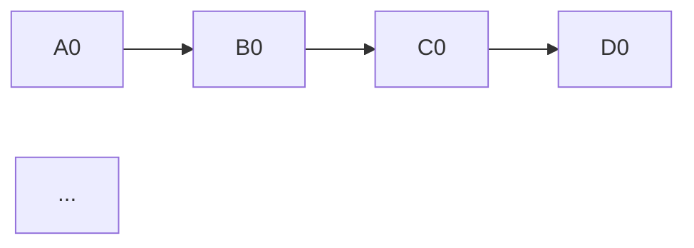
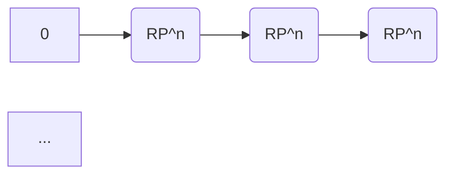

# 流形拓扑学：正合同伦序列

## 1.背景介绍

在研究流形拓扑学时,正合同伦序列是一个非常重要的概念。它为我们提供了一种研究流形之间拓扑等价关系的有力工具。在本文中,我们将深入探讨正合同伦序列的本质,以及它在流形拓扑学中的应用。

### 1.1 拓扑等价性

在拓扑学中,我们经常需要研究两个不同的拓扑空间是否存在某种等价关系。例如,一个圆和一个正方形在拓扑意义上是等价的,因为它们都是单纯连通的。然而,一个圆和一个环面在拓扑意义上是不等价的。因此,判断两个空间是否拓扑等价就成为一个关键问题。

### 1.2 同伦理论

同伦理论为研究拓扑等价性提供了一种强有力的方法。在同伦理论中,我们引入了一个新的等价关系——同伦等价。如果两个空间存在一个同伦等价映射,那么它们就被认为是同伦等价的。同伦等价是一种更强的等价关系,它蕴含了拓扑等价性。

### 1.3 链复形

为了研究同伦等价性,我们需要引入链复形的概念。链复形是一种代数结构,它能够捕捉空间的拓扑信息。通过研究链复形的同伦群,我们可以判断两个空间是否同伦等价。

## 2.核心概念与联系

### 2.1 正合同伦序列

正合同伦序列是一个由链复形和链映射组成的序列,它满足某些特定的条件。具体来说,一个正合同伦序列是一个形如下面的序列:

其中,每个箭头都代表一个链映射,并且满足以下条件:

1. 任意两个相邻的链映射的复合都是零映射,即 $f_{i+1} \circ f_i = 0$。
2. 每个链映射都是单射或者满射,但不能同时是单射和满射。

一个正合同伦序列能够捕捉两个空间之间的拓扑信息,并且具有一些非常重要的性质。

### 2.2 同伦群

同伦群是研究同伦等价性的关键工具。对于一个给定的空间 $X$,我们可以构造出它的同伦群 $H_n(X)$。同伦群能够反映空间的一些基本拓扑不变量,例如连通分量的个数、环面的个数等。

如果两个空间 $X$ 和 $Y$ 同伦等价,那么它们的同伦群就是同构的,即 $H_n(X) \cong H_n(Y)$。反之,如果两个空间的同伦群不同构,那么它们就一定不同伦等价。

### 2.3 正合同伦序列与同伦群

正合同伦序列和同伦群之间存在着密切的联系。事实上,我们可以利用正合同伦序列来计算同伦群。这个过程被称为"同伦计算"。

具体来说,如果我们有一个正合同伦序列:

那么,我们可以利用这个序列来计算出 $B_0$ 的同伦群。这个计算过程涉及到了一些代数运算,例如核、像、商群等。通过这种方式,我们可以逐步计算出任意一个空间的同伦群。

## 3.核心算法原理具体操作步骤

计算同伦群的核心算法就是利用正合同伦序列进行"同伦计算"。具体的操作步骤如下:

1. 构造出待研究空间的链复形序列。
2. 从链复形序列中提取出一个正合同伦子序列。
3. 利用正合同伦子序列计算出关键项的同伦群。
4. 通过同伦群的计算结果,推导出原空间的同伦群。

下面我们将详细介绍每一个步骤的具体操作。

### 3.1 构造链复形序列

第一步是构造出待研究空间的链复形序列。这个过程通常需要一些代数拓扑的知识,例如单纯剖分、胞复形等。对于一个给定的空间 $X$,我们可以构造出它的链复形序列:

$$
\cdots \xrightarrow{\partial_{n+1}} C_n(X) \xrightarrow{\partial_n} C_{n-1}(X) \xrightarrow{\partial_{n-1}} \cdots
$$

其中,每一项 $C_n(X)$ 都是一个链群,代表了空间 $X$ 中 $n$ 维的链的集合。边界映射 $\partial_n$ 则描述了 $n$ 维链和 $(n-1)$ 维链之间的关系。

### 3.2 提取正合同伦子序列

接下来,我们需要从链复形序列中提取出一个正合同伦子序列。这个过程通常需要一些技巧和经验。

我们可以尝试构造一些链映射,使得它们满足正合同伦序列的条件。例如,我们可以尝试构造一些投影映射、包含映射或者其他一些特殊的链映射。

假设我们构造出了一个正合同伦子序列:

那么,我们就可以利用这个子序列来计算关键项 $B_0$ 的同伦群了。

### 3.3 计算关键项的同伦群

现在,我们需要利用正合同伦子序列来计算关键项 $B_0$ 的同伦群。这个过程涉及到了一些代数运算,例如核、像、商群等。

具体来说,我们可以利用以下公式来计算 $B_0$ 的同伦群:

$$
H_n(B_0) \cong \frac{\ker(\partial_n^{B_0})}{\operatorname{im}(\partial_{n+1}^{B_0})}
$$

其中,

- $\ker(\partial_n^{B_0})$ 表示边界映射 $\partial_n^{B_0}$ 的核;
- $\operatorname{im}(\partial_{n+1}^{B_0})$ 表示边界映射 $\partial_{n+1}^{B_0}$ 的像;
- $\frac{\ker(\partial_n^{B_0})}{\operatorname{im}(\partial_{n+1}^{B_0})}$ 表示将 $\ker(\partial_n^{B_0})$ 中的元素模上 $\operatorname{im}(\partial_{n+1}^{B_0})$ 中的元素所得到的商群。

通过这种方式,我们就可以计算出 $B_0$ 的同伦群了。

### 3.4 推导原空间的同伦群

最后一步,我们需要利用 $B_0$ 的同伦群来推导出原空间 $X$ 的同伦群。这个过程也需要一些代数运算,例如确切序列、五重理论等。

具体来说,我们可以利用以下确切序列:

根据确切序列的性质,我们可以推导出:

$$
H_n(X) \cong H_n(B_0) \cong \frac{\ker(\partial_n^{B_0})}{\operatorname{im}(\partial_{n+1}^{B_0})}
$$

因此,只要我们计算出了 $B_0$ 的同伦群,就可以直接推导出原空间 $X$ 的同伦群了。

通过这种方式,我们就完成了利用正合同伦序列进行同伦计算的全部过程。

## 4.数学模型和公式详细讲解举例说明

在上一节中,我们已经介绍了利用正合同伦序列进行同伦计算的核心算法。现在,我们将通过一个具体的例子来详细说明这个过程。

### 4.1 例子:计算实射影球体的同伦群

我们将计算 $n$ 维实射影球体 $\mathbb{R}P^n$ 的同伦群。$\mathbb{R}P^n$ 可以看作是将 $n$ 维球面 $S^n$ 的对称点等同所得到的空间。

首先,我们需要构造出 $\mathbb{R}P^n$ 的链复形序列。这个过程比较复杂,我们将直接给出结果:

$$
\cdots \xrightarrow{} \mathbb{Z}_2 \xrightarrow{\partial_{n+1}} C_n(\mathbb{R}P^n) \xrightarrow{\partial_n} C_{n-1}(\mathbb{R}P^n) \xrightarrow{\partial_{n-1}} \cdots
$$

其中,每一项 $C_n(\mathbb{R}P^n)$ 都是一个 $\mathbb{Z}_2$ 向量空间,代表了 $\mathbb{R}P^n$ 中 $n$ 维的链的集合。边界映射 $\partial_n$ 则描述了 $n$ 维链和 $(n-1)$ 维链之间的关系。

### 4.2 提取正合同伦子序列

接下来,我们需要从链复形序列中提取出一个正合同伦子序列。在这个例子中,我们可以构造出以下子序列:

其中,第一个映射是常值映射,将 $0$ 映射到 $C_0(\mathbb{R}P^n)$ 中的单位元。后续的映射都是边界映射 $\partial_n$。

可以验证,这个子序列确实满足正合同伦序列的条件。

### 4.3 计算关键项的同伦群

现在,我们需要利用正合同伦子序列来计算关键项 $C_0(\mathbb{R}P^n)$ 的同伦群。

根据公式:

$$
H_n(C_0(\mathbb{R}P^n)) \cong \frac{\ker(\partial_n^{C_0(\mathbb{R}P^n)})}{\operatorname{im}(\partial_{n+1}^{C_0(\mathbb{R}P^n)})}
$$

我们可以计算出:

- $\ker(\partial_0^{C_0(\mathbb{R}P^n)}) = C_0(\mathbb{R}P^n) \cong \mathbb{Z}_2$;
- $\operatorname{im}(\partial_1^{C_0(\mathbb{R}P^n)}) = 0$;

因此,

$$
H_0(C_0(\mathbb{R}P^n)) \cong \frac{\mathbb{Z}_2}{0} \cong \mathbb{Z}_2
$$

### 4.4 推导原空间的同伦群

最后,我们需要利用 $C_0(\mathbb{R}P^n)$ 的同伦群来推导出 $\mathbb{R}P^n$ 的同伦群。

根据确切序列的性质,我们可以推导出:

$$
H_0(\mathbb{R}P^n) \cong H_0(C_0(\mathbb{R}P^n)) \cong \mathbb{Z}_2
$$

这说明,实射影球体 $\mathbb{R}P^n$ 在 $0$ 维上只有一个连通分量。

同理,我们可以计算出 $\mathbb{R}P^n$ 在其他维度上的同伦群。最终的结果是:

$$
H_k(\mathbb{R}P^n) \cong
\begin{cases}
\mathbb{Z}_2, & \text{if } k \text{ is even}\\
0, & \text{if } k \text{ is odd}
\end{cases}
$$

这个结果反映了实射影球体 $\mathbb{R}P^n$ 的一些基本拓扑不变量,例如它在偶数维度上有一个 $\mathbb{Z}_2$ 生成的同伦群,而在奇数维度上的同伦群都是平凡的。

通过这个例子,我们可以看到利用正合同伦序列进行同伦计算的全部过程。虽然计算过程可能比较繁琐,但是它为我们提供了一种有效的方法来研究流形的拓扑性质。

## 5.项目实践:代码实例和详细解释说明

虽然同伦计算的过程看起来比较抽象,但是我们可以利用计算机程序来自动化这个过程。在这一节中,我们将给出一个基于 Python 的代码实例,用于计算流形的同伦群。

### 5.1 代码