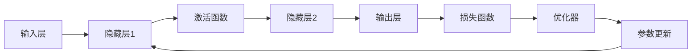

# 深度学习原理与代码实例讲解

## 1. 背景介绍
深度学习，作为机器学习的一个分支，近年来在图像识别、语音识别、自然语言处理等领域取得了显著的进展。它的核心思想是通过构建多层的神经网络来模拟人脑处理信息的方式，从而实现对数据的高层次抽象。深度学习的成功背后，是大数据的支持、算力的提升和算法的突破。

## 2. 核心概念与联系
深度学习的核心概念包括神经网络、激活函数、损失函数、优化器等。神经网络是由多个层次的节点（或称为神经元）组成，每个节点都是一个计算单元。激活函数的作用是为网络引入非线性因素，使得网络能够学习和执行更复杂的任务。损失函数衡量的是模型预测值与真实值之间的差异，优化器则负责根据损失函数的结果调整网络参数，以达到最小化损失的目的。



## 3. 核心算法原理具体操作步骤
深度学习的核心算法包括前向传播和反向传播。前向传播是指输入数据在神经网络中从输入层逐层传递至输出层，并产生输出结果的过程。反向传播则是根据输出结果的误差，逆向调整网络参数的过程。

1. 初始化网络参数
2. 输入数据进行前向传播
3. 计算损失函数
4. 通过反向传播计算梯度
5. 使用优化器更新网络参数
6. 重复步骤2-5直到满足停止条件

## 4. 数学模型和公式详细讲解举例说明
以最常见的多层感知机（MLP）为例，其数学模型可以表示为：

$$
h^{(1)} = \sigma(W^{(1)}x + b^{(1)})
$$
$$
h^{(2)} = \sigma(W^{(2)}h^{(1)} + b^{(2)})
$$
$$
\hat{y} = softmax(W^{(3)}h^{(2)} + b^{(3)})
$$

其中，$x$ 是输入向量，$h^{(1)}$ 和 $h^{(2)}$ 是隐藏层的输出，$\hat{y}$ 是预测结果，$W$ 和 $b$ 分别是权重矩阵和偏置向量，$\sigma$ 是激活函数，$softmax$ 是输出层的激活函数，用于多分类问题。

## 5. 项目实践：代码实例和详细解释说明
以TensorFlow为例，构建一个简单的深度神经网络来识别手写数字：

```python
import tensorflow as tf

# 加载数据集
mnist = tf.keras.datasets.mnist
(x_train, y_train), (x_test, y_test) = mnist.load_data()
x_train, x_test = x_train / 255.0, x_test / 255.0

# 构建模型
model = tf.keras.models.Sequential([
  tf.keras.layers.Flatten(input_shape=(28, 28)),
  tf.keras.layers.Dense(128, activation='relu'),
  tf.keras.layers.Dropout(0.2),
  tf.keras.layers.Dense(10, activation='softmax')
])

# 编译模型
model.compile(optimizer='adam',
              loss='sparse_categorical_crossentropy',
              metrics=['accuracy'])

# 训练模型
model.fit(x_train, y_train, epochs=5)

# 评估模型
model.evaluate(x_test,  y_test, verbose=2)
```

## 6. 实际应用场景
深度学习已广泛应用于图像识别、语音识别、自然语言处理、无人驾驶汽车、医疗诊断等多个领域。

## 7. 工具和资源推荐
- TensorFlow
- PyTorch
- Keras
- NVIDIA CUDA
- Google Colab

## 8. 总结：未来发展趋势与挑战
深度学习未来的发展趋势包括模型的轻量化、自动化机器学习（AutoML）、跨模态学习等。同时，挑战也很明显，如解释性问题、数据隐私问题、模型泛化能力等。

## 9. 附录：常见问题与解答
Q1: 深度学习和机器学习有什么区别？
A1: 机器学习是一个广泛的领域，包括各种算法和方法。深度学习是机器学习中的一个子集，专注于使用深层神经网络。

Q2: 如何选择合适的激活函数？
A2: 选择激活函数通常基于任务的性质和网络的深度。ReLU及其变种在实践中表现良好。

Q3: 如何防止过拟合？
A3: 可以通过增加数据集、使用正则化技术、引入Dropout层等方法来防止过拟合。

作者：禅与计算机程序设计艺术 / Zen and the Art of Computer Programming