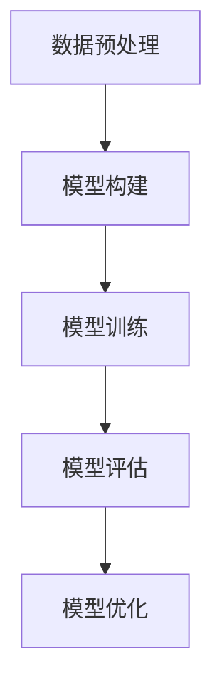

# 深度学习基础原理与代码实战案例讲解

## 1.背景介绍

深度学习（Deep Learning）作为人工智能（AI）领域的一个重要分支，近年来取得了显著的进展。它通过模拟人脑的神经网络结构，能够在图像识别、自然语言处理、语音识别等多个领域实现突破性的成果。深度学习的核心在于其多层神经网络结构，这使得它能够从大量数据中自动提取特征并进行复杂的模式识别。

深度学习的兴起得益于以下几个关键因素：
1. **数据的爆炸性增长**：互联网和物联网的发展使得数据量呈指数级增长，为深度学习模型的训练提供了丰富的素材。
2. **计算能力的提升**：GPU和TPU等硬件的进步大大加速了深度学习模型的训练过程。
3. **算法的创新**：如卷积神经网络（CNN）、循环神经网络（RNN）等新型网络结构的提出，使得深度学习在处理图像和序列数据方面表现出色。

## 2.核心概念与联系

### 2.1 神经网络

神经网络是深度学习的基础结构。一个典型的神经网络由输入层、隐藏层和输出层组成。每一层由若干个神经元（Neuron）构成，神经元之间通过权重（Weight）连接。

### 2.2 前向传播与反向传播

前向传播（Forward Propagation）是指数据从输入层经过隐藏层到输出层的过程。反向传播（Backpropagation）则是通过计算损失函数的梯度，调整网络中的权重，以最小化预测误差。

### 2.3 激活函数

激活函数（Activation Function）用于引入非线性因素，使神经网络能够处理复杂的模式。常见的激活函数包括Sigmoid、ReLU和Tanh等。

### 2.4 损失函数

损失函数（Loss Function）用于衡量模型预测值与真实值之间的差距。常见的损失函数有均方误差（MSE）、交叉熵（Cross-Entropy）等。

### 2.5 优化算法

优化算法（Optimization Algorithm）用于更新神经网络的权重，以最小化损失函数。常见的优化算法有梯度下降（Gradient Descent）、Adam等。

## 3.核心算法原理具体操作步骤

### 3.1 数据预处理

数据预处理是深度学习的第一步，主要包括数据清洗、归一化、分割训练集和测试集等步骤。

### 3.2 模型构建

模型构建包括选择网络结构、定义层数和神经元数量、选择激活函数和损失函数等。

### 3.3 模型训练

模型训练通过前向传播和反向传播，不断调整网络权重，使得损失函数逐渐减小。

### 3.4 模型评估

模型评估通过在测试集上计算损失函数和准确率，评估模型的性能。

### 3.5 模型优化

模型优化包括调整超参数、使用正则化方法防止过拟合等。

以下是一个典型的深度学习流程图：



## 4.数学模型和公式详细讲解举例说明

### 4.1 前向传播公式

假设一个简单的三层神经网络，输入层有 $x_1, x_2$ 两个节点，隐藏层有 $h_1, h_2$ 两个节点，输出层有 $y$ 一个节点。权重分别为 $w_{ij}$，偏置为 $b_i$。

隐藏层的输出：
$$
h_i = \sigma\left(\sum_{j} w_{ij} x_j + b_i\right)
$$

输出层的输出：
$$
y = \sigma\left(\sum_{i} w_{i} h_i + b\right)
$$

### 4.2 反向传播公式

损失函数 $L$ 对权重 $w_{ij}$ 的梯度：
$$
\frac{\partial L}{\partial w_{ij}} = \frac{\partial L}{\partial y} \cdot \frac{\partial y}{\partial h_i} \cdot \frac{\partial h_i}{\partial w_{ij}}
$$

### 4.3 优化算法公式

梯度下降算法更新权重的公式：
$$
w_{ij} = w_{ij} - \eta \cdot \frac{\partial L}{\partial w_{ij}}
$$
其中，$\eta$ 为学习率。

## 5.项目实践：代码实例和详细解释说明

### 5.1 数据集准备

我们以经典的MNIST手写数字识别数据集为例，进行深度学习模型的构建和训练。

```python
import tensorflow as tf
from tensorflow.keras.datasets import mnist
from tensorflow.keras.utils import to_categorical

# 加载数据集
(x_train, y_train), (x_test, y_test) = mnist.load_data()

# 数据预处理
x_train = x_train.reshape(-1, 28, 28, 1).astype('float32') / 255
x_test = x_test.reshape(-1, 28, 28, 1).astype('float32') / 255
y_train = to_categorical(y_train, 10)
y_test = to_categorical(y_test, 10)
```

### 5.2 模型构建

```python
from tensorflow.keras.models import Sequential
from tensorflow.keras.layers import Conv2D, MaxPooling2D, Flatten, Dense

# 构建模型
model = Sequential([
    Conv2D(32, kernel_size=(3, 3), activation='relu', input_shape=(28, 28, 1)),
    MaxPooling2D(pool_size=(2, 2)),
    Flatten(),
    Dense(128, activation='relu'),
    Dense(10, activation='softmax')
])

# 编译模型
model.compile(optimizer='adam', loss='categorical_crossentropy', metrics=['accuracy'])
```

### 5.3 模型训练

```python
# 训练模型
model.fit(x_train, y_train, epochs=10, batch_size=128, validation_split=0.2)
```

### 5.4 模型评估

```python
# 评估模型
loss, accuracy = model.evaluate(x_test, y_test)
print(f'Test loss: {loss}')
print(f'Test accuracy: {accuracy}')
```

## 6.实际应用场景

### 6.1 图像识别

深度学习在图像识别领域表现出色，广泛应用于人脸识别、自动驾驶、医疗影像分析等场景。

### 6.2 自然语言处理

在自然语言处理（NLP）领域，深度学习用于机器翻译、情感分析、文本生成等任务。

### 6.3 语音识别

深度学习在语音识别领域的应用包括语音助手、语音转文字等。

### 6.4 推荐系统

深度学习在推荐系统中的应用包括个性化推荐、广告投放等。

## 7.工具和资源推荐

### 7.1 深度学习框架

- TensorFlow
- PyTorch
- Keras

### 7.2 数据集

- MNIST
- CIFAR-10
- ImageNet

### 7.3 学习资源

- 《深度学习》 by Ian Goodfellow, Yoshua Bengio, Aaron Courville
- Coursera上的深度学习课程
- GitHub上的开源项目

## 8.总结：未来发展趋势与挑战

深度学习在过去几年中取得了显著的进展，但仍面临一些挑战，如模型的可解释性、数据隐私问题、计算资源的需求等。未来，深度学习有望在以下几个方面取得突破：

1. **模型的可解释性**：提高模型的透明度和可解释性，使其在实际应用中更加可信。
2. **小样本学习**：开发能够在小样本数据上表现出色的模型，减少对大规模数据的依赖。
3. **跨领域应用**：将深度学习应用于更多领域，如金融、医疗、教育等，解决实际问题。

## 9.附录：常见问题与解答

### 9.1 深度学习与传统机器学习的区别是什么？

深度学习通过多层神经网络自动提取特征，而传统机器学习通常需要手工设计特征。

### 9.2 如何选择合适的深度学习框架？

选择框架时应考虑项目需求、团队熟悉度、社区支持等因素。TensorFlow和PyTorch是目前最流行的深度学习框架。

### 9.3 如何防止模型过拟合？

可以通过正则化、数据增强、早停等方法防止模型过拟合。

### 9.4 深度学习模型的训练时间为什么这么长？

深度学习模型通常包含大量参数，需要在大规模数据上进行训练，因此训练时间较长。可以通过使用GPU、分布式训练等方法加速训练过程。

### 9.5 如何调试深度学习模型？

可以通过可视化工具（如TensorBoard）、逐层检查模型输出、调整超参数等方法进行调试。

---

作者：禅与计算机程序设计艺术 / Zen and the Art of Computer Programming