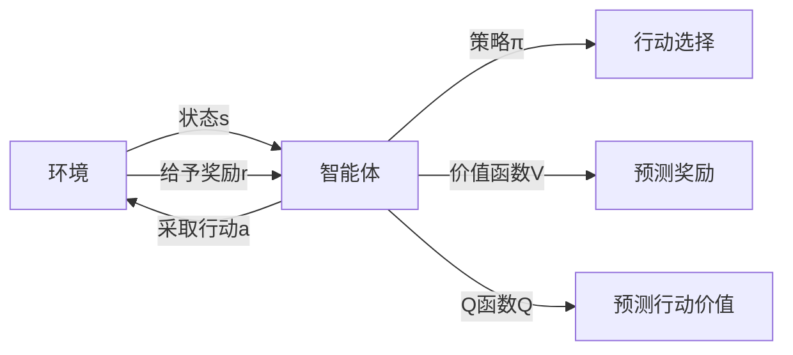

# 深度强化学习(DRL)原理与代码实战案例讲解

## 1. 背景介绍
深度强化学习（Deep Reinforcement Learning，简称DRL）是机器学习领域的一颗冉冉升起的新星，它结合了深度学习（Deep Learning）的感知能力和强化学习（Reinforcement Learning）的决策能力，使得机器能够在复杂的环境中自主学习最优策略。从AlphaGo击败人类世界冠军，到自动驾驶汽车，再到复杂的资源管理，DRL的应用前景广阔，引人注目。

## 2. 核心概念与联系
在深入探讨DRL之前，我们需要理解几个核心概念及其相互之间的联系：

- **强化学习（RL）**：一种学习方法，智能体（agent）通过与环境（environment）的交互，从而学习到在特定状态（state）下采取什么行动（action）能获得最大的累积奖励（reward）。
- **深度学习（DL）**：一种通过多层神经网络对数据进行高层抽象的学习方法，能够处理高维度的输入数据。
- **策略（Policy）**：智能体在给定状态下选择行动的规则，通常用 $\pi(a|s)$ 表示在状态 $s$ 下选择行动 $a$ 的概率。
- **价值函数（Value Function）**：预测智能体从某一状态开始，按照特定策略行动所能获得的累积奖励的期望值。
- **Q函数（Q Function）**：预测智能体在某一状态下采取特定行动，然后按照特定策略行动所能获得的累积奖励的期望值。

这些概念之间的联系可以用以下Mermaid流程图表示：



## 3. 核心算法原理具体操作步骤
DRL的核心算法原理可以分为以下几个步骤：

1. **初始化**：随机初始化策略网络和价值网络的参数。
2. **采样**：智能体根据当前策略与环境交互，收集状态、行动、奖励和新状态的样本。
3. **学习**：使用收集到的样本更新策略网络和价值网络的参数。
4. **评估**：测试更新后的策略，评估其性能。
5. **重复**：重复采样、学习和评估的过程，直到策略性能达到满意的程度。

## 4. 数学模型和公式详细讲解举例说明
在DRL中，我们通常使用以下数学模型和公式：

- **贝尔曼方程（Bellman Equation）**：
$$
V^\pi(s) = \sum_{a \in A} \pi(a|s) \sum_{s' \in S} P(s'|s,a) [R(s,a,s') + \gamma V^\pi(s')]
$$
这个方程描述了状态价值函数的递归关系。

- **Q学习（Q-Learning）**：
$$
Q(s,a) \leftarrow Q(s,a) + \alpha [r + \gamma \max_{a'} Q(s',a') - Q(s,a)]
$$
这个公式用于迭代更新Q值。

通过以上公式，我们可以构建DRL的数学基础，并在此基础上设计算法。

## 5. 项目实践：代码实例和详细解释说明
在实践中，我们可以使用Python和TensorFlow或PyTorch等框架来实现DRL算法。以下是一个简单的DRL网络更新的伪代码示例：

```python
for episode in range(total_episodes):
    state = env.reset()
    done = False
    
    while not done:
        action = policy_network.choose_action(state)
        next_state, reward, done, _ = env.step(action)
        target = reward + gamma * value_network.predict(next_state)
        value_network.update(state, target)
        policy_network.update(state, action, reward, next_state)
        
        state = next_state
```

这段代码展示了在每个episode中，智能体如何根据策略网络选择行动，然后根据环境的反馈更新价值网络和策略网络。

## 6. 实际应用场景
DRL已经在多个领域展现了其强大的应用潜力，包括但不限于：

- **游戏**：如AlphaGo、星际争霸II等。
- **自动驾驶**：通过DRL进行决策和路径规划。
- **机器人控制**：使机器人能够在复杂环境中自主学习行走和操控物体。
- **资源管理**：如数据中心的能源管理。

## 7. 工具和资源推荐
为了更好地学习和实践DRL，以下是一些推荐的工具和资源：

- **OpenAI Gym**：一个用于开发和比较强化学习算法的工具包。
- **TensorFlow Agents**：一个基于TensorFlow的强化学习库。
- **PyTorch**：一个开源的机器学习库，适合于深度学习和强化学习。

## 8. 总结：未来发展趋势与挑战
DRL的未来发展趋势看好，但也面临着一些挑战，如算法的稳定性和收敛性、样本效率、多智能体协作等。随着研究的深入和技术的进步，这些挑战将逐渐被克服。

## 9. 附录：常见问题与解答
- **Q1：DRL和传统RL有什么区别？**
  - A1：DRL结合了深度学习，能够处理更高维度的输入数据，适用于更复杂的环境。

- **Q2：DRL的训练过程为什么通常需要大量的数据？**
  - A2：因为DRL需要通过大量的试错来学习策略，这通常需要大量的数据来保证学习的准确性和泛化能力。

- **Q3：如何评估DRL算法的性能？**
  - A3：可以通过模拟环境中的累积奖励、任务完成率等指标来评估DRL算法的性能。

作者：禅与计算机程序设计艺术 / Zen and the Art of Computer Programming