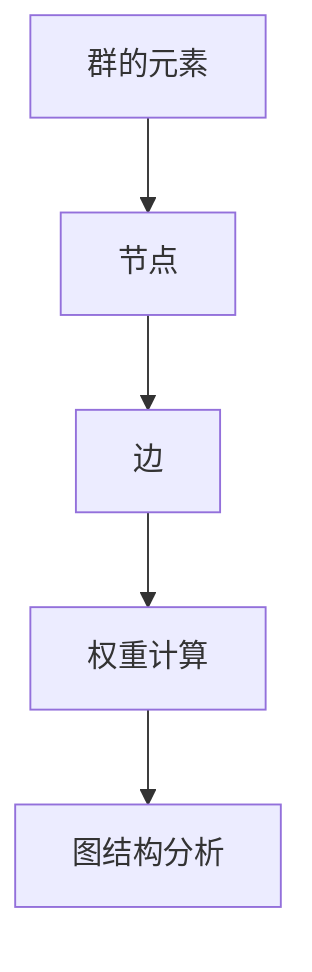

# 物理学中的群论：方块权图方法

## 1.背景介绍

群论是数学的一个重要分支，广泛应用于物理学、化学、计算机科学等领域。它通过研究代数结构中的对称性，帮助我们理解和解决复杂系统中的问题。方块权图方法是群论在物理学中的一种具体应用，特别是在量子力学和统计力学中具有重要意义。

在这篇文章中，我们将深入探讨方块权图方法的核心概念、算法原理、数学模型、实际应用以及未来发展趋势。通过具体的代码实例和详细解释，我们希望能够帮助读者更好地理解这一强大工具的实际应用。

## 2.核心概念与联系

### 2.1 群论基础

群论研究的是具有某种代数结构的集合，称为群。一个群由一个集合和一个二元运算组成，满足封闭性、结合性、单位元存在性和逆元存在性四个基本性质。

### 2.2 方块权图方法

方块权图方法是一种图论技术，用于表示和分析群的表示。它通过将群的元素和表示映射到图的节点和边上，帮助我们直观地理解群的结构和性质。

### 2.3 物理学中的应用

在物理学中，群论和方块权图方法被广泛应用于研究对称性、守恒定律和量子态的表示。例如，在量子力学中，群论帮助我们理解粒子的自旋和轨道角动量的表示。

## 3.核心算法原理具体操作步骤

### 3.1 构建方块权图

构建方块权图的步骤如下：

1. **确定群的元素和表示**：首先确定群的元素和表示。
2. **绘制节点**：将群的每个元素表示为图中的一个节点。
3. **绘制边**：根据群的运算规则，绘制节点之间的边。

### 3.2 计算权重

权重的计算基于群的表示和物理系统的具体性质。通常使用矩阵表示来计算权重。

### 3.3 分析图结构

通过分析方块权图的结构，我们可以得到群的表示和物理系统的对称性信息。



## 4.数学模型和公式详细讲解举例说明

### 4.1 群的定义

一个群 $G$ 是一个集合 $G$ 和一个二元运算 $\cdot$，满足以下性质：

1. **封闭性**：对于任意 $a, b \in G$，有 $a \cdot b \in G$。
2. **结合性**：对于任意 $a, b, c \in G$，有 $(a \cdot b) \cdot c = a \cdot (b \cdot c)$。
3. **单位元**：存在一个元素 $e \in G$，使得对于任意 $a \in G$，有 $e \cdot a = a \cdot e = a$。
4. **逆元**：对于任意 $a \in G$，存在一个元素 $b \in G$，使得 $a \cdot b = b \cdot a = e$。

### 4.2 表示理论

群的表示是将群的元素映射到线性变换的集合上。设 $G$ 是一个群，$V$ 是一个向量空间，表示 $\rho$ 是一个从 $G$ 到 $GL(V)$ 的同态映射。

### 4.3 方块权图的数学表示

方块权图可以用邻接矩阵表示。设 $G$ 是一个群，$A$ 是其邻接矩阵，$A_{ij}$ 表示节点 $i$ 和节点 $j$ 之间的边的权重。

$$
A_{ij} = \begin{cases} 
1 & \text{如果节点 } i \text{ 和节点 } j \text{ 之间有边} \\
0 & \text{否则}
\end{cases}
$$

### 4.4 举例说明

假设我们有一个群 $G = \{e, a, b, c\}$，其运算规则如下：

$$
\begin{array}{c|cccc}
\cdot & e & a & b & c \\
\hline
e & e & a & b & c \\
a & a & e & c & b \\
b & b & c & e & a \\
c & c & b & a & e \\
\end{array}
$$

我们可以构建其方块权图，并计算邻接矩阵。

## 5.项目实践：代码实例和详细解释说明

### 5.1 构建方块权图的Python代码

```python
import networkx as nx
import matplotlib.pyplot as plt

# 定义群的元素和运算规则
elements = ['e', 'a', 'b', 'c']
operation = {
    ('e', 'e'): 'e', ('e', 'a'): 'a', ('e', 'b'): 'b', ('e', 'c'): 'c',
    ('a', 'e'): 'a', ('a', 'a'): 'e', ('a', 'b'): 'c', ('a', 'c'): 'b',
    ('b', 'e'): 'b', ('b', 'a'): 'c', ('b', 'b'): 'e', ('b', 'c'): 'a',
    ('c', 'e'): 'c', ('c', 'a'): 'b', ('c', 'b'): 'a', ('c', 'c'): 'e'
}

# 创建图
G = nx.Graph()

# 添加节点
for element in elements:
    G.add_node(element)

# 添加边
for (x, y), result in operation.items():
    G.add_edge(x, y)

# 绘制图
nx.draw(G, with_labels=True, node_color='lightblue', edge_color='gray')
plt.show()
```

### 5.2 代码解释

上述代码使用 `networkx` 库构建了一个简单的方块权图。首先定义了群的元素和运算规则，然后创建图并添加节点和边，最后绘制图。

### 5.3 进一步分析

通过分析图的结构，我们可以得到群的表示和对称性信息。例如，节点之间的边表示群的运算结果，权重可以进一步用于量化分析。

## 6.实际应用场景

### 6.1 量子力学

在量子力学中，群论和方块权图方法用于研究粒子的自旋和轨道角动量的表示。例如，SU(2) 群用于描述自旋 1/2 粒子的对称性。

### 6.2 统计力学

在统计力学中，群论用于研究系统的对称性和相变。例如，Ising 模型中的对称性可以用群论来描述。

### 6.3 化学

在化学中，群论用于研究分子的对称性和光谱性质。例如，分子的振动模式可以用群论来分析。

## 7.工具和资源推荐

### 7.1 软件工具

- **Mathematica**：强大的数学软件，支持群论和图论的计算。
- **MATLAB**：广泛用于科学计算和工程应用，支持群论和图论的分析。
- **Python**：通过 `networkx` 和 `sympy` 库，可以进行群论和图论的计算和可视化。

### 7.2 在线资源

- **arXiv**：提供大量关于群论和物理学的研究论文。
- **Wolfram Alpha**：在线计算工具，支持群论和图论的计算。

### 7.3 书籍推荐

- **《群论及其在物理学中的应用》**：详细介绍了群论在物理学中的应用。
- **《量子力学中的群论》**：专注于群论在量子力学中的应用。

## 8.总结：未来发展趋势与挑战

### 8.1 未来发展趋势

随着计算能力的提升和算法的改进，群论和方块权图方法在物理学中的应用将更加广泛和深入。例如，量子计算中的对称性分析和高维系统的对称性研究将成为未来的重要方向。

### 8.2 挑战

尽管群论和方块权图方法在物理学中具有重要应用，但其复杂性和计算量仍然是一个挑战。如何高效地计算和分析大规模系统的对称性是一个亟待解决的问题。

## 9.附录：常见问题与解答

### 9.1 什么是群论？

群论是数学的一个分支，研究具有某种代数结构的集合，称为群。群的基本性质包括封闭性、结合性、单位元存在性和逆元存在性。

### 9.2 什么是方块权图方法？

方块权图方法是一种图论技术，用于表示和分析群的表示。它通过将群的元素和表示映射到图的节点和边上，帮助我们直观地理解群的结构和性质。

### 9.3 群论在物理学中的应用有哪些？

群论在物理学中广泛应用于研究对称性、守恒定律和量子态的表示。例如，在量子力学中，群论帮助我们理解粒子的自旋和轨道角动量的表示。

### 9.4 如何构建方块权图？

构建方块权图的步骤包括确定群的元素和表示、绘制节点、绘制边和计算权重。通过分析方块权图的结构，可以得到群的表示和物理系统的对称性信息。

### 9.5 有哪些推荐的工具和资源？

推荐的工具包括 Mathematica、MATLAB 和 Python。推荐的在线资源包括 arXiv 和 Wolfram Alpha。推荐的书籍包括《群论及其在物理学中的应用》和《量子力学中的群论》。

---

作者：禅与计算机程序设计艺术 / Zen and the Art of Computer Programming