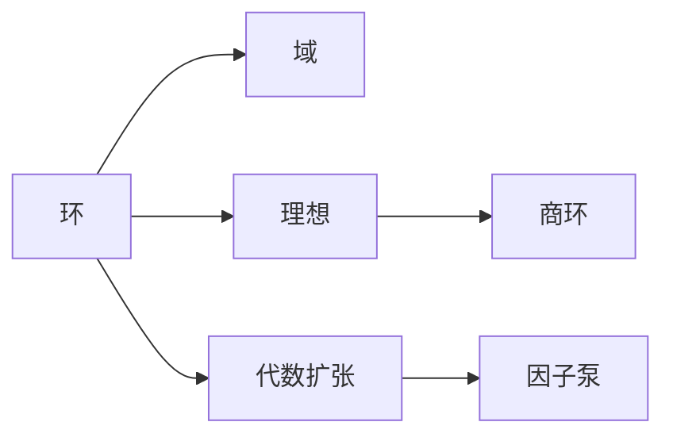

# 环与代数：代数的扩张与因子泵

## 1.背景介绍

### 1.1 代数学的发展历程

代数学是数学的一个重要分支,它研究代数结构,如群、环、域等。代数学的发展可以追溯到古代巴比伦和古埃及,他们使用代数方法解决实际问题。近代代数学的发展始于19世纪,随着抽象代数概念的引入,代数学进入了一个新的阶段。

### 1.2 环论和域论的兴起

环论和域论是现代抽象代数的核心内容。环是一种代数结构,它是一个集合,在加法和乘法运算下满足一定的性质。域是一种特殊的环,它的非零元素对于乘法构成一个群。环论和域论为研究多项式、矩阵、代数数等代数对象提供了理论基础。

### 1.3 代数扩张与因子泵的意义

代数扩张是指在原有代数系统的基础上,通过添加新的元素或运算来构造一个新的代数系统。因子泵是一种代数扩张的方法,它利用幂零元构造新的环和域。代数扩张与因子泵为研究代数结构提供了新的思路和工具,在代数几何、数论等领域有广泛应用。

## 2.核心概念与联系

### 2.1 环的定义与性质

环是一个集合R,配备两个二元运算+和·,满足以下性质:

1. (R,+)是一个交换群。
2. (R,·)是一个半群。
3. 乘法对加法满足分配律。

环可分为交换环、幺环、除环、域等不同类型。

### 2.2 域的定义与性质

域是一个环D,满足以下性质:

1. (D,+)是一个交换群。
2. (D\{0},·)是一个交换群。

域是一种特殊的环,它的非零元素对于乘法构成一个群。常见的域有有理数域、实数域、复数域等。

### 2.3 理想与商环

设R为环,R的子集I称为R的理想,如果:

1. (I,+)是(R,+)的子群。
2. 对任意的r∈R,a∈I,有ra∈I。

对环R和理想I,可以定义商环R/I。商环上的运算通过等价类的运算来定义。

### 2.4 代数扩张的概念

代数扩张是指在原有代数系统的基础上,通过添加新的元素或运算来构造一个新的代数系统。代数扩张可以用于构造新的环、域或其他代数结构。常见的代数扩张包括域扩张、张量积等。

### 2.5 因子泵的定义

因子泵是一种特殊的代数扩张方法。设R是幺环,a∈R是幂零元,即存在正整数n使得a^n=0。令S=R[x]/(x^n),则S是一个环,称为R关于a的n阶因子泵。因子泵利用幂零元构造了一个新的环,该环包含原环R为子环。

### 2.6 概念之间的联系

下图展示了环、域、理想、商环、代数扩张、因子泵之间的关系:



## 3.核心算法原理具体操作步骤

### 3.1 构造因子泵的步骤

给定幺环R和幂零元a∈R,构造因子泵S=R[x]/(x^n)的步骤如下:

1. 构造多项式环R[x]。
2. 在R[x]中,找到由x^n生成的理想(x^n)。
3. 构造商环S=R[x]/(x^n)。

在因子泵S中,元素可以表示为多项式形式r_0+r_1x+...+r_{n-1}x^{n-1},其中r_i∈R。

### 3.2 因子泵中的运算

设S=R[x]/(x^n)是R关于幂零元a的n阶因子泵,对于S中的元素f(x)=r_0+r_1x+...+r_{n-1}x^{n-1}和g(x)=s_0+s_1x+...+s_{n-1}x^{n-1},它们的加法和乘法运算如下:

1. 加法:f(x)+g(x)=(r_0+s_0)+(r_1+s_1)x+...+(r_{n-1}+s_{n-1})x^{n-1}
2. 乘法:f(x)g(x)=t_0+t_1x+...+t_{n-1}x^{n-1},其中t_k=∑_{i+j=k}r_is_j,k=0,1,...,n-1

因子泵中的运算可以看作是多项式环中的运算,再模去(x^n)得到的结果。

### 3.3 因子泵的性质

因子泵S=R[x]/(x^n)具有以下性质:

1. S是一个环,R是S的子环。
2. 若R是交换环,则S也是交换环。
3. 若R是幺环,则S也是幺环。
4. 若R是域,且n=2,则S是域。

因子泵为研究环和域的性质提供了一种新的视角。

## 4.数学模型和公式详细讲解举例说明

### 4.1 环的公理化定义

环是一个代数结构(R,+,·),其中R是一个集合,+和·是R上的二元运算,满足以下公理:

1. (R,+)是交换群:
   - 结合律:对任意a,b,c∈R,有(a+b)+c=a+(b+c)
   - 交换律:对任意a,b∈R,有a+b=b+a
   - 单位元:存在0∈R,使得对任意a∈R,有a+0=0+a=a
   - 逆元:对任意a∈R,存在-a∈R,使得a+(-a)=(-a)+a=0
2. (R,·)是半群:
   - 结合律:对任意a,b,c∈R,有(a·b)·c=a·(b·c)
3. 乘法对加法满足分配律:
   - 左分配律:对任意a,b,c∈R,有a·(b+c)=a·b+a·c
   - 右分配律:对任意a,b,c∈R,有(a+b)·c=a·c+b·c

例如,整数集Z在通常的加法和乘法运算下构成一个环(Z,+,·)。

### 4.2 域的公理化定义

域是一个代数结构(D,+,·),其中D是一个集合,+和·是D上的二元运算,满足以下公理:

1. (D,+)是交换群
2. (D\{0},·)是交换群
3. 乘法对加法满足分配律

例如,有理数集Q在通常的加法和乘法运算下构成一个域(Q,+,·)。

### 4.3 理想的定义与性质

设R为环,R的子集I称为R的理想,如果:

1. (I,+)是(R,+)的子群
2. 对任意的r∈R,a∈I,有ra∈I

理想具有以下性质:

1. {0}和R都是R的理想。
2. 若I,J是R的理想,则I∩J也是R的理想。
3. 若I,J是R的理想,则I+J={a+b:a∈I,b∈J}也是R的理想。

例如,在环(Z,+,·)中,偶数集2Z={2k:k∈Z}是一个理想。

### 4.4 商环的构造

设R为环,I是R的理想。定义关系~:对任意a,b∈R,a~b当且仅当a-b∈I。可以证明~是R上的等价关系。

令R/I={[a]:a∈R}为所有等价类的集合,其中[a]={b∈R:a~b}。在R/I上定义加法和乘法:

- [a]+[b]=[a+b]
- [a]·[b]=[ab]

可以证明上述运算定义良好,且(R/I,+,·)构成一个环,称为商环。

例如,对于环(Z,+,·)和理想2Z,可以构造商环Z/2Z={[0],[1]},它同构于布尔环({0,1},+,·)。

### 4.5 因子泵的构造

设R是幺环,a∈R是幂零元,即存在正整数n使得a^n=0。令S=R[x]/(x^n),其中R[x]是多项式环,(x^n)是由x^n生成的理想。

在S中,每个元素可以表示为r_0+r_1x+...+r_{n-1}x^{n-1},其中r_i∈R。因子泵S的加法和乘法运算如下:

- (r_0+r_1x+...+r_{n-1}x^{n-1})+(s_0+s_1x+...+s_{n-1}x^{n-1})=(r_0+s_0)+(r_1+s_1)x+...+(r_{n-1}+s_{n-1})x^{n-1}
- (r_0+r_1x+...+r_{n-1}x^{n-1})(s_0+s_1x+...+s_{n-1}x^{n-1})=t_0+t_1x+...+t_{n-1}x^{n-1},其中t_k=∑_{i+j=k}r_is_j

例如,设R=Z,a=2,n=3,则S=Z[x]/(x^3)是Z关于2的3阶因子泵。S中的元素可以表示为r_0+r_1x+r_2x^2,其中r_i∈Z。

## 5.项目实践：代码实例和详细解释说明

下面用Python实现环、域、理想、商环和因子泵的基本运算。

### 5.1 环的实现

```python
class Ring:
    def __init__(self, elements):
        self.elements = elements
        
    def add(self, a, b):
        return (a + b) % len(self.elements)
    
    def mul(self, a, b):
        return (a * b) % len(self.elements)
    
    def additive_inverse(self, a):
        return (-a) % len(self.elements)
```

这里实现了一个有限环,元素用整数0,1,...,n-1表示。加法和乘法运算通过模运算实现。

### 5.2 域的实现

```python
class Field(Ring):
    def multiplicative_inverse(self, a):
        if a == 0:
            raise ZeroDivisionError("Division by zero")
        for b in self.elements:
            if self.mul(a, b) == 1:
                return b
        raise ValueError(f"{a} has no multiplicative inverse")
```

域是一种特殊的环,它的非零元素都有乘法逆元。这里在环的基础上增加了求乘法逆元的方法。

### 5.3 理想和商环的实现

```python
class Ideal:
    def __init__(self, ring, generators):
        self.ring = ring
        self.generators = generators
        
    def contains(self, a):
        for g in self.generators:
            if self.ring.mul(a, g) in self.generators:
                return True
        return False
        
class QuotientRing:
    def __init__(self, ring, ideal):
        self.ring = ring
        self.ideal = ideal
        
    def equivalent(self, a, b):
        return self.ideal.contains(self.ring.add(a, self.ring.additive_inverse(b)))
    
    def add(self, a, b):
        return self.ring.add(a, b)
    
    def mul(self, a, b):
        return self.ring.mul(a, b)
```

理想是环的一个特殊子集,它对加法和乘法运算封闭。这里用生成元来表示理想。

商环是模去一个理想得到的新环。等价关系通过判断两个元素之差是否在理想中来实现。商环的加法和乘法运算直接继承自原环。

### 5.4 因子泵的实现

```python
class FactorPump:
    def __init__(self, ring, nilpotent, n):
        self.ring = ring
        self.nilpotent = nilpotent
        self.n = n
        
    def add(self, f, g):
        return [(f[i] + g[i]) % len(self.ring.elements) for i in range(self.n)]
    
    def mul(self, f, g):
        result = [0] * self.n
        for i in range(self.n):
            for j in range(i+1):
                result[i] += self.ring.mul(f[j], g[i-j])
            result[i] %= len(self.ring.elements)
        return result
```

因子泵是利用幂零元构造的新环。这里用列表表示因子泵中的元素,列表的第i项表示x^i项的系数。加法运算通过对应项相加实现,乘法运算通过多项式乘法实现。

以上代码实现了环、