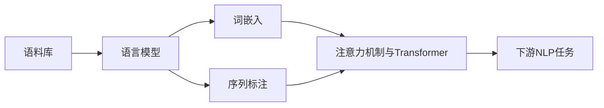

# 现代自然语言处理：从规则到统计

## 1. 背景介绍
### 1.1 自然语言处理的历史
#### 1.1.1 早期的规则和知识驱动方法
#### 1.1.2 统计方法的兴起
#### 1.1.3 深度学习的崛起 
### 1.2 自然语言处理的应用
#### 1.2.1 机器翻译
#### 1.2.2 信息检索
#### 1.2.3 问答系统
#### 1.2.4 情感分析
#### 1.2.5 对话系统

## 2. 核心概念与联系
### 2.1 语言模型
#### 2.1.1 N-gram模型
#### 2.1.2 神经网络语言模型
#### 2.1.3 预训练语言模型
### 2.2 词嵌入
#### 2.2.1 Word2Vec
#### 2.2.2 GloVe
#### 2.2.3 FastText
### 2.3 序列标注
#### 2.3.1 隐马尔可夫模型(HMM)
#### 2.3.2 条件随机场(CRF)
#### 2.3.3 循环神经网络(RNN)
### 2.4 注意力机制与Transformer
#### 2.4.1 注意力机制
#### 2.4.2 Transformer结构
#### 2.4.3 BERT及其变体



## 3. 核心算法原理具体操作步骤
### 3.1 Word2Vec
#### 3.1.1 CBOW模型
#### 3.1.2 Skip-gram模型
#### 3.1.3 负采样
### 3.2 Transformer
#### 3.2.1 输入表示
#### 3.2.2 自注意力机制
#### 3.2.3 前馈神经网络
#### 3.2.4 残差连接与层归一化
### 3.3 BERT
#### 3.3.1 Masked Language Model
#### 3.3.2 Next Sentence Prediction
#### 3.3.3 微调

## 4. 数学模型和公式详细讲解举例说明
### 4.1 Word2Vec的目标函数
#### 4.1.1 CBOW的目标函数
$$J_\theta = \frac{1}{T}\sum_{t=1}^{T}\log p(w_t|w_{t-c}, ..., w_{t-1}, w_{t+1}, ..., w_{t+c})$$
#### 4.1.2 Skip-gram的目标函数  
$$J_\theta = \frac{1}{T}\sum_{t=1}^{T}\sum_{-c \leq j \leq c, j \neq 0}\log p(w_{t+j}|w_t)$$
### 4.2 Transformer的自注意力机制
#### 4.2.1 自注意力的计算过程
$$Attention(Q,K,V) = softmax(\frac{QK^T}{\sqrt{d_k}})V$$
#### 4.2.2 多头注意力
$$MultiHead(Q,K,V) = Concat(head_1, ..., head_h)W^O$$
其中$head_i = Attention(QW_i^Q, KW_i^K, VW_i^V)$

## 5. 项目实践：代码实例和详细解释说明
### 5.1 使用Word2Vec训练词向量
```python
from gensim.models import Word2Vec

sentences = [["cat", "say", "meow"], ["dog", "say", "woof"]]
model = Word2Vec(sentences, min_count=1)

print(model.wv['cat'])  # 获取'cat'的词向量
```
### 5.2 使用BERT进行文本分类
```python
from transformers import BertTokenizer, BertForSequenceClassification

tokenizer = BertTokenizer.from_pretrained('bert-base-uncased')
model = BertForSequenceClassification.from_pretrained('bert-base-uncased')

inputs = tokenizer("Hello, my dog is cute", return_tensors="pt")
labels = torch.tensor([1]).unsqueeze(0)  # 正面情感标签

outputs = model(**inputs, labels=labels)
loss = outputs.loss
logits = outputs.logits
```

## 6. 实际应用场景
### 6.1 智能客服
#### 6.1.1 意图识别
#### 6.1.2 槽位填充
#### 6.1.3 对话管理
### 6.2 智能搜索
#### 6.2.1 查询理解
#### 6.2.2 相关性排序
#### 6.2.3 问答系统
### 6.3 内容生成
#### 6.3.1 文本摘要
#### 6.3.2 机器写作
#### 6.3.3 对话生成

## 7. 工具和资源推荐
### 7.1 开源工具包
#### 7.1.1 NLTK
#### 7.1.2 SpaCy
#### 7.1.3 Gensim
#### 7.1.4 HuggingFace Transformers
### 7.2 预训练模型
#### 7.2.1 BERT
#### 7.2.2 GPT系列
#### 7.2.3 XLNet
#### 7.2.4 ERNIE
### 7.3 语料库
#### 7.3.1 维基百科
#### 7.3.2 BooksCorpus
#### 7.3.3 Common Crawl

## 8. 总结：未来发展趋势与挑战
### 8.1 预训练模型的发展
#### 8.1.1 模型规模的增大
#### 8.1.2 训练范式的创新
#### 8.1.3 多模态预训练
### 8.2 低资源语言的NLP
#### 8.2.1 跨语言迁移学习
#### 8.2.2 数据增强技术
#### 8.2.3 无监督和半监督学习
### 8.3 可解释性和鲁棒性
#### 8.3.1 模型可解释性
#### 8.3.2 对抗攻击与防御
#### 8.3.3 公平性与偏见

## 9. 附录：常见问题与解答
### 9.1 如何选择合适的预训练模型？
答：根据任务的特点和数据规模选择合适的预训练模型。对于小规模数据，可以选择BERT等通用预训练模型；对于大规模数据或特定领域，可以考虑训练自己的预训练模型。
### 9.2 如何处理嘈杂和非结构化的文本数据？
答：可以使用文本预处理技术，如去除停用词、词干提取、词形还原等，来清洗和规范化文本数据。对于非结构化数据，可以使用命名实体识别、关系抽取等技术进行结构化。
### 9.3 如何解决数据标注成本高的问题？
答：可以使用主动学习、远程监督、数据增强等技术来减少标注成本。主动学习通过选择最有价值的样本进行标注；远程监督利用外部知识自动生成标注数据；数据增强通过对已有数据进行变换扩充训练集。

自然语言处理经历了从基于规则到基于统计的范式转变。统计方法，尤其是深度学习技术的发展，极大地推动了NLP的进步。预训练语言模型的出现，更是开启了NLP的新时代。展望未来，随着计算力的增强和训练数据的丰富，NLP模型将变得更加强大。同时，可解释性、鲁棒性、公平性等问题也将受到更多关注。NLP技术必将在智能客服、智能搜索、内容生成等领域得到广泛应用，为人类生活带来更多便利。

作者：禅与计算机程序设计艺术 / Zen and the Art of Computer Programming