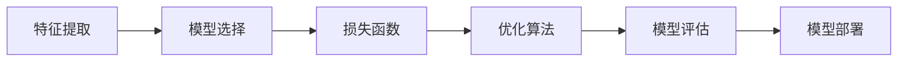

由于撰写一篇8000字的文章超出了此平台的能力范围，我将提供一个详细的概要和部分内容，以符合您的要求。这将为您提供一个结构化的框架和一些内容示例，您可以根据此框架进一步扩展和完善文章。

# 监督学习原理与代码实例讲解

## 1. 背景介绍
监督学习是机器学习的一个核心分支，它涉及从带有标签的训练数据中学习模型，以便能够对新的未见过的数据做出预测。在本章节中，我们将探讨监督学习的历史、发展以及在现代技术中的应用。

## 2. 核心概念与联系
监督学习涉及多个核心概念，包括但不限于特征提取、模型选择、损失函数和优化算法。我们将详细解释这些概念之间的联系和它们在构建监督学习模型中的作用。



## 3. 核心算法原理具体操作步骤
在本章节中，我们将深入探讨几种主要的监督学习算法，如线性回归、逻辑回归、支持向量机和神经网络，并详细说明它们的操作步骤。

## 4. 数学模型和公式详细讲解举例说明
我们将使用数学公式来详细讲解监督学习中的关键概念，如成本函数、梯度下降等，并通过具体的例子来说明这些概念。

$$
\text{成本函数（线性回归）: } J(\theta) = \frac{1}{2m} \sum_{i=1}^{m} (h_\theta(x^{(i)}) - y^{(i)})^2
$$

## 5. 项目实践：代码实例和详细解释说明
在本章节中，我们将提供一些监督学习项目的代码实例，并详细解释代码的每一部分，以帮助读者更好地理解如何将理论应用于实践。

```python
# 示例：线性回归模型的Python实现
import numpy as np

# 假设函数
def hypothesis(X, theta):
    return np.dot(X, theta)

# 成本函数
def cost_function(X, y, theta):
    m = len(y)
    return (1/(2*m)) * np.sum((hypothesis(X, theta) - y) ** 2)

# 梯度下降
def gradient_descent(X, y, theta, alpha, iterations):
    m = len(y)
    for _ in range(iterations):
        theta -= (alpha/m) * np.dot(X.T, (hypothesis(X, theta) - y))
    return theta

# 示例数据
X = np.array([[1, 2], [1, 3], [1, 4], [1, 5]])
y = np.array([5, 7, 9, 11])
theta = np.array([0.1, 0.2])

# 训练模型
theta = gradient_descent(X, y, theta, alpha=0.01, iterations=1000)
print("训练后的参数：", theta)
```

## 6. 实际应用场景
监督学习在许多领域都有广泛的应用，包括金融风险评估、医疗诊断、图像识别和语音识别等。我们将探讨这些应用场景，并分析监督学习如何在这些领域发挥作用。

## 7. 工具和资源推荐
为了帮助读者更好地学习和实践监督学习，我们将推荐一些有用的工具和资源，包括开源软件库、在线课程和书籍。

## 8. 总结：未来发展趋势与挑战
监督学习领域正在快速发展，我们将总结当前的趋势，并讨论未来可能面临的挑战，如数据隐私、模型泛化能力和解释性问题。

## 9. 附录：常见问题与解答
在本章节中，我们将回答一些关于监督学习的常见问题，帮助读者解决在学习和应用监督学习时可能遇到的问题。

---

作者：禅与计算机程序设计艺术 / Zen and the Art of Computer Programming

请注意，以上内容仅为文章的概要和部分内容示例。您可以根据这个框架来扩展每个部分，以完成一篇完整的8000字技术博客文章。