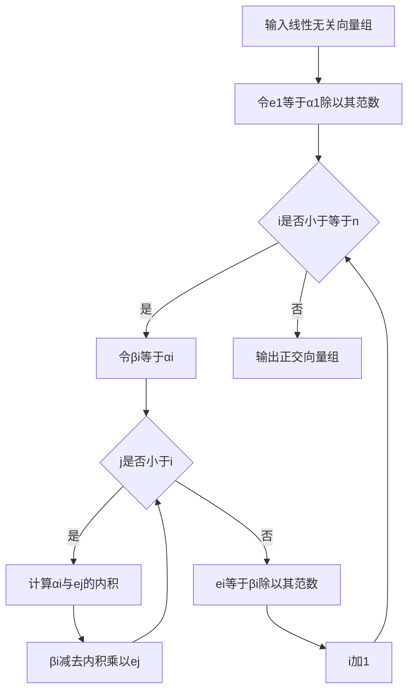
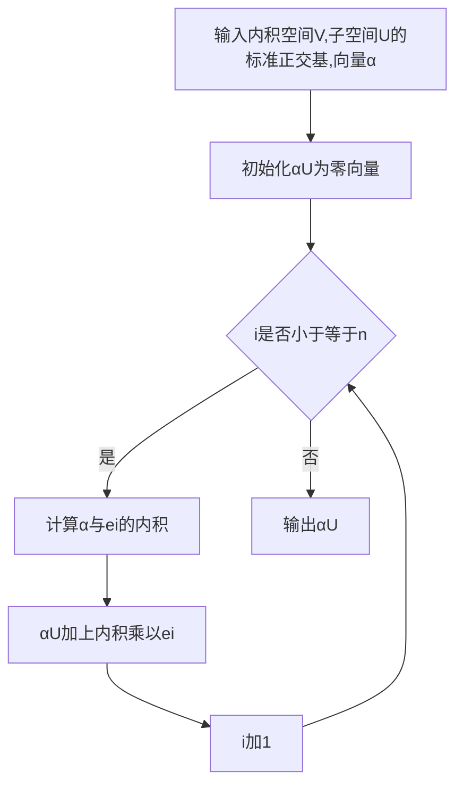

# 线性代数导引：内积空间

## 1.背景介绍
### 1.1 线性代数的重要性
线性代数是现代数学的重要分支,在科学、工程和计算机科学等领域有着广泛的应用。作为一门基础学科,线性代数为学习和研究其他数学分支以及相关应用领域奠定了坚实的基础。

### 1.2 内积空间的概念
内积空间是线性代数中一个重要的概念,它在泛函分析、量子力学等领域有着重要的应用。内积空间是一个带有内积运算的向量空间,内积运算赋予了向量空间一种度量结构,使得我们可以测量向量之间的夹角和长度等几何量。

### 1.3 学习内积空间的意义
学习内积空间有助于加深对线性代数的理解,掌握内积空间的概念和性质,能够更好地理解和运用线性代数的相关知识。同时,内积空间也是泛函分析、量子力学等领域的重要基础,学好内积空间对于进一步学习这些领域的知识有着重要的意义。

## 2.核心概念与联系
### 2.1 向量空间
#### 2.1.1 定义
向量空间是一个集合 $V$ ,其上定义了加法和数乘运算,满足以下性质:

1. 加法交换律:$\forall \alpha,\beta \in V, \alpha+\beta=\beta+\alpha$
2. 加法结合律:$\forall \alpha,\beta,\gamma \in V, (\alpha+\beta)+\gamma=\alpha+(\beta+\gamma)$
3. 零元素:$\exists \theta \in V, \forall \alpha \in V, \alpha+\theta=\alpha$
4. 负元素:$\forall \alpha \in V, \exists (-\alpha) \in V, \alpha+(-\alpha)=\theta$
5. 数乘结合律:$\forall \alpha \in V, \forall k,l \in \mathbb{F}, (kl)\alpha=k(l\alpha)$
6. 数乘分配律:$\forall \alpha,\beta \in V, \forall k \in \mathbb{F}, k(\alpha+\beta)=k\alpha+k\beta$
7. 数乘分配律:$\forall \alpha \in V, \forall k,l \in \mathbb{F}, (k+l)\alpha=k\alpha+l\alpha$
8. 数乘单位元:$\forall \alpha \in V, 1\alpha=\alpha$

其中 $\mathbb{F}$ 表示数域,通常取实数域 $\mathbb{R}$ 或复数域 $\mathbb{C}$ 。

#### 2.1.2 基与维数
向量空间 $V$ 的一个基是 $V$ 中的一个线性无关向量组,能够线性表示 $V$ 中的任意向量。$V$ 的维数定义为它的任意一个基中所含向量的个数。有限维向量空间的维数是有限的,无限维向量空间的维数是无穷的。

### 2.2 内积
#### 2.2.1 定义
设 $V$ 是数域 $\mathbb{F}$ 上的线性空间,如果映射 $\langle \cdot,\cdot \rangle : V \times V \to \mathbb{F}$ 满足以下性质:

1. 对称性:$\forall \alpha,\beta \in V, \langle \alpha,\beta \rangle=\langle \beta,\alpha \rangle$
2. 线性性:$\forall \alpha,\beta,\gamma \in V, \forall k \in \mathbb{F}, \langle \alpha+\beta,\gamma \rangle=\langle \alpha,\gamma \rangle+\langle \beta,\gamma \rangle, \langle k\alpha,\beta \rangle=k\langle \alpha,\beta \rangle$
3. 正定性:$\forall \alpha \in V, \langle \alpha,\alpha \rangle \geq 0$ ,且 $\langle \alpha,\alpha \rangle=0 \Leftrightarrow \alpha=\theta$

则称 $\langle \cdot,\cdot \rangle$ 是 $V$ 上的一个内积。

#### 2.2.2 常见内积
在 $\mathbb{R}^n$ 空间中,常见的内积有:

1. 点积(Dot Product):$\langle \boldsymbol{x},\boldsymbol{y} \rangle=\sum_{i=1}^n x_i y_i$
2. 加权内积:$\langle \boldsymbol{x},\boldsymbol{y} \rangle=\sum_{i=1}^n w_i x_i y_i$ ,其中 $w_i>0$ 。

在 $\mathbb{C}^n$ 空间中,常见的内积有:

1. 点积:$\langle \boldsymbol{x},\boldsymbol{y} \rangle=\sum_{i=1}^n x_i \bar{y_i}$
2. 加权内积:$\langle \boldsymbol{x},\boldsymbol{y} \rangle=\sum_{i=1}^n w_i x_i \bar{y_i}$ ,其中 $w_i>0$ 。

### 2.3 内积空间
#### 2.3.1 定义
内积空间是一个赋予了内积 $\langle \cdot,\cdot \rangle$ 的向量空间 $V$ ,记作 $(V,\langle \cdot,\cdot \rangle)$ 或简记为 $V$ 。

#### 2.3.2 性质
内积空间有许多良好的性质,例如:

1. 柯西-施瓦茨不等式:$\forall \alpha,\beta \in V, |\langle \alpha,\beta \rangle| \leq \|\alpha\| \|\beta\|$
2. 三角不等式:$\forall \alpha,\beta \in V, \|\alpha+\beta\| \leq \|\alpha\|+\|\beta\|$
3. 平行四边形等式:$\forall \alpha,\beta \in V, \|\alpha+\beta\|^2+\|\alpha-\beta\|^2=2(\|\alpha\|^2+\|\beta\|^2)$

其中 $\|\alpha\|=\sqrt{\langle \alpha,\alpha \rangle}$ 表示向量 $\alpha$ 的范数。

### 2.4 概念之间的联系
内积空间是向量空间的一种特殊形式,它在向量空间的基础上引入了内积运算,使得向量空间具有了度量的结构。内积空间中的向量不仅可以进行加法和数乘运算,还可以通过内积来度量向量之间的夹角和长度等几何量。

下图展示了向量空间与内积空间之间的关系:

## 3.核心算法原理具体操作步骤
### 3.1 Gram-Schmidt 正交化
#### 3.1.1 算法描述
Gram-Schmidt 正交化是一种将向量组正交化的算法,使得正交化后的向量组成为一组正交基。设 $\{\alpha_1,\alpha_2,\cdots,\alpha_n\}$ 是内积空间 $V$ 中的一组线性无关向量,Gram-Schmidt 正交化的过程如下:

1. 令 $e_1=\frac{\alpha_1}{\|\alpha_1\|}$
2. 对于 $i=2,3,\cdots,n$ ,令 $e_i=\frac{\beta_i}{\|\beta_i\|}$ ,其中
$$\beta_i=\alpha_i-\sum_{j=1}^{i-1} \langle \alpha_i,e_j \rangle e_j$$

#### 3.1.2 算法步骤
1. 输入:内积空间 $V$ 中的线性无关向量组 $\{\alpha_1,\alpha_2,\cdots,\alpha_n\}$
2. 令 $e_1=\frac{\alpha_1}{\|\alpha_1\|}$
3. 对于 $i=2,3,\cdots,n$ :
   1. 令 $\beta_i=\alpha_i$
   2. 对于 $j=1,2,\cdots,i-1$ :
      1. 计算 $\langle \alpha_i,e_j \rangle$
      2. 令 $\beta_i=\beta_i-\langle \alpha_i,e_j \rangle e_j$
   3. 令 $e_i=\frac{\beta_i}{\|\beta_i\|}$
4. 输出:正交向量组 $\{e_1,e_2,\cdots,e_n\}$

#### 3.1.3 算法流程图

### 3.2 正交投影
#### 3.2.1 定义
设 $U$ 是内积空间 $V$ 的一个子空间,对于任意 $\alpha \in V$ ,称
$$\alpha_U=\sum_{i=1}^n \langle \alpha,e_i \rangle e_i$$
为 $\alpha$ 在 $U$ 上的正交投影,其中 $\{e_1,e_2,\cdots,e_n\}$ 是 $U$ 的一组标准正交基。

#### 3.2.2 性质
设 $U$ 是内积空间 $V$ 的一个子空间,$\alpha \in V$ ,则

1. $\alpha_U \in U$
2. $\alpha-\alpha_U \perp U$
3. $\|\alpha-\alpha_U\|=\min_{\beta \in U} \|\alpha-\beta\|$

#### 3.2.3 计算步骤
1. 输入:内积空间 $V$ ,其子空间 $U$ 的一组标准正交基 $\{e_1,e_2,\cdots,e_n\}$ ,向量 $\alpha \in V$
2. 初始化 $\alpha_U=\theta$
3. 对于 $i=1,2,\cdots,n$ :
   1. 计算 $\langle \alpha,e_i \rangle$
   2. 令 $\alpha_U=\alpha_U+\langle \alpha,e_i \rangle e_i$
4. 输出:$\alpha$ 在 $U$ 上的正交投影 $\alpha_U$

#### 3.2.4 计算流程图

## 4.数学模型和公式详细讲解举例说明
### 4.1 内积的性质
#### 4.1.1 对称性
$\forall \alpha,\beta \in V, \langle \alpha,\beta \rangle=\langle \beta,\alpha \rangle$

**证明:**
由内积的定义可知,
$$\langle \alpha,\beta \rangle=\overline{\langle \beta,\alpha \rangle}$$
又因为内积的值域为实数域,所以
$$\langle \alpha,\beta \rangle=\langle \beta,\alpha \rangle$$

**例:**
在 $\mathbb{R}^2$ 中,取点积作为内积,对于向量 $\alpha=(1,2),\beta=(3,4)$ ,有
$$\langle \alpha,\beta \rangle=1 \times 3+2 \times 4=11$$
$$\langle \beta,\alpha \rangle=3 \times 1+4 \times 2=11$$
可见内积满足对称性。

#### 4.1.2 线性性
$\forall \alpha,\beta,\gamma \in V, \forall k \in \mathbb{F}$ ,有
$$\langle \alpha+\beta,\gamma \rangle=\langle \alpha,\gamma \rangle+\langle \beta,\gamma \rangle$$
$$\langle k\alpha,\beta \rangle=k\langle \alpha,\beta \rangle$$

**证明:**
对于第一个等式,由内积的定义可知,
$$\langle \alpha+\beta,\gamma \rangle=\sum_{i=1}^n (\alpha_i+\beta_i) \bar{\gamma_i}=\sum_{i=1}^n \alpha_i \bar{\gamma_i}+\sum_{i=1}^n \beta_i \bar{\gamma_i}=\langle \alpha,\gamma \rangle+\langle \beta,\gamma \rangle$$
对于第二个等式,同样由内积的定义可知,
$$\langle k\alpha,\beta \rangle=\sum_{i=1}^n (k\alpha_i) \bar{\beta_i}=k \sum_{i=1}^n \alpha_i \bar{\beta_i}=k\langle \alpha,\beta \rangle$$

**例:**
在 $\mathbb{R}^2$ 中,取点积作为内积,对于向量 $\alpha=(1,2),\beta=(3,4),\gamma=(5,6),k=2$ ,有
$$\langle \alpha+\beta,