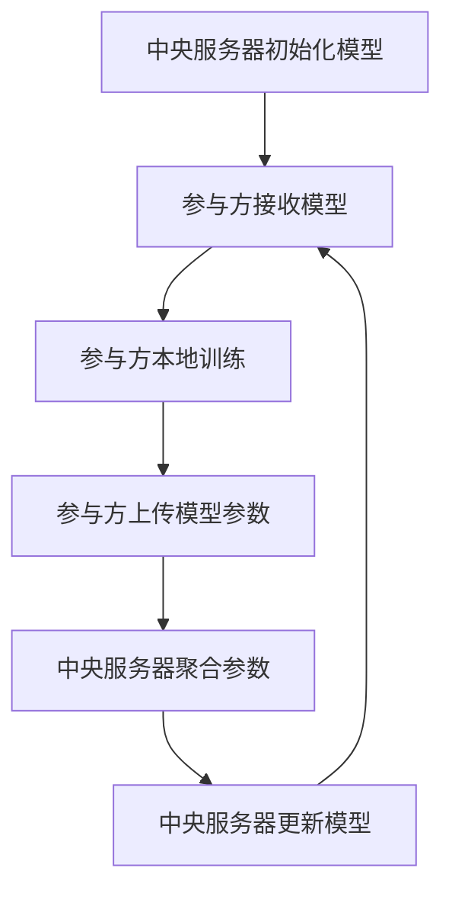

# 联邦学习 原理与代码实例讲解

## 1.背景介绍

随着数据隐私和安全问题的日益突出，传统的集中式机器学习方法面临着巨大的挑战。数据的集中存储和处理不仅增加了数据泄露的风险，还可能违反数据保护法规。联邦学习（Federated Learning）作为一种新兴的分布式机器学习方法，旨在解决这些问题。它允许多个参与方在不共享原始数据的情况下，共同训练一个全局模型，从而保护数据隐私。

## 2.核心概念与联系

### 2.1 联邦学习的定义

联邦学习是一种分布式机器学习方法，参与方在本地数据上训练模型，并将模型参数（如梯度）发送到中央服务器进行聚合。中央服务器将聚合后的参数发送回各参与方，更新本地模型。这个过程反复进行，直到模型收敛。

### 2.2 联邦学习的类型

联邦学习主要分为三种类型：

- **横向联邦学习**：参与方的数据特征相同，但样本不同。
- **纵向联邦学习**：参与方的数据样本相同，但特征不同。
- **联邦迁移学习**：参与方的数据样本和特征都不同。

### 2.3 联邦学习与传统分布式学习的区别

传统的分布式学习通常需要将数据集中到一个地方进行处理，而联邦学习则是在数据本地进行训练，只共享模型参数。这种方法不仅保护了数据隐私，还减少了数据传输的开销。

## 3.核心算法原理具体操作步骤

### 3.1 联邦平均算法（Federated Averaging, FedAvg）

联邦平均算法是联邦学习中最常用的算法，其基本步骤如下：

1. **初始化**：中央服务器初始化全局模型参数，并将其发送给所有参与方。
2. **本地训练**：每个参与方在本地数据上训练模型，计算梯度更新。
3. **参数上传**：每个参与方将本地模型参数上传到中央服务器。
4. **参数聚合**：中央服务器对所有参与方上传的参数进行加权平均，更新全局模型参数。
5. **参数下发**：中央服务器将更新后的全局模型参数发送给所有参与方。
6. **重复步骤2-5**，直到模型收敛。

### 3.2 联邦学习的工作流程图



## 4.数学模型和公式详细讲解举例说明

### 4.1 联邦平均算法的数学模型

假设有 $K$ 个参与方，每个参与方 $k$ 拥有本地数据集 $D_k$，其大小为 $n_k$。全局数据集的大小为 $N = \sum_{k=1}^{K} n_k$。联邦平均算法的目标是最小化全局损失函数：

$$
\min_{w} \sum_{k=1}^{K} \frac{n_k}{N} L_k(w)
$$

其中，$L_k(w)$ 是参与方 $k$ 的本地损失函数。

### 4.2 本地训练和参数聚合

在每一轮迭代中，参与方 $k$ 在本地数据集 $D_k$ 上训练模型，更新参数 $w_k$。然后，参与方将更新后的参数 $w_k$ 上传到中央服务器。中央服务器对所有参与方的参数进行加权平均，更新全局模型参数 $w$：

$$
w = \sum_{k=1}^{K} \frac{n_k}{N} w_k
$$

### 4.3 举例说明

假设有两个参与方 $A$ 和 $B$，其本地数据集大小分别为 $n_A = 100$ 和 $n_B = 200$。在某一轮迭代中，参与方 $A$ 和 $B$ 分别更新了本地模型参数 $w_A$ 和 $w_B$。中央服务器更新全局模型参数的过程如下：

$$
w = \frac{100}{300} w_A + \frac{200}{300} w_B
$$

## 5.项目实践：代码实例和详细解释说明

### 5.1 环境准备

首先，我们需要安装必要的Python库：

```bash
pip install numpy tensorflow
```

### 5.2 数据准备

我们使用MNIST数据集作为示例数据集。每个参与方将拥有部分MNIST数据。

```python
import numpy as np
import tensorflow as tf
from tensorflow.keras.datasets import mnist

# 加载MNIST数据集
(x_train, y_train), (x_test, y_test) = mnist.load_data()
x_train, x_test = x_train / 255.0, x_test / 255.0

# 将数据分割为两个参与方的数据集
x_train_A, x_train_B = np.split(x_train, 2)
y_train_A, y_train_B = np.split(y_train, 2)
```

### 5.3 模型定义

我们定义一个简单的神经网络模型：

```python
def create_model():
    model = tf.keras.models.Sequential([
        tf.keras.layers.Flatten(input_shape=(28, 28)),
        tf.keras.layers.Dense(128, activation='relu'),
        tf.keras.layers.Dropout(0.2),
        tf.keras.layers.Dense(10, activation='softmax')
    ])
    model.compile(optimizer='adam',
                  loss='sparse_categorical_crossentropy',
                  metrics=['accuracy'])
    return model
```

### 5.4 本地训练和参数上传

每个参与方在本地数据上训练模型，并将模型参数上传到中央服务器：

```python
# 参与方A的本地训练
model_A = create_model()
model_A.fit(x_train_A, y_train_A, epochs=5)
weights_A = model_A.get_weights()

# 参与方B的本地训练
model_B = create_model()
model_B.fit(x_train_B, y_train_B, epochs=5)
weights_B = model_B.get_weights()
```

### 5.5 参数聚合和更新

中央服务器对参与方上传的参数进行加权平均，更新全局模型参数：

```python
# 参数聚合
def aggregate_weights(weights_list):
    new_weights = []
    for weights in zip(*weights_list):
        new_weights.append(np.mean(weights, axis=0))
    return new_weights

# 更新全局模型参数
global_weights = aggregate_weights([weights_A, weights_B])

# 将全局模型参数下发给参与方
model_A.set_weights(global_weights)
model_B.set_weights(global_weights)
```

### 5.6 模型评估

在测试数据集上评估全局模型的性能：

```python
loss, accuracy = model_A.evaluate(x_test, y_test)
print(f'Global Model Accuracy: {accuracy}')
```

## 6.实际应用场景

### 6.1 医疗领域

在医疗领域，患者数据通常分布在不同的医院和医疗机构。联邦学习可以在不共享患者数据的情况下，联合多个医疗机构的数据，训练出更准确的疾病预测模型。

### 6.2 金融领域

在金融领域，不同银行和金融机构拥有大量的客户数据。联邦学习可以在保护客户隐私的前提下，联合多个机构的数据，训练出更有效的信用评分模型和欺诈检测模型。

### 6.3 智能设备

在智能设备领域，联邦学习可以在不上传用户数据的情况下，利用分布在各个设备上的数据，训练出更智能的语音识别和图像识别模型。

## 7.工具和资源推荐

### 7.1 开源框架

- **TensorFlow Federated (TFF)**：Google推出的联邦学习框架，支持在TensorFlow中实现联邦学习。
- **PySyft**：OpenMined社区开发的联邦学习和隐私保护机器学习框架，支持PyTorch和TensorFlow。

### 7.2 研究论文

- **Communication-Efficient Learning of Deep Networks from Decentralized Data**：提出了联邦平均算法的经典论文。
- **Federated Learning: Challenges, Methods, and Future Directions**：综述了联邦学习的挑战、方法和未来方向。

### 7.3 在线课程

- **Coursera - Federated Learning**：由Google推出的联邦学习在线课程，涵盖了联邦学习的基本概念和实践。

## 8.总结：未来发展趋势与挑战

### 8.1 发展趋势

随着数据隐私和安全问题的日益重要，联邦学习在各个领域的应用将越来越广泛。未来，联邦学习将与其他技术（如差分隐私和安全多方计算）结合，进一步提高数据隐私保护和模型性能。

### 8.2 挑战

尽管联邦学习具有许多优势，但仍面临一些挑战：

- **通信开销**：联邦学习需要频繁地在参与方和中央服务器之间传输模型参数，通信开销较大。
- **异构性**：参与方的数据分布和计算能力可能存在差异，如何处理这些异构性是一个重要问题。
- **安全性**：尽管联邦学习保护了数据隐私，但仍可能面临模型反向推理攻击等安全威胁。

## 9.附录：常见问题与解答

### 9.1 联邦学习与分布式学习有何不同？

联邦学习在数据本地进行训练，只共享模型参数，而分布式学习通常需要将数据集中到一个地方进行处理。

### 9.2 联邦学习如何保护数据隐私？

联邦学习通过在本地进行训练，不共享原始数据，从而保护数据隐私。

### 9.3 联邦学习的通信开销如何优化？

可以通过模型压缩、参数剪枝等技术减少通信开销。

### 9.4 联邦学习能否与其他隐私保护技术结合？

是的，联邦学习可以与差分隐私、安全多方计算等技术结合，进一步提高数据隐私保护。

### 9.5 联邦学习适用于哪些场景？

联邦学习适用于数据分布在多个参与方且不便于集中存储和处理的场景，如医疗、金融和智能设备等领域。

---

作者：禅与计算机程序设计艺术 / Zen and the Art of Computer Programming