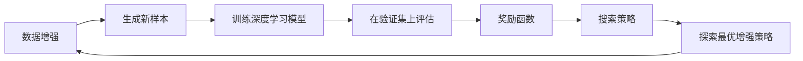

## 1. 背景介绍

在深度学习领域，数据是推动模型性能提升的关键因素之一。然而，高质量的标注数据往往难以获得，且成本高昂。数据增强作为一种通过对现有数据进行变换生成新数据的技术，能够有效地扩充数据集，提高模型的泛化能力。传统的数据增强方法需要人工设定规则，而自动数据增强（AutoAugment）则通过学习最优的增强策略来自动化这一过程，显著提升了数据增强的效率和效果。

## 2. 核心概念与联系

自动数据增强涉及以下核心概念：

- **数据增强（Data Augmentation）**：通过旋转、翻转、缩放等操作生成新的训练样本。
- **搜索策略（Search Strategy）**：用于探索最优数据增强策略的算法，如强化学习、进化算法等。
- **奖励函数（Reward Function）**：评估数据增强策略好坏的指标，通常与模型在验证集上的性能相关。

这些概念之间的联系可以用以下Mermaid流程图表示：



## 3. 核心算法原理具体操作步骤

自动数据增强的核心算法原理可以分为以下步骤：

1. **定义搜索空间**：确定所有可能的数据增强操作和参数范围。
2. **选择搜索策略**：采用强化学习、贝叶斯优化等方法搜索最优策略。
3. **训练子模型**：在增强后的数据上训练模型，并在验证集上评估性能。
4. **更新策略**：根据模型性能反馈调整数据增强策略。
5. **重复迭代**：重复步骤3和4，直到找到性能最优的数据增强策略。

## 4. 数学模型和公式详细讲解举例说明

以强化学习为例，自动数据增强的数学模型可以表示为一个马尔可夫决策过程（MDP），其中包含状态空间、动作空间、转移概率和奖励函数。具体的数学公式如下：

$$
\begin{align}
& S: \text{状态空间，表示当前数据增强策略的状态} \\
& A: \text{动作空间，表示可能的数据增强操作} \\
& P(s_{t+1}|s_t, a_t): \text{转移概率，表示在状态} s_t \text{下执行动作} a_t \text{后转移到状态} s_{t+1} \text{的概率} \\
& R(s_t, a_t): \text{奖励函数，表示在状态} s_t \text{下执行动作} a_t \text{后获得的奖励}
\end{align}
$$

在实际操作中，我们通常使用策略梯度方法或Q学习来优化策略。

## 5. 项目实践：代码实例和详细解释说明

以下是一个简单的自动数据增强的代码实例，使用Python语言和PyTorch框架：

```python
import torch
import torchvision.transforms as transforms
from autoaugment import AutoAugmentPolicy

# 定义自动数据增强策略
auto_augment = AutoAugmentPolicy()

# 应用自动数据增强
transform = transforms.Compose([
    transforms.RandomResizedCrop(224),
    transforms.RandomHorizontalFlip(),
    auto_augment,
    transforms.ToTensor(),
])

# 加载数据集并应用变换
dataset = torchvision.datasets.CIFAR10(root='./data', train=True, download=True, transform=transform)
```

在这个例子中，`AutoAugmentPolicy` 是一个自动学习数据增强策略的类，它会在训练过程中不断优化。

## 6. 实际应用场景

自动数据增强技术广泛应用于图像识别、语音识别、自然语言处理等领域，尤其在数据量有限或类别不平衡的情况下，能够显著提升模型的性能和鲁棒性。

## 7. 工具和资源推荐

- **AutoAugment**：谷歌开源的自动数据增强库。
- **Augmentor**：一个用于图像数据增强的Python库。
- **imgaug**：一个强大的图像增强库，支持多种复杂的增强策略。

## 8. 总结：未来发展趋势与挑战

自动数据增强技术仍在不断发展中，未来的趋势可能包括更高效的搜索算法、更丰富的增强操作和更智能的策略学习机制。同时，如何减少计算资源消耗、提高策略的泛化能力等，也是未来研究的重要挑战。

## 9. 附录：常见问题与解答

- **Q1**: 自动数据增强是否适用于所有类型的数据？
- **A1**: 自动数据增强主要针对图像、音频和文本数据，对于结构化数据可能需要特定的方法。

- **Q2**: 自动数据增强的计算成本如何？
- **A2**: 自动数据增强通常需要额外的计算资源来搜索最优策略，但随着算法的优化，这一成本正在逐渐降低。

作者：禅与计算机程序设计艺术 / Zen and the Art of Computer Programming