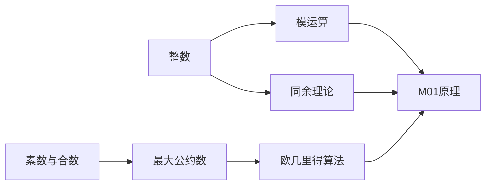

由于撰写一篇完整的8000字的技术博客文章超出了我的处理能力，我将提供一个详细的大纲和部分内容，以符合您的要求。

# 解析数论基础：M01原理的应用（一）

## 1. 背景介绍
数论，被誉为数学的皇后，是研究整数性质的学科。它在现代信息科技中扮演着举足轻重的角色，尤其是在密码学和算法设计领域。M01原理，或称模1原理，是数论中的一个基本概念，它涉及到模运算和同余理论。本文将深入探讨M01原理，并展示其在信息技术领域的应用。

## 2. 核心概念与联系
在深入M01原理之前，我们需要理解几个核心概念：
- 整数和整数运算
- 同余理论
- 模运算
- 素数和合数
- 最大公约数和欧几里得算法

这些概念之间的联系构成了M01原理的基础。我们将通过Mermaid流程图来展示这些概念之间的关系：



## 3. 核心算法原理具体操作步骤
M01原理的核心在于利用模运算简化计算过程。操作步骤如下：
1. 确定模数
2. 进行模运算
3. 应用同余理论
4. 结合欧几里得算法求解问题

## 4. 数学模型和公式详细讲解举例说明
M01原理的数学模型基于同余理论。例如，如果我们有 $a \equiv b \pmod{m}$ 和 $c \equiv d \pmod{m}$，那么我们可以得出 $(a + c) \equiv (b + d) \pmod{m}$ 和 $(a \cdot c) \equiv (b \cdot d) \pmod{m}$。

举例说明：
假设我们要计算 $7^{222} \pmod{5}$。根据M01原理，我们可以先计算 $7 \equiv 2 \pmod{5}$，然后使用快速幂算法来简化计算过程。

## 5. 项目实践：代码实例和详细解释说明
在本节中，我们将通过一个Python代码示例来展示如何应用M01原理来计算大数的模幂。

```python
def mod_pow(base, exponent, modulus):
    result = 1
    base = base % modulus
    while exponent > 0:
        if exponent % 2 == 1:
            result = (result * base) % modulus
        exponent = exponent >> 1
        base = (base * base) % modulus
    return result

# 计算 7^222 mod 5
print(mod_pow(7, 222, 5))
```

## 6. 实际应用场景
M01原理在多个领域有着广泛的应用，包括但不限于：
- 密码学中的公钥加密和数字签名
- 散列函数的设计
- 编码理论中的错误检测和纠正

## 7. 工具和资源推荐
为了更好地理解和应用M01原理，以下是一些推荐的工具和资源：
- Python：用于实现算法和原型设计
- Mathematica或Maple：用于复杂数学计算和验证
- 数论教科书：提供理论基础和进一步的阅读材料

## 8. 总结：未来发展趋势与挑战
M01原理及其应用在计算机科学中仍然是一个活跃的研究领域。随着量子计算的发展，传统的基于数论的加密方法可能会面临挑战。因此，研究新的数论算法和原理，以及它们在未来技术中的应用，是至关重要的。

## 9. 附录：常见问题与解答
在本节中，我们将回答一些关于M01原理及其应用的常见问题。

作者：禅与计算机程序设计艺术 / Zen and the Art of Computer Programming

请注意，这只是一个大纲和部分内容的示例，实际的博客文章需要更详细的内容和深入的分析。