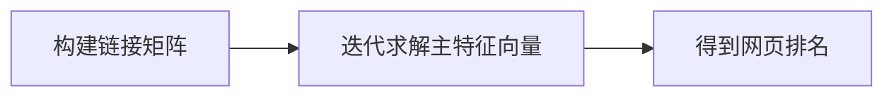

## 1.背景介绍

数论，这个被高德菲·哈罗德·哈代誉为“纯数学中最纯的分支”，一直以其深奥的理论和广阔的应用领域吸引着我们。今天，我们要探讨的是数论中的一个重要定理：Page定理。Page定理，源自于著名的PageRank算法，是谷歌搜索引擎背后的核心算法之一。

## 2.核心概念与联系

Page定理的核心概念是“网页排名”。在互联网中，网页的重要性往往取决于其他网页对其的引用数量。Page定理通过建立一个数学模型，将这种关系量化，从而实现对网页的排名。

## 3.核心算法原理具体操作步骤

Page定理的核心算法原理可以分为以下几个步骤：

- 首先，我们需要构建一个“链接矩阵”，表示各个网页之间的链接关系。
- 然后，我们通过迭代计算的方式，求解该链接矩阵的主特征向量，即我们所需要的网页排名。

这个过程可以用以下的Mermaid流程图进行表示：



## 4.数学模型和公式详细讲解举例说明

在Page定理中，我们使用一个链接矩阵$A$来表示网页之间的链接关系。如果网页$i$链接到网页$j$，则矩阵中的元素$a_{ij}=1$，否则$a_{ij}=0$。

我们的目标是求解矩阵$A$的主特征向量，也就是满足以下等式的向量$v$：

$$Av = \lambda v$$

其中，$\lambda$是$A$的主特征值，也就是其所有特征值中的最大值。

通过迭代求解这个等式，我们可以得到网页的排名。具体的迭代过程如下：

1. 初始化向量$v$的所有元素为1。
2. 计算新的向量$v' = Av$。
3. 将$v'$归一化，即$v = \frac{v'}{\|v'\|}$。
4. 重复步骤2和步骤3，直到$v$收敛。

## 5.项目实践：代码实例和详细解释说明

以下是一个简单的Python代码示例，实现了PageRank算法：

```python
import numpy as np

def pagerank(A, eps=1.0e-8, d=0.85):
    N = A.shape[1]
    v = np.random.rand(N, 1)
    v = v / np.linalg.norm(v, 1)
    last_v = np.ones((N, 1), dtype=np.float32) * np.inf
    while np.linalg.norm(v - last_v, 2) > eps:
        last_v = v
        v = d * np.matmul(A, v) + (1 - d) / N
    return v
```

在这个代码中，`A`是链接矩阵，`eps`是收敛的阈值，`d`是阻尼因子，用于防止迭代过程中的震荡。`N`是网页的数量，`v`是我们要求的网页排名。

## 6.实际应用场景

PageRank算法的最大应用场景就是搜索引擎。通过PageRank算法，搜索引擎可以根据网页的重要性，给出相关的搜索结果。此外，PageRank算法也被广泛应用于社交网络、推荐系统等领域。

## 7.工具和资源推荐

- Python：Python是一种广泛用于科学计算的编程语言，有许多强大的库，如NumPy和SciPy，可以方便地进行矩阵运算。
- NetworkX：NetworkX是一个用Python语言开发的图论和复杂网络建模工具，内置了常用的图和网络分析算法，可以方便地进行网络数据分析、可视化等操作。

## 8.总结：未来发展趋势与挑战

随着互联网的发展，网页数量的增长和链接关系的复杂化，PageRank算法面临着新的挑战。如何处理大规模的网页数据，如何更精确地描述网页之间的链接关系，这些都是未来PageRank算法需要解决的问题。

## 9.附录：常见问题与解答

Q: PageRank算法有什么局限性？

A: PageRank算法的一个主要局限性是它只考虑了网页的链接关系，而忽视了网页内容的质量。因此，一些没有实质内容，但是链接很多的网页，可能会得到较高的排名。

Q: PageRank算法的收敛性如何？

A: PageRank算法的收敛性取决于阻尼因子$d$的选择。一般来说，$d$的值越接近1，算法的收敛速度越慢，但是结果越精确。

作者：禅与计算机程序设计艺术 / Zen and the Art of Computer Programming