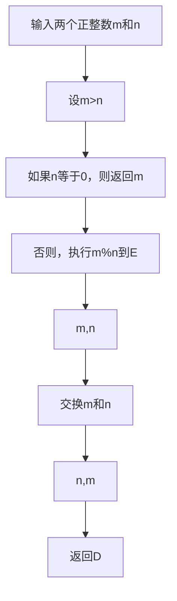

## 背景介绍

数论是数学的一个分支，主要研究整数的性质。在现代计算机科学中，数论的重要性日益凸显，特别是在密码学、算法设计、大数据处理等领域。本文旨在探讨数论的基础理论，特别是与渐进分析相关的概念，以及如何通过数学公式来描述和分析算法的时间复杂度。

## 核心概念与联系

### 渐进分析

渐进分析是用于描述函数随输入规模变化趋势的一种方法。在数论和算法分析中，我们经常关注的是算法运行时间或空间需求随着输入大小增长的方式。渐进分析用大O表示法、小o表示法、大Omega表示法和小omega表示法来描述这种趋势。

### 渐进公式

渐进公式是一种用来描述函数在特定输入范围内的行为的数学表达式。在数论中，最常使用的渐进公式是斯特林公式，它用于估计阶乘的值。此外，欧拉-马斯刻若尼恒等式和黎曼ζ函数也提供了对数论函数的重要渐进估计。

## 核心算法原理具体操作步骤

### 最小公倍数和最大公约数

最小公倍数（LCM）和最大公约数（GCD）是两个基本的数论概念。Euclid算法是一个高效的求解这两个问题的经典算法。以下是欧几里得算法的具体步骤：



### 哈希表分析

哈希表是数据结构之一，其性能依赖于哈希函数和散列表的大小。理想情况下，每个输入应该均匀地映射到散列表中的位置，从而实现O(1)的平均查找时间。然而，实际情况可能会因为冲突而变差。

## 数学模型和公式详细讲解举例说明

### 斯特林公式

斯特林公式用于估算阶乘的值。对于大数N，阶乘N!的近似值可以用斯特林公式给出：

$$ N! \\approx \\sqrt{2\\pi N} \\left(\\frac{N}{e}\\right)^N $$

### 欧拉-马斯刻若尼恒等式

欧拉-马斯刻若尼恒等式描述了自然对数的连续函数与调和级数之间的关系：

$$ \\lim_{n \\to \\infty} \\left( \\sum_{k=1}^n \\frac{1}{k} - \\ln(n) \\right) = \\gamma $$

其中γ是欧拉-马斯刻若尼常数。

### 黎曼ζ函数

黎曼ζ函数是一个定义在复数域上的函数，在数论中有广泛的应用。当s为实数且大于1时，ζ(s)的定义为：

$$ \\zeta(s) = \\sum_{n=1}^\\infty \\frac{1}{n^s} $$

对于特定值，例如ζ(2)，可以给出精确的闭形式：

$$ \\zeta(2) = \\frac{\\pi^2}{6} $$

## 项目实践：代码实例和详细解释说明

以下是一个简单的Python实现的欧几里得算法，用于计算最大公约数：

```python
def gcd(a, b):
    while b:
        a, b = b, a % b
    return a

# 示例调用
print(gcd(48, 18))  # 输出：6
```

## 实际应用场景

数论的概念在加密、压缩、大数据分析、图像处理等多个领域有着广泛的应用。例如，在RSA加密算法中，欧拉定理和欧拉-费马定理被用于保证加密的安全性和有效性。

## 工具和资源推荐

为了更好地理解和应用数论和渐进分析，以下是一些推荐的工具和资源：

- **数论软件**：SageMath 是一个免费的开源软件，用于进行数学计算，包括数论。
- **在线教程**：MIT 的 OpenCourseWare 提供了数论和算法的课程，适合深入学习。
- **论文和书籍**：《Introduction to the Theory of Numbers》和《Analytic Number Theory》是经典的数论教材。

## 总结：未来发展趋势与挑战

随着大数据和机器学习的兴起，对数论的需求不断增长，尤其是在数据加密、安全通信和算法优化方面。未来，随着量子计算的发展，数论在密码学中的应用将面临新的挑战和机遇。

## 附录：常见问题与解答

Q: 如何提高欧几里得算法的效率？

   A: 在实际应用中，可以通过引入缓存（记忆化）来避免重复计算相同值的最大公约数。这可以通过递归函数或动态规划实现。

Q: 为什么在加密算法中需要使用欧拉-马斯刻若尼常数？

   A: 欧拉-马斯刻若尼常数γ出现在某些加密算法的理论分析中，尤其是在估计密钥空间大小和安全性评估方面。虽然直接使用γ本身并不常见，但它体现了数论在加密领域中的深层次应用。

---
作者：禅与计算机程序设计艺术 / Zen and the Art of Computer Programming