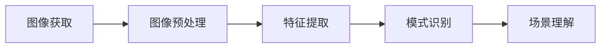
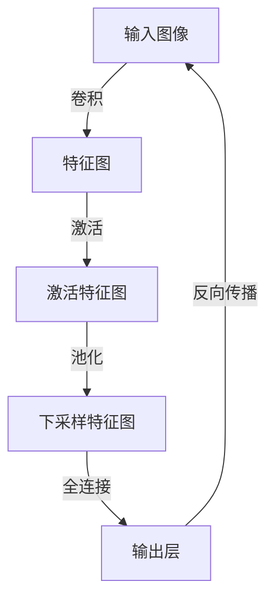

# 计算机视觉CV原理与代码实例讲解

## 1. 背景介绍
计算机视觉（Computer Vision，简称CV）是一门研究如何使机器“看”的科学。它涉及图像处理、模式识别、机器学习等多个领域，旨在让机器能够像人类一样理解和解释视觉世界。随着深度学习技术的兴起，计算机视觉已经取得了革命性的进展，广泛应用于自动驾驶、医疗影像、安防监控等多个领域。

## 2. 核心概念与联系
计算机视觉的核心概念包括图像识别、目标检测、图像分割、场景理解等。这些概念之间的联系在于它们共同构成了视觉信息处理的流程：从接收图像数据开始，到识别出图像中的具体对象，再到理解整个场景的内容。



## 3. 核心算法原理具体操作步骤
计算机视觉中的核心算法包括卷积神经网络（CNN）、循环神经网络（RNN）、生成对抗网络（GAN）等。以CNN为例，其操作步骤包括卷积层、激活层、池化层和全连接层的前向传播和反向传播过程。



## 4. 数学模型和公式详细讲解举例说明
以卷积层为例，其数学模型可以表示为：

$$
f_{ij}^{l} = \sigma\left(\sum_{m}\sum_{n}w_{mn}^{l}x_{i+m,j+n}^{l-1} + b^{l}\right)
$$

其中，$f_{ij}^{l}$ 是第 $l$ 层在位置 $(i, j)$ 的特征图，$w_{mn}^{l}$ 是卷积核的权重，$x_{i+m,j+n}^{l-1}$ 是上一层的输入，$b^{l}$ 是偏置项，$\sigma$ 是激活函数。

## 5. 项目实践：代码实例和详细解释说明
以Python和TensorFlow为例，构建一个简单的CNN模型进行手写数字识别：

```python
import tensorflow as tf
from tensorflow.keras import datasets, layers, models

# 加载数据集
(train_images, train_labels), (test_images, test_labels) = datasets.mnist.load_data()

# 数据预处理
train_images = train_images.reshape((60000, 28, 28, 1))
test_images = test_images.reshape((10000, 28, 28, 1))

# 归一化
train_images, test_images = train_images / 255.0, test_images / 255.0

# 构建模型
model = models.Sequential()
model.add(layers.Conv2D(32, (3, 3), activation='relu', input_shape=(28, 28, 1)))
model.add(layers.MaxPooling2D((2, 2)))
model.add(layers.Conv2D(64, (3, 3), activation='relu'))
model.add(layers.MaxPooling2D((2, 2)))
model.add(layers.Conv2D(64, (3, 3), activation='relu'))

# 添加全连接层
model.add(layers.Flatten())
model.add(layers.Dense(64, activation='relu'))
model.add(layers.Dense(10))

# 编译和训练模型
model.compile(optimizer='adam',
              loss=tf.keras.losses.SparseCategoricalCrossentropy(from_logits=True),
              metrics=['accuracy'])
model.fit(train_images, train_labels, epochs=5)

# 评估模型
test_loss, test_acc = model.evaluate(test_images,  test_labels, verbose=2)
print('\nTest accuracy:', test_acc)
```

## 6. 实际应用场景
计算机视觉技术在自动驾驶汽车中用于识别行人、车辆和交通标志，在医疗领域用于分析医学影像来辅助诊断，在零售业中用于商品识别和客户行为分析等。

## 7. 工具和资源推荐
- TensorFlow和PyTorch：两个主流的深度学习框架。
- OpenCV：一个开源的计算机视觉库。
- ImageNet：一个大规模的图像数据库，常用于训练和测试视觉模型。

## 8. 总结：未来发展趋势与挑战
计算机视觉的未来发展趋势包括更深层次的场景理解、无监督和半监督学习的发展、以及跨模态学习的探索。挑战则包括算法的泛化能力、计算资源的需求、以及隐私和伦理问题。

## 9. 附录：常见问题与解答
Q1: 计算机视觉和图像处理的区别是什么？
A1: 图像处理关注的是图像本身的改善和变换，而计算机视觉则是从图像中提取信息并进行理解和分析。

Q2: 如何选择合适的深度学习模型进行视觉任务？
A2: 需要根据具体任务的需求、数据集的特点以及计算资源的限制来选择合适的模型。

作者：禅与计算机程序设计艺术 / Zen and the Art of Computer Programming