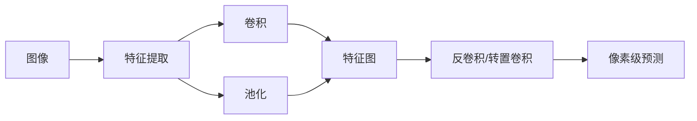

# 计算机视觉CV原理与代码实例讲解

## 1.背景介绍
### 1.1 计算机视觉的定义与发展历程
计算机视觉(Computer Vision,简称CV)是一门研究如何使计算机从图像或视频中获取高层次理解的科学。它旨在让计算机像人类一样"看"和"理解"视觉世界。计算机视觉起源于20世纪60年代,经过半个多世纪的发展,已经成为人工智能和计算机科学领域最活跃的研究方向之一。

### 1.2 计算机视觉的研究内容与应用领域
计算机视觉的研究内容涵盖图像处理、模式识别、机器学习等多个方面。主要研究问题包括:

- 图像分类:判断一幅图像所属的类别
- 目标检测:找出图像中感兴趣的目标并确定其位置和大小  
- 语义分割:对图像的每个像素进行分类
- 实例分割:检测出图像中不同的目标实例并对其进行分割
- 人体姿态估计:检测图像或视频中人体关键点的位置
- 人脸识别:识别出图像中的人脸身份
- ......

计算机视觉在工业、农业、医疗、安防、交通、零售等诸多领域都有广泛应用,如工业缺陷检测、农作物长势监测、医学影像分析、人脸识别考勤、无人驾驶、智能监控等。

### 1.3 计算机视觉的技术挑战
尽管计算机视觉取得了长足进步,但仍面临诸多技术挑战:

- 视觉世界的多样性:现实世界的视觉信息千变万化,存在形态、姿态、光照、背景等诸多变化因素,给视觉任务带来很大挑战。
- 视觉任务的复杂性:许多视觉任务如语义分割、实例分割等需要像素级别的精细理解,对算法的建模和推理能力要求很高。  
- 标注数据的稀缺性:许多视觉任务需要大量的人工标注数据进行模型训练,但高质量的标注数据获取成本高昂。
- 模型的泛化能力:如何让视觉模型学到鲁棒、泛化的视觉表征,在新场景新任务上保持良好性能是一大挑战。

## 2.核心概念与联系
### 2.1 计算机视觉的核心概念
#### 2.1.1 图像
图像是计算机视觉的基本处理单元,通常用一个H×W×C的多维数组表示,H、W、C分别表示图像的高度、宽度和通道数。常见的图像有RGB图像、灰度图像等。

#### 2.1.2 特征
特征是对输入图像进行某种变换得到的表征,能够表达图像所蕴含的视觉信息。常见的手工特征有SIFT、HOG等,深度学习时代主要依靠卷积神经网络学习层次化的特征表示。

#### 2.1.3 卷积
卷积是视觉算法中最常用的一种操作,通过滑动窗口对图像局部区域进行加权求和,可以提取图像的纹理、边缘等模式信息。卷积神经网络通过堆叠卷积层来提取层次化的特征。

#### 2.1.4 池化 
池化是一种下采样操作,通过对特征图的局部区域取最大值或平均值,可以增大感受野、减少参数量、提高平移不变性。常见的池化操作有最大池化和平均池化。

#### 2.1.5 反卷积/转置卷积
反卷积/转置卷积与卷积操作相反,通过插值可以对特征图进行上采样,在语义分割等像素级预测任务中广泛使用。反卷积并非卷积的逆操作,而是一种参数化的插值方法。

### 2.2 核心概念间的联系
下图展示了计算机视觉中几个核心概念间的联系:



从图像出发,通过交替使用卷积和池化操作,可以一步步提取出高级语义特征。之后,使用反卷积/转置卷积对特征图进行上采样,最终实现像素级的预测。卷积、池化、反卷积是构建视觉模型的基本组件。

## 3.核心算法原理具体操作步骤
### 3.1 目标检测
目标检测旨在找出图像中感兴趣的目标(如人脸、车辆等)并确定其位置和大小。经典的目标检测算法有Faster R-CNN、YOLO、SSD等。以YOLO为例,其主要步骤如下:

1. 将输入图像划分为S×S个网格
2. 对每个网格预测B个边界框、C个类别概率和1个objectness置信度得分
3. 根据置信度得分过滤边界框,并使用非极大值抑制去除冗余检测
4. 输出最终的检测结果,包括边界框位置和类别

### 3.2 图像分类
图像分类旨在判断一幅图像所属的类别。以经典的卷积神经网络分类模型为例,其主要步骤如下:

1. 对输入图像进行数据增强,如随机裁剪、翻转、颜色变换等
2. 将图像输入卷积神经网络,通过交替的卷积和池化操作提取特征  
3. 将卷积特征图展平并输入全连接层进行分类预测
4. 使用Softmax函数将预测结果转化为概率分布
5. 计算交叉熵损失并使用优化算法(如SGD)进行模型训练
6. 在测试集上评估模型性能

### 3.3 语义分割  
语义分割旨在对图像的每个像素进行类别标注。以FCN为代表的全卷积分割网络主要步骤如下:

1. 使用主干网络(如ResNet)提取图像特征
2. 通过1x1卷积将特征图通道数转换为类别数  
3. 使用反卷积/转置卷积对特征图进行上采样,恢复到输入图像的分辨率
4. 使用Softmax函数得到每个像素的类别概率
5. 计算逐像素的交叉熵损失并使用优化算法进行模型训练  
6. 在测试集上评估mIoU等分割指标

## 4.数学模型和公式详细讲解举例说明
### 4.1 Softmax函数
Softmax函数常用于多分类任务,将一组实数转化为概率分布。其数学定义为:

$$
\sigma(\mathbf{z})_i=\frac{e^{z_i}}{\sum_{j=1}^K e^{z_j}}, \quad i=1,2,\cdots,K
$$

其中$\mathbf{z}=(z_1,\cdots,z_K) \in \mathbb{R}^K$为一组实数,$\sigma(\mathbf{z})_i$表示第$i$个类别的概率。例如,对于一个3分类问题,模型的输出为$\mathbf{z}=(1.2, 2.5, -1.1)$,通过Softmax函数转化后得到概率分布:

$$
\sigma(\mathbf{z}) = (\frac{e^{1.2}}{e^{1.2}+e^{2.5}+e^{-1.1}}, \frac{e^{2.5}}{e^{1.2}+e^{2.5}+e^{-1.1}}, \frac{e^{-1.1}}{e^{1.2}+e^{2.5}+e^{-1.1}}) \approx (0.18, 0.76, 0.06)
$$

### 4.2 交叉熵损失
交叉熵损失常用于分类和分割任务的模型训练。对于一个样本,其交叉熵损失定义为:

$$
\mathcal{L}(\mathbf{y},\hat{\mathbf{y}})=-\sum_{i=1}^K y_i \log \hat{y}_i
$$

其中$\mathbf{y}=(y_1,\cdots,y_K)$为真实标签的one-hot编码,$\hat{\mathbf{y}}=(\hat{y}_1,\cdots,\hat{y}_K)$为模型预测的概率分布。例如,一个样本的真实标签为"猫",模型预测概率为$\hat{\mathbf{y}}=(0.1,0.2,0.7)$(分别对应"狗","猫","鸟"),则其交叉熵损失为:

$$
\mathcal{L}=-0 \log 0.1 - 1 \log 0.2 - 0 \log 0.7 \approx 1.61  
$$

### 4.3 IoU
IoU(Intersection over Union)常用于目标检测和实例分割任务的性能评估。其定义为两个边界框/掩码的交集面积除以并集面积:

$$
\text{IoU}=\frac{\text{Area of Intersection}}{\text{Area of Union}}
$$

例如,下图中红色和蓝色矩形框的IoU为:


$$
\text{IoU}=\frac{w \times h}{(W \times H)-(w \times h)} = \frac{4 \times 2}{(6 \times 4)-(4 \times 2)}=\frac{8}{16}=0.5
$$

## 5.项目实践:代码实例和详细解释说明
下面以PyTorch为例,给出几个计算机视觉任务的代码实践。

### 5.1 图像分类
```python
import torch
import torch.nn as nn
from torchvision import models, transforms

# 定义数据预处理
transform = transforms.Compose([
    transforms.Resize(256),
    transforms.CenterCrop(224),
    transforms.ToTensor(),
    transforms.Normalize(
        mean=[0.485, 0.456, 0.406], 
        std=[0.229, 0.224, 0.225]
    )])

# 加载预训练的ResNet18模型
model = models.resnet18(pretrained=True) 
num_ftrs = model.fc.in_features
model.fc = nn.Linear(num_ftrs, 10) # 假设有10个类别

# 定义损失函数和优化器  
criterion = nn.CrossEntropyLoss()
optimizer = torch.optim.SGD(model.parameters(), lr=0.001, momentum=0.9)

# 训练模型
num_epochs = 10
for epoch in range(num_epochs):
    for inputs, labels in train_loader:
        inputs = inputs.to(device)
        labels = labels.to(device)
        
        # 前向传播
        outputs = model(inputs)
        loss = criterion(outputs, labels)
        
        # 反向传播和优化
        optimizer.zero_grad()
        loss.backward()
        optimizer.step()

# 在测试集上评估模型
model.eval()
with torch.no_grad():
    correct = 0
    total = 0
    for images, labels in test_loader:
        images = images.to(device)
        labels = labels.to(device)
        outputs = model(images)
        _, predicted = torch.max(outputs.data, 1)
        total += labels.size(0)
        correct += (predicted == labels).sum().item()

    print('Accuracy: {} %'.format(100 * correct / total))
```

这个例子展示了如何使用PyTorch进行图像分类任务:
1. 定义图像的预处理操作,包括缩放、裁剪、转Tensor、归一化等
2. 加载预训练的ResNet18模型,并修改最后一层适应新的类别数
3. 定义交叉熵损失函数和SGD优化器
4. 进行模型训练,不断进行前向传播、计算损失、反向传播和参数更新
5. 在测试集上评估模型性能

### 5.2 目标检测
```python
import torch
import torch.nn as nn
from torchvision import models
from torchvision.models.detection.faster_rcnn import FastRCNNPredictor

# 加载预训练的Faster R-CNN模型
model = models.detection.fasterrcnn_resnet50_fpn(pretrained=True)

# 替换预测器的类别数
num_classes = 10 # 假设有10个类别(包括背景)
in_features = model.roi_heads.box_predictor.cls_score.in_features
model.roi_heads.box_predictor = FastRCNNPredictor(in_features, num_classes)

# 定义优化器
params = [p for p in model.parameters() if p.requires_grad]
optimizer = torch.optim.SGD(params, lr=0.005, momentum=0.9, weight_decay=0.0005)

# 训练模型  
num_epochs = 10
for epoch in range(num_epochs):
    for images, targets in train_loader:
        images = list(image.to(device) for