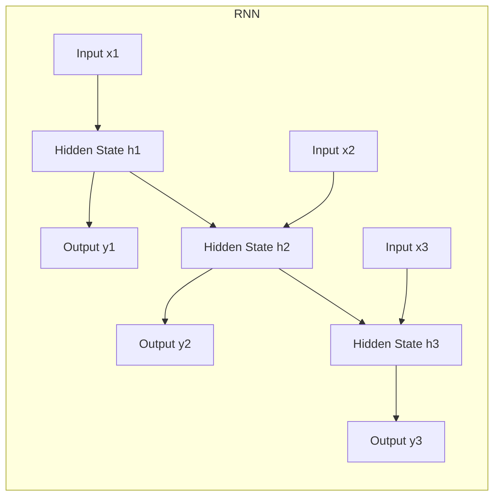
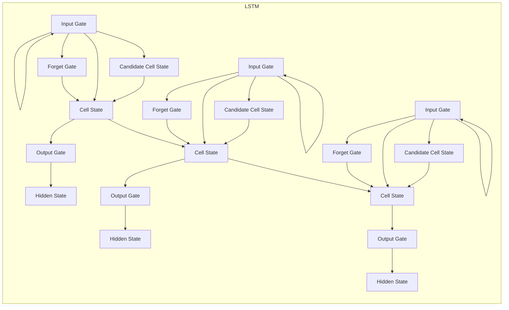

# 递归神经网络 原理与代码实例讲解

## 1.背景介绍

随着深度学习技术的不断发展,递归神经网络(Recurrent Neural Networks, RNNs)作为一种处理序列数据的有力工具,在自然语言处理、语音识别、时间序列预测等领域发挥着越来越重要的作用。与传统的前馈神经网络不同,RNN能够捕捉输入序列中的长期依赖关系,从而更好地建模和理解序列数据。

序列数据无处不在,比如文本、语音、视频等,都可以看作是一系列有序的元素序列。处理这种序列数据需要考虑元素之间的上下文关系,而RNN恰好能够通过内部状态的循环传递来捕获这种长期依赖关系。因此,RNN在自然语言处理、语音识别、机器翻译等领域有着广泛的应用前景。

### 1.1 序列数据处理的挑战

序列数据处理面临着一些独特的挑战:

1. **长期依赖关系**:序列中的元素之间可能存在长期的相关性,需要模型能够捕捉到这种长期依赖。
2. **可变长度输入**:与固定长度的输入不同,序列数据的长度通常是可变的,模型需要能够处理不同长度的输入。
3. **上下文相关性**:序列中的每个元素都与其上下文相关,需要模型能够利用上下文信息来更好地理解当前元素。

传统的机器学习模型如隐马尔可夫模型(HMM)和n-gram模型在处理长期依赖关系和利用上下文信息方面存在局限性。而RNN通过引入循环连接,使得网络能够在不同时间步之间传递状态信息,从而更好地捕捉序列数据中的长期依赖关系和上下文相关性。

## 2.核心概念与联系

### 2.1 RNN的基本结构

RNN是一种具有循环连接的神经网络,它将当前输入与前一时间步的隐藏状态相结合,通过非线性变换产生当前时间步的隐藏状态,并基于当前隐藏状态输出相应的预测结果。这种循环结构使得RNN能够在处理序列数据时,将之前的信息编码到隐藏状态中,从而捕捉长期依赖关系。

RNN的基本计算过程可以表示为:

$$
h_t = f_W(x_t, h_{t-1})
$$
$$
y_t = g_V(h_t)
$$

其中:
- $x_t$是时间步t的输入
- $h_t$是时间步t的隐藏状态
- $h_{t-1}$是前一时间步的隐藏状态
- $f_W$是计算隐藏状态的函数,通常使用非线性激活函数(如tanh或ReLU)
- $y_t$是时间步t的输出
- $g_V$是计算输出的函数,通常为仿射变换(affine transformation)

这种结构使得RNN能够在处理序列数据时,将之前的信息编码到隐藏状态中,从而捕捉长期依赖关系。然而,在实践中,传统的RNN存在梯度消失或爆炸的问题,难以有效捕捉长期依赖关系。为解决这一问题,出现了长短期记忆网络(LSTM)和门控循环单元(GRU)等变体。

### 2.2 LSTM和GRU

**长短期记忆网络(LSTM)**是RNN的一种变体,旨在解决传统RNN中梯度消失和爆炸的问题。LSTM通过引入门控机制和携带记忆细胞(Memory Cell),使得网络能够更好地控制信息的流动,从而捕捉长期依赖关系。

LSTM的核心思想是通过三个门(遗忘门、输入门和输出门)来控制信息的流动,并使用携带记忆细胞来存储长期状态。这种设计使得LSTM能够更好地捕捉长期依赖关系,并避免梯度消失或爆炸的问题。

**门控循环单元(GRU)**是另一种RNN变体,与LSTM类似,也旨在解决传统RNN中的梯度问题。GRU相对于LSTM结构更加简单,只包含两个门(重置门和更新门),并合并了LSTM中的遗忘门和输入门。

GRU的计算过程如下:

$$
z_t = \sigma(W_z x_t + U_z h_{t-1})
$$
$$
r_t = \sigma(W_r x_t + U_r h_{t-1})
$$
$$
\tilde{h}_t = \tanh(W x_t + U (r_t \odot h_{t-1}))
$$
$$
h_t = (1 - z_t) \odot h_{t-1} + z_t \odot \tilde{h}_t
$$

其中:
- $z_t$是更新门,控制了新状态中有多少来自当前输入
- $r_t$是重置门,控制了有多少之前的状态被忽略
- $\tilde{h}_t$是候选隐藏状态
- $\odot$表示元素wise乘积

GRU相比LSTM结构更加简单,在某些任务上表现也更加出色。但总的来说,LSTM和GRU在处理长期依赖关系方面都表现出了优越的能力。

## 3.核心算法原理具体操作步骤

在了解了RNN、LSTM和GRU的基本概念之后,我们来具体讲解它们的核心算法原理和操作步骤。

### 3.1 RNN前向传播

RNN的前向传播过程包括计算每个时间步的隐藏状态和输出。具体步骤如下:

1. 初始化隐藏状态$h_0$,通常将其设置为全0向量。
2. 对于每个时间步t:
    a. 计算当前时间步的隐藏状态$h_t$:
    $$h_t = f_W(x_t, h_{t-1})$$
    b. 计算当前时间步的输出$y_t$:
    $$y_t = g_V(h_t)$$
3. 重复步骤2,直到处理完整个序列。

其中,函数$f_W$和$g_V$通常使用仿射变换(affine transformation)和非线性激活函数(如tanh或ReLU)的组合来实现。

### 3.2 LSTM前向传播

LSTM的前向传播过程相对于RNN更加复杂,需要计算遗忘门、输入门、输出门和携带记忆细胞的状态。具体步骤如下:

1. 初始化携带记忆细胞$c_0$和隐藏状态$h_0$,通常将它们设置为全0向量。
2. 对于每个时间步t:
    a. 计算遗忘门$f_t$:
    $$f_t = \sigma(W_f x_t + U_f h_{t-1} + b_f)$$
    b. 计算输入门$i_t$:
    $$i_t = \sigma(W_i x_t + U_i h_{t-1} + b_i)$$
    c. 计算候选携带记忆细胞$\tilde{c}_t$:
    $$\tilde{c}_t = \tanh(W_c x_t + U_c h_{t-1} + b_c)$$
    d. 更新携带记忆细胞$c_t$:
    $$c_t = f_t \odot c_{t-1} + i_t \odot \tilde{c}_t$$
    e. 计算输出门$o_t$:
    $$o_t = \sigma(W_o x_t + U_o h_{t-1} + b_o)$$
    f. 计算当前时间步的隐藏状态$h_t$:
    $$h_t = o_t \odot \tanh(c_t)$$
3. 重复步骤2,直到处理完整个序列。

其中,$\sigma$表示sigmoid激活函数,$\odot$表示元素wise乘积。通过门控机制和携带记忆细胞,LSTM能够更好地捕捉长期依赖关系。

### 3.3 GRU前向传播

GRU的前向传播过程相对于LSTM更加简单,只需要计算重置门和更新门。具体步骤如下:

1. 初始化隐藏状态$h_0$,通常将其设置为全0向量。
2. 对于每个时间步t:
    a. 计算重置门$r_t$:
    $$r_t = \sigma(W_r x_t + U_r h_{t-1})$$
    b. 计算更新门$z_t$:
    $$z_t = \sigma(W_z x_t + U_z h_{t-1})$$
    c. 计算候选隐藏状态$\tilde{h}_t$:
    $$\tilde{h}_t = \tanh(W x_t + U (r_t \odot h_{t-1}))$$
    d. 更新隐藏状态$h_t$:
    $$h_t = (1 - z_t) \odot h_{t-1} + z_t \odot \tilde{h}_t$$
3. 重复步骤2,直到处理完整个序列。

GRU通过更新门和重置门来控制信息的流动,从而捕捉长期依赖关系。相比LSTM,GRU结构更加简单,在某些任务上表现也更加出色。

## 4.数学模型和公式详细讲解举例说明

在前面的章节中,我们已经介绍了RNN、LSTM和GRU的核心概念和算法原理。现在,我们将通过具体的数学模型和公式,进一步深入讲解它们的细节。

### 4.1 RNN的数学模型

RNN的核心数学模型可以表示为:

$$
h_t = f_W(x_t, h_{t-1}) = \phi(W_{xh} x_t + W_{hh} h_{t-1} + b_h)
$$
$$
y_t = g_V(h_t) = W_{hy} h_t + b_y
$$

其中:
- $x_t$是时间步t的输入
- $h_t$是时间步t的隐藏状态
- $h_{t-1}$是前一时间步的隐藏状态
- $y_t$是时间步t的输出
- $W_{xh}$、$W_{hh}$、$W_{hy}$分别是输入到隐藏层、隐藏层到隐藏层、隐藏层到输出层的权重矩阵
- $b_h$、$b_y$分别是隐藏层和输出层的偏置向量
- $\phi$是非线性激活函数,通常使用tanh或ReLU

让我们通过一个具体的例子来理解RNN的计算过程。假设我们有一个包含3个单词的序列"我 爱 学习",每个单词用一个one-hot向量表示,隐藏层大小为4,输出层大小为3(分别对应3个单词)。

1. 初始化隐藏状态$h_0$为全0向量。
2. 对于第一个单词"我":
    - 输入$x_1$是"我"对应的one-hot向量
    - 计算$h_1 = \tanh(W_{xh} x_1 + W_{hh} h_0 + b_h)$
    - 计算$y_1 = W_{hy} h_1 + b_y$
3. 对于第二个单词"爱":
    - 输入$x_2$是"爱"对应的one-hot向量
    - 计算$h_2 = \tanh(W_{xh} x_2 + W_{hh} h_1 +