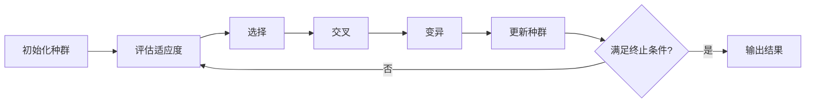

# 遗传算法(Genetic Algorithms) - 原理与代码实例讲解

## 1. 背景介绍
遗传算法（Genetic Algorithms，GA）是模拟生物进化过程的搜索算法，它由美国计算机科学家约翰·霍兰德（John Holland）在20世纪70年代初期提出。遗传算法的设计灵感来源于达尔文的自然选择理论，通过模拟自然界中生物的遗传和进化机制来解决优化问题。遗传算法在多目标优化、机器学习、人工智能等领域有着广泛的应用。

## 2. 核心概念与联系
遗传算法的核心概念包括种群（Population）、个体（Individual）、基因（Gene）、染色体（Chromosome）、适应度（Fitness）、选择（Selection）、交叉（Crossover）和变异（Mutation）。这些概念相互联系，共同构成了遗传算法的基本框架。

## 3. 核心算法原理具体操作步骤
遗传算法的操作步骤通常包括初始化种群、评估适应度、选择、交叉、变异和更新种群。这些步骤循环迭代，直到满足终止条件，如达到最大迭代次数或找到满意的解。



## 4. 数学模型和公式详细讲解举例说明
遗传算法的数学模型涉及适应度函数的定义，它是评价个体适应环境能力的量化指标。适应度函数的选择取决于具体问题，通常是优化问题的目标函数。例如，若目标是求函数 $f(x)$ 的最大值，则适应度函数可以定义为 $fitness(x) = f(x)$。

## 5. 项目实践：代码实例和详细解释说明
在项目实践中，我们将通过一个简单的优化问题来展示遗传算法的代码实现。假设我们要最大化函数 $f(x) = x^2$，其中 $x$ 的取值范围为 [0, 31]。

```python
import random

# 个体类
class Individual:
    def __init__(self, genes):
        self.genes = genes
        self.fitness = self.calc_fitness()

    def calc_fitness(self):
        # 将二进制基因序列转换为十进制
        x = int(''.join(map(str, self.genes)), 2)
        return x ** 2

# 初始化种群
def init_population(pop_size, gene_length):
    return [Individual([random.randint(0, 1) for _ in range(gene_length)]) for _ in range(pop_size)]

# 选择过程
def select(population):
    # 轮盘赌选择
    fitness_sum = sum(individual.fitness for individual in population)
    probs = [individual.fitness / fitness_sum for individual in population]
    return random.choices(population, weights=probs, k=2)

# 交叉过程
def crossover(parent1, parent2):
    # 单点交叉
    point = random.randint(1, len(parent1.genes) - 1)
    child1_genes = parent1.genes[:point] + parent2.genes[point:]
    child2_genes = parent2.genes[:point] + parent1.genes[point:]
    return Individual(child1_genes), Individual(child2_genes)

# 变异过程
def mutate(individual, mutation_rate):
    for i in range(len(individual.genes)):
        if random.random() < mutation_rate:
            individual.genes[i] = 1 - individual.genes[i]
    individual.fitness = individual.calc_fitness()

# 遗传算法主函数
def genetic_algorithm(pop_size, gene_length, mutation_rate, generations):
    population = init_population(pop_size, gene_length)
    for _ in range(generations):
        new_population = []
        for _ in range(pop_size // 2):
            parent1, parent2 = select(population)
            child1, child2 = crossover(parent1, parent2)
            mutate(child1, mutation_rate)
            mutate(child2, mutation_rate)
            new_population.extend([child1, child2])
        population = new_population
    return max(population, key=lambda ind: ind.fitness)

# 参数设置
POP_SIZE = 100
GENE_LENGTH = 5
MUTATION_RATE = 0.01
GENERATIONS = 100

# 运行遗传算法
best_individual = genetic_algorithm(POP_SIZE, GENE_LENGTH, MUTATION_RATE, GENERATIONS)
print(f'Best Individual: {best_individual.genes}, Fitness: {best_individual.fitness}')
```

## 6. 实际应用场景
遗传算法在工程优化、生物信息学、经济学、机器学习等多个领域有着广泛的应用。例如，在机器学习中，遗传算法可以用于特征选择和神经网络的结构优化。

## 7. 工具和资源推荐
对于遗传算法的实现，推荐使用Python语言，其相关库如DEAP（Distributed Evolutionary Algorithms in Python）提供了强大的遗传算法框架。

## 8. 总结：未来发展趋势与挑战
遗传算法作为一种启发式算法，在解决复杂优化问题方面具有独特优势。未来的发展趋势可能会集中在算法效率的提升、与其他优化算法的结合以及在更多领域的应用上。挑战则包括如何处理大规模、高维度的数据以及如何提高算法的稳定性和鲁棒性。

## 9. 附录：常见问题与解答
Q1: 遗传算法是否总能找到全局最优解？
A1: 遗传算法是一种启发式算法，它能够在合理的时间内找到较好的解，但不保证总是全局最优解。

Q2: 遗传算法的参数如何设置？
A2: 参数设置依赖于具体问题，通常需要通过实验来调整，如种群大小、交叉率和变异率等。

作者：禅与计算机程序设计艺术 / Zen and the Art of Computer Programming