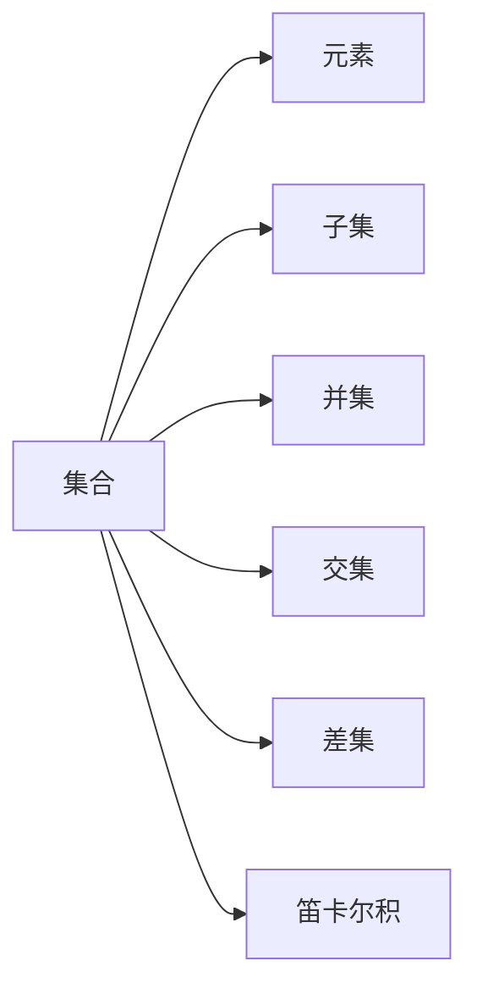

# 集合论导引：集合论语言及形式理论

## 1. 背景介绍

集合论是数学的一个基础分支，它研究集合以及集合间的关系和操作。集合论的语言和概念不仅在数学中无处不在，也是现代计算机科学的基石。在编程、数据库设计、人工智能等领域，集合论的理念和工具都发挥着重要作用。本文旨在介绍集合论的基本语言和形式理论，以及它们在信息技术领域中的应用。

## 2. 核心概念与联系

集合论的核心概念包括集合、元素、子集、并集、交集、差集、笛卡尔积等。集合是对象的汇集，元素是构成集合的对象。子集是包含在另一集合中的集合。并集、交集和差集描述了集合间的基本运算。笛卡尔积则是从两个集合中分别取元素组成有序对的集合。



## 3. 核心算法原理具体操作步骤

集合论中的核心算法包括集合的构建、集合运算以及集合的比较。构建集合通常从确定集合的元素开始，然后使用集合构造器定义集合。集合运算如并集、交集和差集的算法实现需要遍历集合元素并应用相应的逻辑判断。集合的比较则涉及到子集和相等性的判断。

## 4. 数学模型和公式详细讲解举例说明

集合论的数学模型基于逻辑和公理系统。例如，Zermelo-Fraenkel集合论（ZF）是一个广泛接受的集合论公理系统。公式如子集的定义可以表示为：

$$
A \subseteq B \iff \forall x (x \in A \rightarrow x \in B)
$$

这表示集合A是集合B的子集当且仅当A中的每个元素x也属于B。

## 5. 项目实践：代码实例和详细解释说明

在编程实践中，集合论的概念可以通过各种编程语言的数据结构来实现。以下是一个使用Python语言实现集合运算的简单例子：

```python
# 定义两个集合
A = {1, 2, 3}
B = {3, 4, 5}

# 并集
union = A | B
print("并集:", union)

# 交集
intersection = A & B
print("交集:", intersection)

# 差集
difference = A - B
print("差集:", difference)

# 笛卡尔积
cartesian_product = {(a, b) for a in A for b in B}
print("笛卡尔积:", cartesian_product)
```

## 6. 实际应用场景

集合论在IT领域有广泛的应用。在数据库中，SQL的查询语句就是基于集合论的。在编程中，数据结构如哈希表和树结构都与集合论有关。在人工智能领域，机器学习算法如聚类分析也使用了集合论的概念。

## 7. 工具和资源推荐

对于想深入学习集合论的读者，以下是一些推荐的资源和工具：

- 书籍：《Naive Set Theory》 by Paul R. Halmos
- 在线课程：Coursera上的“Introduction to Mathematical Thinking”
- 软件：Coq和Isabelle等证明助手可以用于形式化集合论证明

## 8. 总结：未来发展趋势与挑战

集合论作为数学和计算机科学的基础，其发展趋势与挑战与这两个领域的发展紧密相关。随着计算机科学的进步，集合论在处理大数据、并行计算和人工智能等方面的应用将会更加广泛。同时，集合论的深入研究也可能带来新的数学发现和理论。

## 9. 附录：常见问题与解答

Q1: 集合论在编程中有哪些实际应用？
A1: 集合论在编程中的应用包括数据结构设计、算法分析、数据库查询优化等。

Q2: 如何在编程中实现集合论的概念？
A2: 多数编程语言提供了集合数据类型或类库，可以直接使用这些工具来实现集合论的概念。

Q3: 集合论的学习对于计算机科学专业的学生有多重要？
A3: 集合论是计算机科学的基础之一，对于理解数据结构、算法和软件工程等领域至关重要。

作者：禅与计算机程序设计艺术 / Zen and the Art of Computer Programming