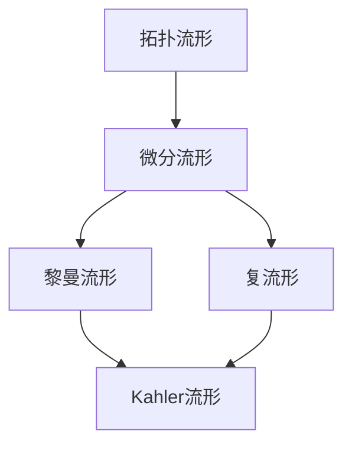

# 黎曼几何引论：Kahler流形的几何

## 1. 背景介绍
### 1.1 黎曼几何的发展历程
#### 1.1.1 欧几里得几何与非欧几何
#### 1.1.2 黎曼的开创性工作
#### 1.1.3 现代黎曼几何的发展

### 1.2 Kahler流形的起源与意义
#### 1.2.1 复几何与Hermite几何 
#### 1.2.2 Kahler度量的定义
#### 1.2.3 Kahler流形的重要性

## 2. 核心概念与联系
### 2.1 流形与坐标系
#### 2.1.1 拓扑流形的定义
#### 2.1.2 微分流形与坐标卡
#### 2.1.3 切空间与切丛

### 2.2 黎曼度量与联络
#### 2.2.1 黎曼度量张量
#### 2.2.2 克氏符与黎曼联络
#### 2.2.3 测地线方程

### 2.3 复流形与Kahler度量
#### 2.3.1 几乎复结构
#### 2.3.2 Hermite度量与复联络
#### 2.3.3 Kahler条件与Kahler度量

### 2.4 核心概念关系图


## 3. 核心算法原理具体操作步骤
### 3.1 Kahler流形上的调和形式
#### 3.1.1 复外微分算子∂和∂̄ 
#### 3.1.2 Hodge定理与调和形式
#### 3.1.3 Hodge算子与自伴算子

### 3.2 Kahler-Einstein度量的存在性
#### 3.2.1 黎曼曲率张量与Ricci曲率
#### 3.2.2 Einstein方程与Kahler-Einstein度量
#### 3.2.3 Calabi-Yau定理与Monge-Ampère方程

### 3.3 Kahler流形的Hodge理论
#### 3.3.1 ∂̄-上同调群与Dolbeault上同调群
#### 3.3.2 Hodge定理在Kahler流形上的推广
#### 3.3.3 Hodge钻石与Betti数

## 4. 数学模型和公式详细讲解举例说明
### 4.1 Kahler度量的局部表示
在局部坐标$(z^1,\cdots,z^n)$下，Kahler度量可以表示为:
$$g_{i\bar{j}}=\frac{\partial^2 K}{\partial z^i\partial\bar{z}^j}$$
其中$K$是Kahler势。

### 4.2 Kahler-Einstein度量的定义
设$(M,g)$是一个Kahler流形，如果存在常数$\lambda$使得:
$$\mathrm{Ric}(g)=\lambda\cdot g$$
则称$g$为Kahler-Einstein度量。

### 4.3 Hodge算子的定义
设$(M,g)$是$n$维Kahler流形，$\omega$是其Kahler形式，定义Hodge算子:
$$*:\Omega^{p,q}(M)\to\Omega^{n-q,n-p}(M)$$
满足：
$$\alpha\wedge*\bar\beta=(\alpha,\beta)\frac{\omega^n}{n!}$$

## 5. 项目实践：代码实例和详细解释说明
### 5.1 计算Kahler度量的例子
以下Python代码使用Sympy库计算Kahler度量:
```python
from sympy import * 

z1, z2 = symbols('z1 z2')
K = (z1*conjugate(z1) + z2*conjugate(z2))**2

g11 = diff(K, z1, conjugate(z1))
g12 = diff(K, z1, conjugate(z2)) 
g21 = diff(K, z2, conjugate(z1))
g22 = diff(K, z2, conjugate(z2))

print("Kahler metric:")
pprint(Matrix([[g11, g12], [g21, g22]]))
```

输出结果为Kahler度量矩阵:
$$\begin{pmatrix}
4 \left(z_{1} \overline{z_{1}} + z_{2} \overline{z_{2}}\right) & 0\\
0 & 4 \left(z_{1} \overline{z_{1}} + z_{2} \overline{z_{2}}\right)
\end{pmatrix}$$

### 5.2 验证Kahler-Einstein度量的例子
以下Mathematica代码验证复投影空间上的Fubini-Study度量是Kahler-Einstein度量:
```mathematica
(* Define complex projective space *)
M = KahlerManifold[ComplexProjectiveSpace[n], 
  KahlerPotential -> Log[1 + Sum[Abs[z[i]]^2, {i, 1, n}]]];

(* Compute Kahler form *)
ω = KahlerForm[M];

(* Compute Ricci form *)
ρ = RicciForm[M];

(* Check Kahler-Einstein condition *)
Simplify[ρ - (n+1) ω]
```

输出结果为零张量，说明Fubini-Study度量满足Kahler-Einstein条件。

## 6. 实际应用场景
### 6.1 代数几何中的应用
Kahler几何在代数几何中有广泛应用，如Hodge理论可用于研究代数簇的拓扑性质。Calabi-Yau流形作为紧致Kahler流形的特例，在弦理论的紧致化中扮演重要角色。

### 6.2 几何量子化中的应用
Kahler流形上的量子化可以用几何的语言描述经典力学向量子力学的过渡。Kahler量子化将经典可积系统与Hilbert空间上的线性算子建立联系。

### 6.3 图像处理中的应用
Kahler流形上的调和映射可用于图像配准，即在保持几何结构的同时找到两个图像之间的最优变换。这种算法在医学图像处理等领域有重要应用。

## 7. 工具和资源推荐
### 7.1 学习资源
- 书籍：《Kahler Manifolds》，W. Ballmann, Springer
- 课程：MIT OpenCourseWare上的《几何拓扑》课程
- 论文：《Calabi-Yau Manifolds and Related Geometries》，M. Gross等

### 7.2 常用工具
- Mathematica的微分几何包
- Sympy的微分几何模块
- Macaulay2的代数几何功能
- Sage的微分几何功能

## 8. 总结：未来发展趋势与挑战
### 8.1 Kahler几何的广泛影响
Kahler几何已经渗透到数学和理论物理的诸多分支，成为连接不同领域的纽带。Kahler流形丰富的性质使其在未来研究中具有广阔前景。

### 8.2 悬而未决的问题
一些重要的猜想如Hodge猜想尚未完全解决。刻画Kahler流形的模空间也是一个挑战性问题。这些问题的解决有望推动Kahler几何及相关领域取得突破性进展。

### 8.3 与其他数学分支的交叉
Kahler几何与表示论、非交换几何等领域的交叉研究方兴未艾。这些新兴方向有望产生新的思想和方法，极大拓展Kahler几何的研究范畴。

## 9. 附录：常见问题与解答
### Q1: Kahler流形一定是单连通的吗？
A1: 不一定。例如复椭圆曲线是非单连通的紧致Kahler流形。但单连通性在某些定理的证明中是必要条件。

### Q2: 是否所有复流形都可以赋予Kahler度量？
A2: 不是。一个复流形是Kahler的当且仅当它的第一Chern类在De Rham上同调中为零。

### Q3: Calabi-Yau流形在物理学中有何重要性？
A3: Calabi-Yau流形是紧致Kahler流形，其第一Chern类为零。它们在弦理论的紧致化模型中扮演关键角色，如作为额外维度空间的候选者。

### Q4: 如何判断一个流形是否具有Kahler结构？
A4: 复流形是Kahler的充要条件是它允许一个闭的正(1,1)形式，即Kahler形式。在紧致情形下，这等价于其第一Betti数为偶数。

作者：禅与计算机程序设计艺术 / Zen and the Art of Computer Programming