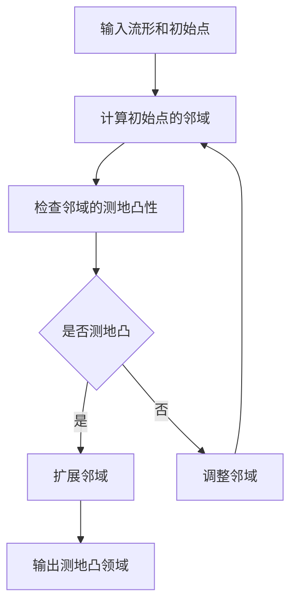

# 黎曼几何引论：测地凸领域

## 1.背景介绍

黎曼几何是现代数学和物理学中的一个重要分支，它研究的是曲面和更高维度流形上的几何性质。测地凸领域是黎曼几何中的一个重要概念，涉及到测地线、凸性和流形的局部和全局性质。测地线是流形上的最短路径，而测地凸领域则是指在这些路径上保持凸性的区域。

在计算机科学和人工智能领域，黎曼几何和测地凸领域有着广泛的应用。例如，在机器学习中，许多算法依赖于数据的几何结构，而这些结构可以通过黎曼几何来描述和分析。理解测地凸领域不仅有助于理论研究，还能为实际应用提供有力的工具。

## 2.核心概念与联系

### 2.1 流形

流形是一个局部类似于欧几里得空间的拓扑空间。简单来说，流形是一个可以在局部用坐标系描述的空间，但在全局上可能具有复杂的几何结构。

### 2.2 黎曼度量

黎曼度量是流形上的一个内积，它定义了流形上的距离和角度。通过黎曼度量，我们可以在流形上定义长度、面积和体积等几何量。

### 2.3 测地线

测地线是流形上的最短路径。它是通过最小化路径长度的变分问题得到的。测地线在黎曼几何中起着关键作用，因为它们是流形上最自然的曲线。

### 2.4 凸性

在欧几里得空间中，凸性是指一个集合中的任意两点之间的线段完全包含在该集合内。在黎曼几何中，凸性可以通过测地线来定义，即一个集合是测地凸的，如果它包含了任意两点之间的测地线。

### 2.5 测地凸领域

测地凸领域是指在流形上保持测地凸性的区域。这些区域在许多应用中非常重要，因为它们具有良好的几何性质，例如唯一性和稳定性。

## 3.核心算法原理具体操作步骤

### 3.1 测地线的计算

计算测地线通常涉及求解黎曼度量下的最短路径问题。这个问题可以通过求解一组二阶常微分方程（测地线方程）来解决。

### 3.2 测地凸性的判定

判定一个区域是否是测地凸的，可以通过检查该区域内任意两点之间的测地线是否完全包含在该区域内。这通常需要计算多个测地线并进行验证。

### 3.3 测地凸领域的构造

构造测地凸领域可以通过迭代算法来实现。首先选择一个初始点，然后逐步扩展该点的邻域，确保每一步都保持测地凸性。

### 3.4 算法流程图



## 4.数学模型和公式详细讲解举例说明

### 4.1 流形和黎曼度量

设 $M$ 是一个流形，$g$ 是 $M$ 上的黎曼度量。对于任意两个切向量 $X, Y \in T_pM$，$g$ 定义了一个内积 $g(X, Y)$。

### 4.2 测地线方程

测地线 $\gamma(t)$ 满足以下方程：

$$
\frac{D}{dt} \dot{\gamma}(t) = 0
$$

其中 $\frac{D}{dt}$ 是协变导数，$\dot{\gamma}(t)$ 是 $\gamma(t)$ 的速度向量。

### 4.3 测地凸性判定

设 $U \subset M$ 是一个子集，$U$ 是测地凸的，如果对于任意 $p, q \in U$，存在唯一的测地线 $\gamma$ 连接 $p$ 和 $q$，且 $\gamma \subset U$。

### 4.4 实例说明

考虑二维球面 $S^2$，其黎曼度量为：

$$
ds^2 = d\theta^2 + \sin^2(\theta) d\phi^2
$$

在 $S^2$ 上，测地线是大圆的弧。我们可以通过计算大圆弧的长度来验证某个区域是否是测地凸的。

## 5.项目实践：代码实例和详细解释说明

### 5.1 测地线计算代码

以下是一个使用Python和SciPy库计算测地线的示例代码：

```python
import numpy as np
from scipy.integrate import solve_ivp

def geodesic_equations(t, y, g_inv):
    n = len(y) // 2
    dydt = np.zeros_like(y)
    dydt[:n] = y[n:]
    dydt[n:] = -0.5 * np.einsum('ijk,j,k->i', g_inv, y[n:], y[n:])
    return dydt

def compute_geodesic(initial_point, initial_velocity, g_inv, t_span):
    y0 = np.hstack((initial_point, initial_velocity))
    sol = solve_ivp(geodesic_equations, t_span, y0, args=(g_inv,), dense_output=True)
    return sol

# 示例参数
initial_point = np.array([0.0, 0.0])
initial_velocity = np.array([1.0, 0.0])
g_inv = np.eye(2)  # 简单的欧几里得度量
t_span = (0, 10)

sol = compute_geodesic(initial_point, initial_velocity, g_inv, t_span)
print(sol.y)
```

### 5.2 代码解释

上述代码定义了一个计算测地线的函数 `compute_geodesic`，它使用SciPy的 `solve_ivp` 函数来求解测地线方程。`geodesic_equations` 函数定义了测地线方程，`g_inv` 是黎曼度量的逆矩阵。

### 5.3 测地凸性验证代码

以下是一个验证测地凸性的示例代码：

```python
def is_geodesically_convex(points, g_inv):
    for i in range(len(points)):
        for j in range(i + 1, len(points)):
            sol = compute_geodesic(points[i], points[j] - points[i], g_inv, (0, 1))
            if not np.all(np.isin(sol.y[:2], points)):
                return False
    return True

# 示例参数
points = np.array([[0.0, 0.0], [1.0, 0.0], [0.5, 0.5]])
print(is_geodesically_convex(points, g_inv))
```

### 5.4 代码解释

上述代码定义了一个函数 `is_geodesically_convex`，它检查给定的点集是否是测地凸的。通过计算每对点之间的测地线，并检查测地线是否完全包含在点集中。

## 6.实际应用场景

### 6.1 机器学习中的流形学习

在机器学习中，流形学习是一种用于降维和数据表示的方法。通过假设数据分布在一个低维流形上，可以更有效地进行数据分析和建模。测地凸领域在流形学习中起着重要作用，因为它们可以帮助定义和识别数据的局部结构。

### 6.2 计算机视觉中的图像处理

在计算机视觉中，图像可以看作是高维空间中的点。通过使用黎曼几何和测地凸领域，可以更好地理解和处理图像数据。例如，在图像分割和物体识别中，测地凸领域可以帮助定义和识别图像中的重要区域。

### 6.3 机器人导航

在机器人导航中，路径规划是一个关键问题。通过使用测地线和测地凸领域，可以更有效地规划机器人的路径，避免障碍物并找到最短路径。

## 7.工具和资源推荐

### 7.1 软件工具

- **SciPy**: 一个用于科学计算的Python库，提供了求解微分方程和优化问题的工具。
- **Geogebra**: 一个用于几何和代数计算的交互式软件，可以帮助可视化黎曼几何中的概念。
- **MATLAB**: 一个强大的数学计算工具，提供了丰富的函数库和可视化工具。

### 7.2 在线资源

- **arXiv**: 一个开放获取的学术论文预印本平台，包含大量关于黎曼几何和测地凸领域的最新研究。
- **MathWorld**: 一个在线数学百科全书，提供了详细的数学概念和公式解释。

### 7.3 书籍推荐

- **《黎曼几何引论》**: 这本书详细介绍了黎曼几何的基本概念和理论，是学习黎曼几何的经典教材。
- **《流形学习》**: 这本书介绍了流形学习的基本方法和应用，是机器学习领域的重要参考书。

## 8.总结：未来发展趋势与挑战

### 8.1 未来发展趋势

随着计算能力的提高和数据量的增加，黎曼几何和测地凸领域在计算机科学和人工智能中的应用将会越来越广泛。特别是在大数据和深度学习领域，理解数据的几何结构将变得越来越重要。

### 8.2 挑战

尽管黎曼几何和测地凸领域有着广泛的应用，但它们的计算复杂度和理论难度仍然是一个挑战。如何高效地计算测地线和验证测地凸性，仍然是一个需要进一步研究的问题。

## 9.附录：常见问题与解答

### 9.1 什么是黎曼几何？

黎曼几何是研究曲面和更高维度流形上的几何性质的数学分支。它通过黎曼度量定义了流形上的距离和角度。

### 9.2 什么是测地线？

测地线是流形上的最短路径。它是通过最小化路径长度的变分问题得到的。

### 9.3 什么是测地凸领域？

测地凸领域是指在流形上保持测地凸性的区域。一个区域是测地凸的，如果它包含了任意两点之间的测地线。

### 9.4 如何计算测地线？

计算测地线通常涉及求解黎曼度量下的最短路径问题。这个问题可以通过求解一组二阶常微分方程（测地线方程）来解决。

### 9.5 测地凸领域有哪些实际应用？

测地凸领域在机器学习、计算机视觉和机器人导航等领域有着广泛的应用。例如，在流形学习中，测地凸领域可以帮助定义和识别数据的局部结构。

---

作者：禅与计算机程序设计艺术 / Zen and the Art of Computer Programming