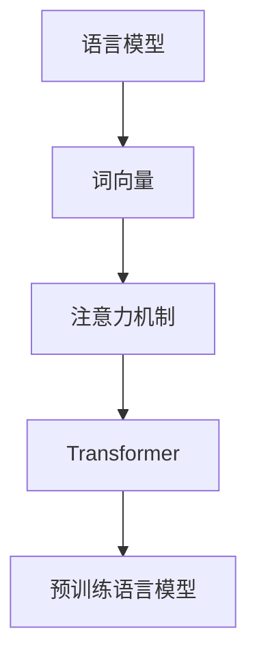

# AI Agent: AI的下一个风口 NLP

## 1. 背景介绍

在当今时代,人工智能(AI)已经渗透到我们生活的方方面面。从语音助手到自动驾驶汽车,从推荐系统到医疗诊断,AI无处不在。然而,AI的下一个风口或许就潜伏在自然语言处理(NLP)领域。

NLP是人工智能的一个分支,旨在使计算机能够理解、处理和生成人类语言。它是实现人机自然交互的关键技术,对于构建智能系统至关重要。随着大数据时代的到来和计算能力的不断提高,NLP技术正在突飞猛进的发展,催生出了一系列令人兴奋的应用。

### 1.1 NLP的重要性

语言是人类进行思维和交流的基础工具。掌握了语言处理的能力,计算机就可以更好地理解和服务于人类。NLP技术可以使计算机系统具备以下能力:

- 自然语言理解(NLU):理解人类语言的含义和语义
- 自然语言生成(NLG):生成人类可以理解的自然语言输出
- 语音识别:将人类语音转换为文本
- 语音合成:将文本转换为自然语音输出
- 机器翻译:在不同语言之间进行自动翻译
- 问答系统:回答人类提出的自然语言问题

掌握了这些能力,计算机就可以像人类一样与我们进行自然交流,极大地提高人机交互的效率和体验。

### 1.2 NLP的应用前景

NLP技术的应用前景是广阔的,它可以渗透到各个领域,为传统行业注入新的活力。以下是一些典型的应用场景:

- 智能助手:如Siri、Alexa等,可以通过自然语言与用户进行对话交互
- 客户服务:自动化的客户服务系统,可以回答用户的常见问题
- 内容生成:自动生成新闻报道、文案、故事等内容
- 信息检索:根据自然语言查询检索相关信息
- 情感分析:分析文本中的情感倾向,用于舆情监控等
- 智能教育:根据学生的语言能力提供个性化的教学内容和方式

总的来说,NLP技术将使人机交互更加自然、高效,并为各行各业带来革命性的变革。

## 2. 核心概念与联系

要深入理解NLP,我们需要掌握一些核心概念和技术。这些概念和技术相互关联、相辅相成,共同构筑了NLP的理论基础和技术体系。

### 2.1 语言模型

语言模型(Language Model)是NLP中最基础和最重要的概念之一。它是一种概率统计模型,用于估计一个句子或一段文本的概率。具体来说,给定一个文本序列$w_1, w_2, \ldots, w_n$,语言模型的目标是计算该序列的概率:

$$P(w_1, w_2, \ldots, w_n)$$

根据链式法则,我们可以将上式分解为:

$$P(w_1, w_2, \ldots, w_n) = \prod_{i=1}^{n}P(w_i|w_1, \ldots, w_{i-1})$$

也就是说,语言模型需要学习计算一个词出现的条件概率,给定前面的词序列。

语言模型在NLP中有着广泛的应用,例如机器翻译、语音识别、文本生成等,它们都需要计算文本序列的概率。一个好的语言模型可以捕捉语言的语法和语义特征,从而提高NLP系统的性能。

### 2.2 词向量

词向量(Word Embedding)是另一个核心概念,它将词映射到一个连续的向量空间中,使得语义相似的词在这个空间中彼此靠近。

具体来说,每个词$w_i$被表示为一个$d$维的向量$\vec{v_i} \in \mathbb{R}^d$,这个向量能够编码词的语义和句法信息。通过词向量,我们可以使用向量空间中的距离来度量词与词之间的相似性,也可以对词进行有意义的代数运算(如$\vec{king} - \vec{man} + \vec{woman} \approx \vec{queen}$)。

词向量通常是使用神经网络模型从大量文本数据中学习得到的,常用的模型包括Word2Vec、GloVe等。词向量技术极大地推动了NLP的发展,使得NLP模型能够更好地理解和表示词的语义信息。

### 2.3 注意力机制

注意力机制(Attention Mechanism)是NLP中一种广泛使用的技术,它允许模型在处理序列数据时,动态地关注输入序列的不同部分,并根据当前的任务目标分配不同的注意力权重。

在传统的序列模型(如RNN)中,每个时间步的隐藏状态都是基于前一时间步的隐藏状态和当前输入计算得到的,这种编码方式很难捕捉长距离依赖关系。注意力机制则允许模型直接关注输入序列中与当前任务相关的部分,从而更好地建模长距离依赖。

注意力机制在机器翻译、阅读理解、图像字幕生成等任务中发挥着关键作用,它使模型能够更好地关注输入的重要部分,提高了模型的性能和解释性。

### 2.4 transformer

Transformer是一种全新的基于注意力机制的序列模型,它完全摒弃了RNN的结构,使用多头自注意力(Multi-Head Attention)和位置编码(Positional Encoding)来建模序列数据。

Transformer的核心思想是允许每个位置的词向量直接关注其他所有位置的词向量,从而捕捉长距离依赖关系。它通过自注意力机制实现了这一点,使得模型可以同时关注输入序列的不同部分,而不需要按序遍历。

自从2017年被提出以来,Transformer模型在机器翻译、语言模型等任务上取得了卓越的成绩,成为NLP领域的主流模型之一。它的出现极大地推动了NLP技术的发展,催生了一系列基于Transformer的预训练语言模型,如BERT、GPT等。

### 2.5 预训练语言模型

预训练语言模型(Pre-trained Language Model)是近年来NLP领域的一个重大突破。它们通过在大规模无标注文本数据上进行预训练,学习通用的语言表示,然后在下游任务上进行微调(fine-tuning),从而显著提高了NLP系统的性能。

典型的预训练语言模型包括BERT、GPT、XLNet等。它们采用了Transformer的结构,并在预训练阶段设计了特殊的任务,如掩码语言模型(Masked Language Model)和下一句预测(Next Sentence Prediction),使模型能够学习到丰富的语义和上下文信息。

预训练语言模型的出现极大地推动了NLP技术的发展,它们在多项任务上取得了同期最佳性能,并被广泛应用于各种场景。未来,预训练语言模型将继续在NLP领域扮演重要角色。

### 2.6 核心概念关系

上述核心概念相互关联、相辅相成,共同构筑了NLP的理论基础和技术体系。它们的关系可以用下图概括:

语言模型是NLP的基石,它为后续的词向量、注意力机制等技术奠定了基础。词向量技术使得NLP模型能够更好地表示和理解词的语义信息。注意力机制则解决了序列模型难以捕捉长距离依赖的问题。Transformer模型将注意力机制发挥到了极致,成为NLP领域的主流模型。最后,预训练语言模型通过在大规模数据上预训练,进一步提升了NLP系统的性能。

掌握了这些核心概念及其关联,我们就能更好地理解NLP技术的本质,把握其发展脉络和趋势。

## 3. 核心算法原理具体操作步骤

在上一节中,我们介绍了NLP的核心概念和技术。接下来,我们将深入探讨其中一些算法的具体原理和操作步骤,以加深对NLP的理解。

### 3.1 Word2Vec

Word2Vec是一种广为人知的词向量训练算法,它由Google的Tomas Mikolov等人于2013年提出。Word2Vec能够从大量文本数据中学习出高质量的词向量表示,这些词向量能够很好地捕捉词与词之间的语义关系。

Word2Vec包含两个主要的模型:连续词袋模型(CBOW)和Skip-Gram模型。它们的目标都是最大化目标词在给定上下文词的条件概率。

#### 3.1.1 CBOW模型

CBOW模型的思想是根据上下文词来预测目标词。具体来说,给定一个大小为$m$的上下文窗口,以及上下文词$w_{t-m}, \ldots, w_{t-1}, w_{t+1}, \ldots, w_{t+m}$,我们希望最大化目标词$w_t$的条件概率:

$$\max_{\theta} \prod_{t=1}^T P(w_t|w_{t-m}, \ldots, w_{t-1}, w_{t+1}, \ldots, w_{t+m}; \theta)$$

其中$\theta$是需要学习的模型参数。

CBOW模型的操作步骤如下:

1. 将上下文词的词向量$\vec{v}(w_{t-m}), \ldots, \vec{v}(w_{t-1}), \vec{v}(w_{t+1}), \ldots, \vec{v}(w_{t+m})$求和,得到上下文向量$\vec{x}$。
2. 将上下文向量$\vec{x}$通过一个线性层映射到词典大小的维度,得到分数向量$\vec{z}$。
3. 对分数向量$\vec{z}$应用softmax函数,得到每个词的概率分布$\hat{y}$。
4. 将$\hat{y}$与真实的one-hot编码目标词$y$计算交叉熵损失,并通过反向传播更新模型参数$\theta$。

#### 3.1.2 Skip-Gram模型

Skip-Gram模型的思想则是根据目标词来预测上下文词。给定目标词$w_t$,我们希望最大化上下文词$w_{t-m}, \ldots, w_{t-1}, w_{t+1}, \ldots, w_{t+m}$的条件概率:

$$\max_{\theta} \prod_{t=1}^T \prod_{-m \leq j \leq m, j \neq 0} P(w_{t+j}|w_t; \theta)$$

Skip-Gram模型的操作步骤如下:

1. 将目标词$w_t$的词向量$\vec{v}(w_t)$通过一个线性层映射到词典大小的维度,得到分数向量$\vec{z}$。
2. 对分数向量$\vec{z}$应用softmax函数,得到每个上下文词的概率分布$\hat{y}$。
3. 将$\hat{y}$与真实的one-hot编码上下文词$y$计算交叉熵损失,并通过反向传播更新模型参数$\theta$。

通过上述步骤,Word2Vec可以学习出高质量的词向量表示,这些词向量能够很好地捕捉词与词之间的语义关系,为后续的NLP任务提供有力支持。

### 3.2 Transformer

Transformer是一种全新的基于注意力机制的序列模型,它完全摒弃了RNN的结构,使用多头自注意力和位置编码来建模序列数据。下面我们将详细介绍Transformer的核心机制和操作步骤。

#### 3.2.1 多头自注意力

多头自注意力(Multi-Head Attention)是Transformer的核心组件之一,它允许每个位置的词向量直接关注其他所有位置的词向量,从而捕捉长距离依赖关系。

具体来说,给定一个输入序列$X = (x_1, x_2, \ldots, x_n)$,其中$x_i \in \mathbb{R}^{d_x}$是$i$位置的词向量,多头自注意力的计算过程如下:

1. 将输入序列$X$分别线性映射到查询(Query)、键(Key)和值(Value)空间,得到$Q$、$K$和$V$。
2. 计算注意力分数矩阵$S$:

$$S = \text{softmax}\left