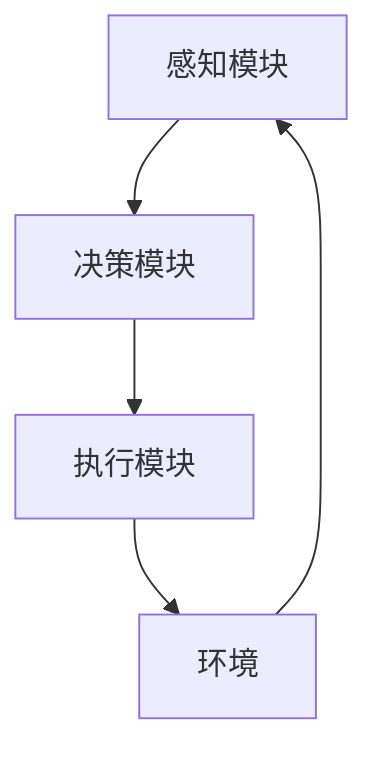
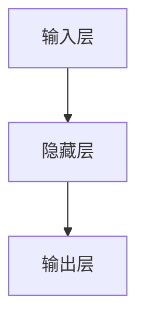
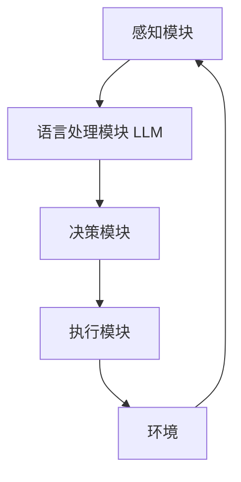

# AI Agent: AI的下一个风口 智能体与LLM的关系

## 1.背景介绍

在过去的十年中，人工智能（AI）技术取得了飞速的发展。从早期的规则系统到如今的深度学习和大规模语言模型（LLM），AI的应用范围和能力不断扩展。特别是近年来，智能体（AI Agent）和大规模语言模型（LLM）成为了AI领域的两个重要方向。智能体是指能够自主感知、决策和行动的系统，而LLM则是通过大规模数据训练的语言模型，能够生成和理解自然语言文本。

智能体和LLM的结合被认为是AI的下一个风口。智能体可以利用LLM的强大语言理解和生成能力，提升其在复杂环境中的表现。本文将深入探讨智能体与LLM的关系，分析其核心概念、算法原理、数学模型、实际应用场景，并提供代码实例和工具资源推荐。

## 2.核心概念与联系

### 2.1 智能体（AI Agent）

智能体是指能够自主感知环境、做出决策并采取行动的系统。智能体通常由感知模块、决策模块和执行模块组成。感知模块负责获取环境信息，决策模块根据感知信息和预设目标做出决策，执行模块则负责执行决策。

### 2.2 大规模语言模型（LLM）

大规模语言模型是通过大规模数据训练的深度学习模型，能够生成和理解自然语言文本。典型的LLM包括GPT-3、BERT等。这些模型通过大量的文本数据进行训练，能够捕捉语言的复杂结构和语义关系。

### 2.3 智能体与LLM的联系

智能体与LLM的结合可以提升智能体的语言理解和生成能力，使其在复杂环境中表现更为出色。LLM可以作为智能体的语言处理模块，帮助智能体更好地理解和生成自然语言文本，从而提升其感知和决策能力。

## 3.核心算法原理具体操作步骤

### 3.1 智能体的基本架构

智能体的基本架构通常包括感知模块、决策模块和执行模块。以下是一个典型的智能体架构图：



### 3.2 LLM的基本架构

LLM的基本架构通常包括输入层、隐藏层和输出层。以下是一个典型的LLM架构图：



### 3.3 智能体与LLM的结合

智能体与LLM的结合可以通过以下步骤实现：

1. **感知模块**：智能体的感知模块获取环境信息，并将其转换为自然语言文本。
2. **语言处理模块**：LLM作为智能体的语言处理模块，对感知信息进行理解和生成。
3. **决策模块**：智能体的决策模块根据LLM生成的文本信息做出决策。
4. **执行模块**：智能体的执行模块执行决策，并与环境进行交互。

以下是智能体与LLM结合的架构图：



## 4.数学模型和公式详细讲解举例说明

### 4.1 智能体的数学模型

智能体的数学模型通常包括状态空间、动作空间和奖励函数。状态空间表示智能体在环境中的所有可能状态，动作空间表示智能体可以采取的所有可能动作，奖励函数则表示智能体在特定状态下采取特定动作所获得的奖励。

设 $S$ 为状态空间，$A$ 为动作空间，$R(s, a)$ 为奖励函数，其中 $s \in S$，$a \in A$。智能体的目标是通过策略 $\pi(a|s)$ 最大化累积奖励：

$$
G_t = \sum_{k=0}^{\infty} \gamma^k R(s_{t+k}, a_{t+k})
$$

其中，$\gamma$ 为折扣因子，$G_t$ 为从时间步 $t$ 开始的累积奖励。

### 4.2 LLM的数学模型

LLM的数学模型通常包括输入序列、输出序列和概率分布。设输入序列为 $X = (x_1, x_2, \ldots, x_n)$，输出序列为 $Y = (y_1, y_2, \ldots, y_m)$，LLM通过最大化输出序列的条件概率 $P(Y|X)$ 进行训练：

$$
P(Y|X) = \prod_{t=1}^{m} P(y_t|y_{1:t-1}, X)
$$

其中，$P(y_t|y_{1:t-1}, X)$ 表示在给定输入序列 $X$ 和之前的输出序列 $y_{1:t-1}$ 的条件下，生成第 $t$ 个输出 $y_t$ 的概率。

### 4.3 智能体与LLM结合的数学模型

智能体与LLM结合的数学模型可以表示为：

$$
\pi(a|s) = \text{LLM}(s)
$$

其中，$\pi(a|s)$ 表示智能体在状态 $s$ 下采取动作 $a$ 的策略，$\text{LLM}(s)$ 表示LLM对状态 $s$ 的语言理解和生成结果。

## 5.项目实践：代码实例和详细解释说明

### 5.1 环境设置

首先，我们需要安装必要的Python库：

```bash
pip install transformers gym
```

### 5.2 智能体与LLM结合的代码实例

以下是一个简单的智能体与LLM结合的代码实例：

```python
import gym
from transformers import GPT2Tokenizer, GPT2LMHeadModel

# 初始化环境
env = gym.make('CartPole-v1')
state = env.reset()

# 初始化LLM
tokenizer = GPT2Tokenizer.from_pretrained('gpt2')
model = GPT2LMHeadModel.from_pretrained('gpt2')

# 智能体与LLM结合
for _ in range(1000):
    env.render()
    
    # 将状态转换为文本
    state_text = f"State: {state}"
    inputs = tokenizer.encode(state_text, return_tensors='pt')
    
    # 使用LLM生成动作
    outputs = model.generate(inputs, max_length=50)
    action_text = tokenizer.decode(outputs[0], skip_special_tokens=True)
    
    # 将文本动作转换为实际动作
    action = int(action_text.split()[-1])
    
    # 执行动作
    state, reward, done, _ = env.step(action)
    
    if done:
        state = env.reset()

env.close()
```

### 5.3 代码解释

1. **环境设置**：我们使用Gym库创建一个CartPole环境，并初始化状态。
2. **初始化LLM**：我们使用Transformers库加载预训练的GPT-2模型和对应的分词器。
3. **智能体与LLM结合**：在每个时间步中，我们将状态转换为文本，并使用LLM生成动作。然后，我们将生成的文本动作转换为实际动作，并在环境中执行。

## 6.实际应用场景

### 6.1 自然语言处理

智能体与LLM的结合在自然语言处理（NLP）领域有广泛应用。例如，智能客服系统可以利用LLM理解用户的自然语言问题，并生成相应的回答，从而提升用户体验。

### 6.2 自动驾驶

在自动驾驶领域，智能体与LLM的结合可以提升车辆对复杂交通环境的理解和决策能力。例如，车辆可以利用LLM理解交通标志和路况信息，并做出相应的驾驶决策。

### 6.3 游戏AI

在游戏AI领域，智能体与LLM的结合可以提升游戏角色的智能化程度。例如，游戏角色可以利用LLM理解玩家的指令，并做出相应的行动，从而提升游戏体验。

## 7.工具和资源推荐

### 7.1 开发工具

- **Transformers**：一个用于自然语言处理的开源库，提供了多种预训练的LLM模型。
- **Gym**：一个用于开发和比较强化学习算法的开源库，提供了多种模拟环境。

### 7.2 学习资源

- **《深度学习》**：一本经典的深度学习教材，详细介绍了深度学习的基本概念和算法。
- **《强化学习：原理与实践》**：一本详细介绍强化学习原理和实践的教材，适合初学者和进阶学习者。

## 8.总结：未来发展趋势与挑战

智能体与LLM的结合是AI领域的一个重要发展方向。通过结合LLM的强大语言理解和生成能力，智能体可以在复杂环境中表现得更为出色。然而，这一领域也面临一些挑战，例如如何提升LLM的实时性和鲁棒性，如何处理大规模数据和计算资源的需求等。

未来，随着技术的不断进步，智能体与LLM的结合将会在更多实际应用场景中发挥重要作用。我们期待看到更多创新的应用和解决方案，推动AI技术的发展和进步。

## 9.附录：常见问题与解答

### 9.1 智能体与LLM结合的优势是什么？

智能体与LLM结合的优势在于提升智能体的语言理解和生成能力，使其在复杂环境中表现更为出色。

### 9.2 如何选择合适的LLM模型？

选择合适的LLM模型需要考虑具体应用场景和需求。例如，对于需要高实时性的应用场景，可以选择较小的LLM模型；对于需要高精度的应用场景，可以选择较大的LLM模型。

### 9.3 智能体与LLM结合的挑战有哪些？

智能体与LLM结合的挑战包括提升LLM的实时性和鲁棒性，处理大规模数据和计算资源的需求等。

---

作者：禅与计算机程序设计艺术 / Zen and the Art of Computer Programming