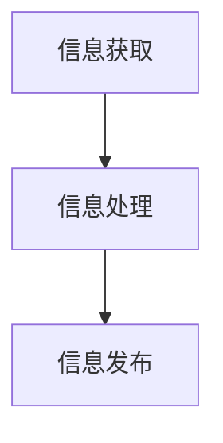

## 1.背景介绍

在信息爆炸的时代，新闻资讯的时效性是决定其价值的重要因素。然而，传统的新闻创作方式在面对大量信息的筛选、整理和发布上显得力不从心。为此，人工智能新闻创作（AIGC，Artificial Intelligence Generated Content）技术应运而生，它通过AI技术，实现对新闻创作的自动化，大大提升了新闻资讯的时效性。

## 2.核心概念与联系

AIGC是通过自然语言处理（NLP）、机器学习（ML）等AI技术，自动化生成新闻内容。其核心包括信息获取、信息处理和信息发布三个环节。信息获取主要通过爬虫技术，从网页、社交媒体等各类信息源获取原始信息；信息处理则涉及到文本分析、信息抽取、新闻生成等步骤，其中新闻生成是AIGC的核心，主要通过自然语言生成（NLG）技术实现；信息发布则是将生成的新闻内容发布到各类媒体平台。



## 3.核心算法原理具体操作步骤

AIGC的核心算法主要包括自然语言处理（NLP）和机器学习（ML）。NLP主要用于文本分析和新闻生成，ML则用于信息抽取和新闻生成。

1. 文本分析：通过NLP技术，对获取的原始信息进行分词、词性标注、命名实体识别等处理，提取出有用的信息。
2. 信息抽取：通过ML技术，从提取的信息中找出新闻事件的关键信息，如时间、地点、人物、事件等。
3. 新闻生成：通过NLP和ML技术，根据抽取的关键信息，生成新闻文本。

## 4.数学模型和公式详细讲解举例说明

新闻生成的核心是自然语言生成（NLG），其基本模型是序列到序列（Seq2Seq）模型。Seq2Seq模型是一种端到端的模型，可以将一个序列转换为另一个序列。在新闻生成中，输入序列是抽取的关键信息，输出序列是生成的新闻文本。

Seq2Seq模型主要包括编码器和解码器两部分。编码器负责将输入序列编码为一个固定长度的向量，解码器则根据这个向量生成输出序列。编码器和解码器通常都是循环神经网络（RNN）或其变体。

Seq2Seq模型的基本公式如下：

- 编码器：$h_t = f(h_{t-1}, x_t)$
- 解码器：$y_t = g(h_t, y_{t-1})$

其中，$h_t$是隐藏状态，$x_t$是输入序列，$y_t$是输出序列，$f$和$g$是非线性函数。

## 5.项目实践：代码实例和详细解释说明

下面以一个简单的Seq2Seq模型实现新闻生成为例，进行说明。首先，我们需要准备训练数据，这里假设我们已经有了一些新闻事件的关键信息和对应的新闻文本。

然后，我们可以使用TensorFlow等深度学习框架，实现Seq2Seq模型。具体代码如下：

```python
import tensorflow as tf

# 定义模型参数
hidden_size = 100
input_size = output_size = vocab_size

# 定义模型
encoder_inputs = tf.placeholder(tf.float32, [None, input_size])
decoder_inputs = tf.placeholder(tf.float32, [None, output_size])

# 编码器
encoder_cell = tf.nn.rnn_cell.BasicRNNCell(hidden_size)
encoder_outputs, encoder_state = tf.nn.dynamic_rnn(encoder_cell, encoder_inputs, dtype=tf.float32)

# 解码器
decoder_cell = tf.nn.rnn_cell.BasicRNNCell(hidden_size)
decoder_outputs, decoder_state = tf.nn.dynamic_rnn(decoder_cell, decoder_inputs, initial_state=encoder_state)

# 定义损失函数和优化器
loss = tf.reduce_mean(tf.square(decoder_outputs - decoder_inputs))
optimizer = tf.train.AdamOptimizer().minimize(loss)
```

最后，我们可以使用这个模型进行新闻生成。具体步骤是，首先，我们将新闻事件的关键信息输入模型，得到新闻文本的第一个词；然后，我们将这个词和关键信息一起输入模型，得到新闻文本的第二个词；以此类推，直到生成完整的新闻文本。

## 6.实际应用场景

AIGC在实际中有广泛的应用，主要包括：

1. 新闻报道：新闻机构可以使用AIGC自动化生成新闻报道，提升新闻的时效性和覆盖率。
2. 社交媒体：社交媒体平台可以使用AIGC自动化生成用户的动态，提升用户的活跃度。
3. 内容营销：企业可以使用AIGC自动化生成营销内容，提升营销的效率和效果。

## 7.工具和资源推荐

以下是一些有用的工具和资源：

1. TensorFlow：一个强大的深度学习框架，可以用来实现Seq2Seq模型。
2. NLTK：一个强大的自然语言处理库，可以用来进行文本分析。
3. Gensim：一个强大的文本处理库，可以用来进行信息抽取。
4. OpenNMT：一个开源的神经机器翻译框架，可以用来实现Seq2Seq模型。

## 8.总结：未来发展趋势与挑战

AIGC是一种有前景的技术，它能够大大提升新闻资讯的时效性。然而，它也面临一些挑战，如如何保证新闻的准确性和公正性，如何防止生成的新闻被用于传播假新闻等。这些都需要我们在未来的研究中去解决。

## 9.附录：常见问题与解答

Q: AIGC生成的新闻质量如何？
A: AIGC生成的新闻质量取决于训练数据的质量和模型的性能。一般来说，如果训练数据是高质量的，模型也足够强大，那么生成的新闻质量可以达到人类记者的水平。

Q: AIGC会取代人类记者吗？
A: AIGC主要是用来提升新闻的时效性和覆盖率，它并不能完全取代人类记者。人类记者在新闻的深度报道、评论等方面，还是有其不可替代的作用。

作者：禅与计算机程序设计艺术 / Zen and the Art of Computer Programming
