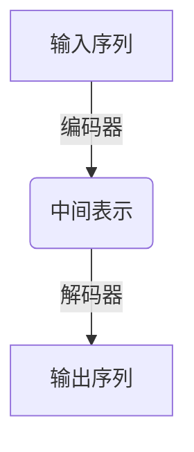
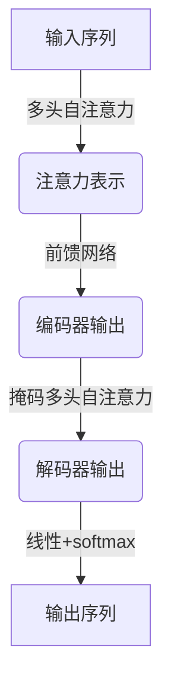
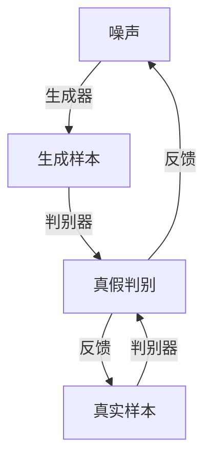
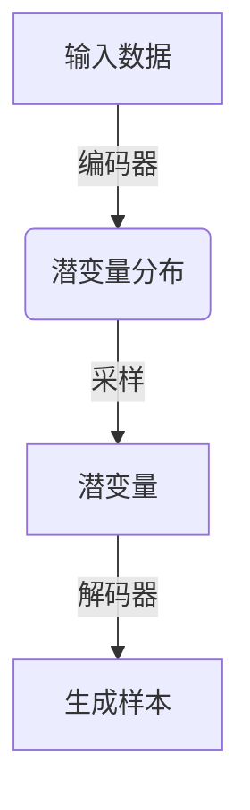

# AIGC从入门到实战：AIGC的产业图谱带来新的创变纪元

## 1.背景介绍

### 1.1 人工智能时代的到来

人工智能(Artificial Intelligence,AI)已经成为当今科技发展的核心驱动力。从语音助手到自动驾驶汽车,AI无处不在,正在深刻改变着我们的生活、工作和社会。随着算力的不断提升和算法的日益先进,AI的应用领域正在不断扩大,给各行各业带来了巨大的机遇和挑战。

### 1.2 AIGC的兴起

在AI的浪潮中,AIGC(AI Generated Content,AI生成内容)凭借其强大的创作能力,正在引领着一场新的产业变革。AIGC技术可以基于大量数据和训练,生成高质量的文本、图像、音频、视频等多种形式的内容,极大提高了内容创作的效率和质量。

### 1.3 AIGC的影响力

AIGC的兴起正在重塑传统的内容创作模式,对多个行业产生深远影响。无论是营销广告、新闻出版、教育培训,还是设计创作、娱乐游戏等领域,AIGC都有着广阔的应用前景。它不仅能够降低内容生产成本,还能创造出更加个性化、智能化的内容体验。

## 2.核心概念与联系

### 2.1 生成式人工智能

AIGC属于生成式人工智能(Generative AI)的范畴。生成式AI旨在基于输入数据,生成新的、有意义的内容输出,如文本、图像、音频等。这与传统的判别式AI(如图像识别、语音识别等)有着本质区别。

生成式AI的核心是通过深度学习模型(如变分自编码器VAE、生成对抗网络GAN等)从大量训练数据中捕捉到内在的模式和规律,并利用这些模式生成新的内容。

### 2.2 大模型与少样本学习

AIGC的发展离不开大模型(Large Model)和少样本学习(Few-Shot Learning)等关键技术。

- **大模型**指具有数十亿甚至上万亿参数的深度学习模型,能够从海量数据中学习到丰富的知识。著名的大语言模型如GPT-3、PaLM等,就展现出了惊人的文本生成能力。

- **少样本学习**则使模型能够仅通过少量示例,就学会完成特定任务。这极大提高了模型的泛化能力和适应性。

结合大模型和少样本学习,AIGC可以快速适应不同领域,生成高质量、多样化的内容。

### 2.3 多模态融合

AIGC的另一大趋势是多模态融合(Multimodal Fusion),即将不同模态(文本、图像、语音等)的信息进行融合处理。多模态模型能够捕捉和理解不同模态之间的关联,从而生成更加丰富、一致的跨模态内容。

例如,一个多模态AIGC系统不仅能够根据文本生成图像,还能根据图像生成相应的文字描述。多模态融合为AIGC开辟了更广阔的应用空间。

### 2.4 人机协作

虽然AIGC展现出了强大的创作能力,但它并非旨在完全取代人类,而是与人类形成良性互补。未来,AIGC将与人类创作者紧密协作,在创意构思、内容优化、高效生产等环节发挥作用,提升整体创作效率和质量。

人机协作模式下,人类将扮演更多决策和把控角色,而AIGC则承担辅助性的创作任务。二者通力合作,方能充分发挥各自的优势,推动内容创作进入一个全新的阶段。

## 3.核心算法原理具体操作步骤  

### 3.1 序列到序列模型(Seq2Seq)

AIGC中常用的核心算法是序列到序列模型(Sequence-to-Sequence,Seq2Seq)。Seq2Seq模型可以将一个序列(如文本)映射为另一个序列(如图像描述),广泛应用于机器翻译、文本摘要、对话系统等任务。

Seq2Seq模型的基本结构包括编码器(Encoder)和解码器(Decoder)两部分:

1. **编码器**将输入序列编码为中间表示(如向量);
2. **解码器**则根据该中间表示生成目标输出序列。

编码器和解码器内部通常使用循环神经网络(RNN)或transformer等神经网络模型。在训练过程中,模型会学习到输入和输出序列之间的映射关系。

对于AIGC任务,我们可以将待生成的内容(如文本)看作是一个序列,由Seq2Seq模型生成。输入则可以是少量的示例、提示词或上下文信息。

### 3.2 Transformer与自注意力机制

Transformer是Seq2Seq模型中一种广为使用的神经网络结构。它借助自注意力(Self-Attention)机制,能够更好地捕捉序列中元素之间的长程依赖关系,从而提高了模型的表现力。

自注意力机制的核心思想是,对于序列中的每个元素,计算它与其他元素的相关性权重(注意力分数),然后将所有元素的信息进行加权求和,作为该元素的表示。这种机制使模型能够灵活地关注序列中不同位置的信息。

Transformer的编码器和解码器均采用多头自注意力层和前馈神经网络层堆叠而成。在训练过程中,模型会自动学习到哪些位置的信息更加重要,从而生成高质量的输出。

### 3.3 生成式对抗网络

除了Seq2Seq,生成式对抗网络(Generative Adversarial Networks,GAN)也是AIGC中常用的生成模型,尤其在图像生成任务中表现出色。

GAN由生成器(Generator)和判别器(Discriminator)两个对抗的神经网络组成。生成器从噪声输入中生成假样本,而判别器则判断输入是真实样本还是生成样本。两者相互对抗、相互学习,最终达到生成器生成的假样本能够以假乱真的效果。

在AIGC中,GAN可用于生成逼真的图像、视频等内容。通过设计合理的生成器和判别器结构,引入条件信息(如文本描述),GAN能够生成符合特定条件的内容。

### 3.4 变分自编码器

变分自编码器(Variational Autoencoder,VAE)是一种常用的生成模型,在文本、图像等多模态AIGC任务中均有应用。

VAE的基本思想是将输入数据编码为潜在变量的概率分布,再从该分布中采样、解码生成输出。编码器将输入映射为潜变量的均值和方差,解码器则根据采样的潜变量生成输出。

在训练过程中,VAE会最大化输入数据的概率,同时最小化潜变量的均值和方差,从而学习到输入数据的潜在表示。生成新样本时,只需从潜变量的分布中采样,再通过解码器生成所需内容。

VAE的优点在于生成的样本质量较高,且具有较好的连续性和多样性。通过设计合理的潜变量结构,VAE还可以实现对生成内容的控制和调节。

## 4.数学模型和公式详细讲解举例说明

在AIGC中,数学模型和公式扮演着重要角色,为算法提供理论基础和计算框架。下面将详细讲解一些核心公式,并结合实例加深理解。

### 4.1 自注意力机制

自注意力机制是Transformer等模型的核心,它能够捕捉序列中元素之间的长程依赖关系。对于长度为n的序列$\boldsymbol{x} = (x_1, x_2, \ldots, x_n)$,自注意力的计算过程如下:

1. 计算Query、Key和Value矩阵:

$$\begin{aligned}
\boldsymbol{Q} &= \boldsymbol{x}\boldsymbol{W}^Q \\
\boldsymbol{K} &= \boldsymbol{x}\boldsymbol{W}^K \\
\boldsymbol{V} &= \boldsymbol{x}\boldsymbol{W}^V
\end{aligned}$$

其中$\boldsymbol{W}^Q$、$\boldsymbol{W}^K$、$\boldsymbol{W}^V$为可学习的权重矩阵。

2. 计算注意力分数:

$$\text{Attention}(\boldsymbol{Q}, \boldsymbol{K}, \boldsymbol{V}) = \text{softmax}\left(\frac{\boldsymbol{Q}\boldsymbol{K}^\top}{\sqrt{d_k}}\right)\boldsymbol{V}$$

其中$d_k$为缩放因子,用于防止内积过大导致梯度饱和。

3. 多头注意力机制可以从不同的子空间捕捉信息,公式如下:

$$\text{MultiHead}(\boldsymbol{Q}, \boldsymbol{K}, \boldsymbol{V}) = \text{Concat}(\text{head}_1, \ldots, \text{head}_h)\boldsymbol{W}^O$$

$$\text{where } \text{head}_i = \text{Attention}(\boldsymbol{Q}\boldsymbol{W}_i^Q, \boldsymbol{K}\boldsymbol{W}_i^K, \boldsymbol{V}\boldsymbol{W}_i^V)$$

$\boldsymbol{W}_i^Q$、$\boldsymbol{W}_i^K$、$\boldsymbol{W}_i^V$和$\boldsymbol{W}^O$为可学习的投影矩阵。

例如,对于输入序列"我爱学习自然语言处理",自注意力机制能够自动学习到"自然语言处理"这一关键词与前文的关联,从而更好地生成相关内容。

### 4.2 生成式对抗网络

生成式对抗网络(GAN)的目标是学习真实数据分布$p_\text{data}(x)$,使生成器$G$从噪声先验$p_z(z)$生成的样本分布$p_g(x)$尽可能地逼近真实数据分布。

GAN的损失函数可以表示为:

$$\min_G \max_D V(D, G) = \mathbb{E}_{x \sim p_\text{data}(x)}[\log D(x)] + \mathbb{E}_{z \sim p_z(z)}[\log(1 - D(G(z)))]$$

其中$D$为判别器,旨在最大化判别真实样本和生成样本的能力;$G$为生成器,旨在最小化判别器判别出生成样本的能力。

在优化过程中,判别器和生成器相互对抗、相互学习,最终达到生成器生成的样本能够以假乱真的效果。

例如,在文本到图像生成任务中,GAN可以将文本描述("一只可爱的狗狗在草地上玩耍")作为条件,生成符合描述的逼真图像。

### 4.3 变分自编码器

变分自编码器(VAE)的核心思想是将输入数据$\boldsymbol{x}$编码为潜在变量$\boldsymbol{z}$的概率分布$q_\phi(\boldsymbol{z}|\boldsymbol{x})$,再从该分布中采样、解码生成输出$p_\theta(\boldsymbol{x}|\boldsymbol{z})$。

VAE的证据下界(Evidence Lower Bound,ELBO)定义为:

$$\begin{aligned}
\mathcal{L}(\theta, \phi; \boldsymbol{x}) &= \mathbb{E}_{q_\phi(\boldsymbol{z}|\boldsymbol{x})}\left[\log p_\theta(\boldsymbol{x}|\boldsymbol{z})\right] - D_\text{KL}\left(q_\phi(\