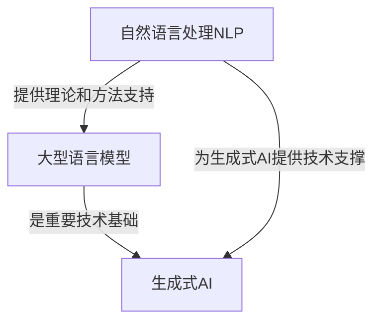

# AIGC从入门到实战：ChatGPT 为什么能生成代码，背后的原理是什么？

## 1. 背景介绍

### 1.1 人工智能的发展历程

人工智能(Artificial Intelligence, AI)是当代科技发展的重要领域之一。自20世纪50年代AI概念被正式提出以来,经历了几个重要的发展阶段:

- 早期阶段(1950s-1960s):专家系统、博弈理论等理论研究为主
- 知识迷阵时期(1970s-1980s):AI研究遇到瓶颈,资金短缺
- 机器学习时代(1990s-2010s):统计机器学习、神经网络等算法取得突破
- 深度学习浪潮(2010s-今):benefited from大数据、高性能计算和新算法,深度学习在计算机视觉、自然语言处理等领域大放异彩

### 1.2 AIGC(AI Generated Content)概念的兴起

伴随AI技术的不断进步,近年来以GPT-3、DALL-E等为代表的大型人工智能模型开始展现出生成高质量内容(文字、图像、视频等)的惊人能力,从而掀起了AIGC(AI Generated Content)的热潮。

AIGC指通过训练有素的AI模型自动生成文字、图像、音频、视频、代码等内容,可广泛应用于内容创作、辅助设计、软件开发等诸多领域。其中,以ChatGPT为代表的大型语言模型能够生成看似人类水平的自然语言文本,包括代码、文章、对话等,引发了人们对AIGC技术原理的浓厚兴趣。

## 2. 核心概念与联系

### 2.1 大型语言模型

大型语言模型(Large Language Model, LLM)是AIGC技术的核心,是一种通过自监督学习方式在大规模文本数据上训练而成的深度神经网络模型。它能够捕捉文本中的上下文语义信息和模式,从而生成看似人类水平的自然语言输出。

常见的大型语言模型包括:

- GPT系列(OpenAI)
- 伯特(BERT,谷歌)
- T5(Exploring the Limits of Transfer Learning,谷歌)
- PALM(Pathways Language Model,谷歌)
- Jurassic-1(AI21 Labs)
- ...

其中,GPT(Generative Pre-trained Transformer)是目前最著名的生成式预训练语言模型,由OpenAI公司开发。GPT-3是GPT系列中最大的模型之一,由1750亿个参数组成,在170多亿个令牌的文本数据上进行预训练。

### 2.2 自然语言处理(NLP)

自然语言处理(Natural Language Processing, NLP)是人工智能的一个重要分支,旨在使计算机能够理解和生成人类语言。NLP技术为大型语言模型的训练和应用奠定了理论基础,主要包括:

- 文本预处理:分词、词性标注、命名实体识别等
- 词向量表示:Word2Vec、GloVe等embedding技术
- 语言模型:N-gram、神经网络语言模型等
- 序列到序列模型:机器翻译、文本摘要等
- 注意力机制:Transformer等self-attention模型
- ...

大型语言模型通过掌握上下文语义,实现了NLP任务中的文本生成、机器翻译、问答系统、代码生成等多种应用。

### 2.3 生成式人工智能

生成式人工智能(Generative AI)是指能够生成新内容(文本、图像、音频等)的AI系统,而非仅对已有内容进行分类或预测。大型语言模型是生成式AI的核心,通过捕捉数据中的模式并生成新的、看似合理的输出,展现出了AI系统的"创造力"。

除了语言模型,生成对抗网络(Generative Adversarial Networks, GANs)、变分自编码器(Variational Autoencoders, VAEs)等也是生成式AI的重要技术。

生成式AI的兴起,标志着人工智能不再仅局限于解决狭义的特定任务,而是朝着通用人工智能(Artificial General Intelligence, AGI)的方向迈进。

### 2.4 核心概念关系

以上三个核心概念相互关联:

- 大型语言模型是生成式AI的重要技术基础
- 语言模型的训练和应用离不开NLP理论和方法
- NLP为生成式AI提供了技术支撑

它们共同推动了AIGC等新兴人工智能技术的发展,如下图所示:



## 3. 核心算法原理具体操作步骤

### 3.1 Transformer模型

Transformer是一种基于注意力机制的序列到序列模型,由谷歌的Vaswani等人在2017年提出,被广泛应用于机器翻译、语言模型等NLP任务。它的核心思想是完全依靠注意力机制来捕捉输入和输出序列之间的长程依赖关系,摒弃了传统序列模型中的循环和卷积结构。

Transformer的基本组成单元是编码器(Encoder)和解码器(Decoder),它们均由多个相同的层组成。每一层包含两个核心子层:

1. **多头注意力机制(Multi-Head Attention)**
2. **前馈全连接网络(Position-wise Feed-Forward Networks)**

此外,还引入了残差连接(Residual Connection)和层归一化(Layer Normalization)以提高训练效率和性能。

Transformer的注意力机制使用了Self-Attention,即对输入序列进行编码时,每个位置的词向量是所有位置词向量的加权和。这种结构允许模型更好地学习输入序列中任意距离的长程依赖关系。

### 3.2 GPT语言模型

GPT(Generative Pre-trained Transformer)是一种基于Transformer解码器的自回归(Autoregressive)语言模型,由OpenAI提出。与传统语言模型不同,GPT采用了自监督学习的方式,在大规模无标注文本数据上进行预训练,捕捉文本中的上下文语义信息。

在预训练阶段,GPT模型的目标是最大化下一个词的条件概率,即给定之前的词序列,预测最可能出现的下一个词。这个过程被称为"因果语言建模"(Causal Language Modeling)。

在微调(Fine-tuning)阶段,GPT模型会在特定的下游任务(如文本生成、机器翻译等)的标注数据集上进行进一步训练,使模型输出符合任务需求。

GPT-3作为GPT系列中最大的模型,通过在海量文本数据上预训练,展现出了惊人的语言生成能力,可用于撰写文章、对话、代码生成等多种应用。

### 3.3 GPT语言模型生成代码的操作步骤

以GPT-3为例,生成代码的基本操作步骤如下:

1. **输入问题描述**:用户向GPT-3输入一个自然语言的问题描述,例如"写一个Python函数来计算斐波那契数列"。

2. **上下文构建**:GPT-3根据输入的问题描述,构建一个合适的上下文向量表示。

3. **生成初始代码**:基于上下文向量,GPT-3生成代码的初始部分,如函数定义、导入语句等。

4. **自回归生成**:GPT-3以自回归的方式逐步生成后续代码,每生成一个新token(如变量名、关键字等),都会更新上下文向量。

5. **结果输出**:当GPT-3检测到代码生成已经完成(如遇到EOF标记),则输出最终的代码结果。

6. **代码评估(可选)**:GPT-3可以对生成的代码进行评估,并根据评估结果对代码进行优化或重新生成。

这一过程中,GPT-3通过捕捉输入问题描述和已生成代码的上下文语义信息,来预测最可能出现的下一个token,从而生成看似人类编写的代码。

## 4. 数学模型和公式详细讲解举例说明

### 4.1 Transformer中的注意力机制

注意力机制(Attention Mechanism)是Transformer模型的核心,它使用了一种称为"Scaled Dot-Product Attention"的计算方式:

$$
\text{Attention}(Q, K, V) = \text{softmax}\left(\frac{QK^T}{\sqrt{d_k}}\right)V
$$

其中:
- $Q$是查询向量(Query)
- $K$是键向量(Key)
- $V$是值向量(Value)
- $d_k$是缩放因子,用于防止较深层次的值落入softmax函数的梯度较小区域

这种注意力机制可以捕捉输入序列中任意两个位置之间的关系,从而学习长程依赖。

在多头注意力(Multi-Head Attention)中,注意力机制会被并行运行$h$次,每次使用不同的线性投影,最后将结果拼接:

$$
\begin{aligned}
\text{MultiHead}(Q, K, V) &= \text{Concat}(\text{head}_1, \dots, \text{head}_h)W^O\\
\text{where\ head}_i &= \text{Attention}(QW_i^Q, KW_i^K, VW_i^V)
\end{aligned}
$$

其中$W_i^Q$、$W_i^K$、$W_i^V$和$W^O$是可学习的线性投影参数。

通过多头注意力机制,Transformer能够关注输入序列中不同的表示子空间,提高了模型的表达能力。

### 4.2 GPT语言模型中的因果语言建模

GPT语言模型采用了自回归(Autoregressive)结构,旨在最大化给定历史文本的条件概率:

$$
P(x_1, \dots, x_T) = \prod_{t=1}^T P(x_t | x_1, \dots, x_{t-1})
$$

其中$x_1, \dots, x_T$是文本序列,每个$x_t$是一个token(如单词或子词)。

在实际计算中,GPT模型使用了一种被称为"Top-K随机采样"的策略,从前K个最可能的token中随机采样下一个token。具体来说,给定当前的上下文$x_1, \dots, x_{t-1}$,模型会计算所有可能token的条件概率:

$$
P(x_t = w | x_1, \dots, x_{t-1})
$$

然后从概率最高的前K个token中随机采样得到$x_t$,并将其添加到上下文中,重复该过程直到生成完整序列。

通过这种方式,GPT模型可以生成看似自然、合理的文本序列。

## 5. 项目实践: 代码实例和详细解释说明

以下是一个使用Python和HuggingFace Transformers库,基于GPT-2模型生成文本的代码示例:

```python
from transformers import GPT2LMHeadModel, GPT2Tokenizer

# 加载预训练模型和分词器
model = GPT2LMHeadModel.from_pretrained('gpt2')
tokenizer = GPT2Tokenizer.from_pretrained('gpt2')

# 输入种子文本
input_text = "Once upon a time, there was a"
input_ids = tokenizer.encode(input_text, return_tensors='pt')

# 生成文本
output = model.generate(input_ids, max_length=100, do_sample=True, top_k=50, top_p=0.95, num_return_sequences=1)
generated_text = tokenizer.decode(output[0], skip_special_tokens=True)

print(generated_text)
```

代码解释:

1. 首先导入必要的模块和类,包括`GPT2LMHeadModel`(GPT-2语言模型)和`GPT2Tokenizer`(GPT-2分词器)。

2. 使用`from_pretrained`方法加载预训练的GPT-2模型和分词器。

3. 定义输入的种子文本`input_text`,并使用分词器的`encode`方法将其转换为模型可接受的输入张量`input_ids`。

4. 调用模型的`generate`方法生成文本。这里设置了以下参数:
   - `max_length=100`:生成文本的最大长度为100个token
   - `do_sample=True`:启用随机采样,而不是贪婪解码
   - `top_k=50`:只从概率最高的前50个token中采样
   - `top_p=0.95`:只从累积概率达到95%的token中采样
   - `num_return_sequences=1`:只生成一个序列

5. 使用分词器的`decode`方法将生成的token序列解码为可读的文本,并打印输出。