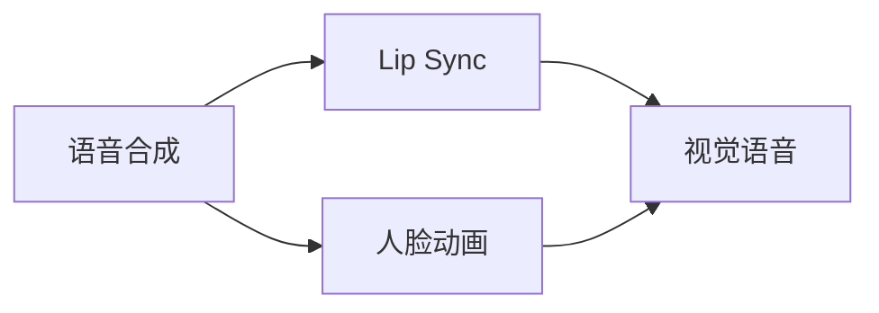

# AIGC从入门到实战：借助 AI，听听照片里的人物怎么说

## 1. 背景介绍
### 1.1 人工智能生成内容(AIGC)的兴起
近年来,人工智能生成内容(AIGC, AI-Generated Content)技术迅猛发展,在文本、图像、音频、视频等领域取得了令人瞩目的成就。AIGC利用机器学习和深度学习算法,通过训练海量数据,生成与人类创作难以区分的高质量内容。这一技术正在改变我们创作和交互的方式,为内容生产提供了更多可能性。

### 1.2 AIGC在视觉领域的应用
在AIGC的众多应用中,视觉领域尤其引人注目。图像生成模型如DALL-E、Midjourney、Stable Diffusion等,可以根据文本描述生成逼真的图像。而在视频领域,Meta、Google等科技巨头也推出了音频驱动的视频生成模型,如Make-A-Video等。这些技术让机器能够"想象"和"创作"出令人惊叹的视觉内容。

### 1.3 AIGC赋予照片声音的意义
在AIGC视觉应用中,一个有趣的方向是让静态照片"开口说话"。传统上,我们只能通过观察照片中人物的表情、动作等视觉线索来推测他们想表达什么。而现在,借助AIGC技术,我们可以让照片中的人物"活"起来,用语音表达他们的心声。这不仅为照片赋予了新的表现力,也让人与照片的互动更加生动有趣。本文将深入探讨这一技术的实现原理和应用场景。

## 2. 核心概念与联系
### 2.1 语音合成
语音合成(Speech Synthesis)是将文本转化为语音的技术。其核心是建立文本到语音的映射关系,使机器能够像人一样朗读文本。传统的语音合成方法如隐马尔可夫模型(HMM)、拼接合成等,需要大量人工调制的语音数据,合成质量差,听感不自然。近年来,深度学习语音合成如Tacotron、WaveNet等,通过端到端学习文本到语音的映射,大幅提升了合成音质,生成了接近真人发音的流畅语音。

### 2.2 Lip Sync
Lip Sync即唇形同步,是将语音与人物唇部动作实时同步的技术。常见于动画、游戏等数字人领域,让角色的口型与配音吻合,提升视听体验。传统方法需要手工调整关键帧,费时费力。基于深度学习的Lip Sync可自动学习音素与口型的对应关系,实时生成准确的唇形动画。

### 2.3 人脸动画
人脸动画(Facial Animation)是模拟人脸表情、肌肉运动的技术。通过建模人脸几何结构和运动规律,控制虚拟角色做出真实的表情动作。传统方法多采用手工制作或运动捕捉,局限性大。基于深度学习的人脸动画可端到端学习输入(如音频、文本)到面部运动的映射,自动生成丰富的表情细节。

### 2.4 视觉语音(Visual Speech)
视觉语音是将语音与人脸视觉信息结合的前沿研究方向。相比纯听觉的语音,视觉语音加入了口唇、表情等视觉线索,使人机交互更自然。当前的视觉语音研究聚焦于唇语识别、语音驱动的人脸动画生成、语音与人脸特征的联合建模等。这为实现照片配音提供了理论和技术基础。

### 2.5 概念联系
上述概念环环相扣,共同构建了照片配音的技术框架:



语音合成负责将文本转化为逼真的语音;Lip Sync和人脸动画分别生成与语音同步的口型和表情;视觉语音将语音和视觉信息融合,生成栩栩如生的"会说话"的人脸。这一流程让照片人物不再沉默,而是可以开口表达自己的"心声"。

## 3. 核心算法原理与具体步骤
照片配音的核心是语音驱动的人脸动画生成。给定一段语音和一张目标人物照片,自动生成该人物同步说话的视频画面。其一般流程如下:

### 3.1 语音编码
将输入语音转化为紧凑的特征表示,提取语音的内容、韵律、情感等关键信息。主要方法有:
- Mel频谱: 提取语音的频谱特征,反映语音的音色、音高等。
- WaveNet编码器: 使用卷积神经网络对原始波形建模,学习语音的高层特征。
- DeepSpeech等语音识别模型: 提取语音的音素、词汇等内容信息。

### 3.2 人脸特征提取
从目标照片中提取人脸的身份特征和表情特征。常用方法有:
- 人脸关键点检测: 定位眼、鼻、嘴等面部关键点的坐标。
- 人脸表情分类: 识别人脸的情绪状态如高兴、惊讶等。
- 人脸识别模型: 提取人脸的身份嵌入向量,用于驱动目标人物的面部运动。

### 3.3 语音-视觉映射学习
建立语音特征到人脸运动的映射关系,学习语音如何驱动面部表情变化。主流方法包括:
- 回归模型: 如广义线性模型、决策树等,直接学习语音特征到关键点坐标的回归映射。
- CycleGAN等对抗生成网络: 将语音特征视为源域,人脸特征视为目标域,学习两个域之间的转换映射。
- Seq2Seq等序列到序列模型: 将语音和视觉特征序列视为编码器-解码器框架的输入输出,端到端学习语音到面部运动的映射。

### 3.4 人脸动画合成
根据语音-视觉映射生成目标人物的面部运动序列,再合成为连贯的人脸动画。常见方法有:
- 关键点驱动: 根据预测的面部关键点坐标,变形并生成人脸图像序列。
- GAN等生成模型: 以语音特征为条件,生成与之同步的人脸图像序列。
- 三维人脸模型: 如3DMM等,根据语音生成三维人脸网格的运动参数,再渲染为图像序列。

### 3.5 后处理
对生成的人脸动画进行增强和修饰,提升真实感。如调整光照、平滑面部运动、融合原始背景等。

## 4. 数学模型与公式详解
### 4.1 语音特征提取
以Mel频谱为例,其提取过程如下:
1. 对语音信号$x(t)$进行短时傅里叶变换(STFT),得到频谱$X(f, t)$:

$$X(f, t) = \sum_{n=0}^{N-1} x(n)w(n-t)e^{-j2\pi fn/N}$$

其中$w(n)$为窗函数,如汉明窗:

$$w(n) = 0.54 - 0.46 \cos(\frac{2 \pi n}{N-1})$$

2. 将频谱通过Mel滤波器组$H_m(f)$,得到Mel频谱$S(m, t)$:

$$S(m, t) = \sum_{f=0}^{F-1} |X(f, t)|^2 H_m(f)$$

其中$H_m(f)$为第$m$个三角形滤波器:

$$H_m(f) = \begin{cases} 
0 & f < f_{m-1} \\
\frac{f - f_{m-1}}{f_m - f_{m-1}} & f_{m-1} \leq f < f_m \\
\frac{f_{m+1} - f}{f_{m+1} - f_m} & f_m \leq f < f_{m+1} \\
0 & f \geq f_{m+1}
\end{cases}$$

$f_m$为第$m$个滤波器的中心频率,通常按Mel标度排布:

$$f_m = 700(e^{m/M} - 1)$$

其中$M$为滤波器个数。

3. 取对数并进行离散余弦变换(DCT),得到最终的Mel频谱特征$C(n, t)$:

$$C(n, t) = \sum_{m=0}^{M-1} \log S(m, t) \cos(\frac{\pi n(m+0.5)}{M}), n=0,1,\dots,N-1$$

### 4.2 人脸特征提取
以人脸关键点检测为例,常用方法是级联形状回归(Cascaded Shape Regression)。给定人脸图像$I$和初始形状$S_0$,不断迭代更新形状:

$$S_{t+1} = S_t + r_t(I, S_t)$$

其中$r_t$为第$t$级回归器,可采用决策树、随机森林等。回归器以形状索引像素特征(SIFT)为输入,预测形状增量。SIFT特征为:

$$f(I, S) = [I(x_1, y_1), I(x_2, y_2), \dots, I(x_P, y_P)]^T$$

其中$(x_i, y_i)$为第$i$个关键点的坐标。

### 4.3 语音-视觉映射学习
以Seq2Seq模型为例,设语音特征序列为$\mathbf{a} = (a_1, a_2, \dots, a_T)$,视觉特征序列为$\mathbf{v} = (v_1, v_2, \dots, v_T)$。模型通过最大化条件概率来学习映射:

$$\hat{\mathbf{v}} = \arg\max_{\mathbf{v}} P(\mathbf{v}|\mathbf{a})$$

编码器将$\mathbf{a}$编码为隐状态序列$\mathbf{h} = (h_1, h_2, \dots, h_T)$:

$$h_t = f_{\text{enc}}(a_t, h_{t-1})$$

解码器根据$\mathbf{h}$生成$\mathbf{v}$:

$$v_t = f_{\text{dec}}(h_t, v_{t-1})$$

其中$f_{\text{enc}}$和$f_{\text{dec}}$可采用RNN、Transformer等网络结构。模型通过最小化重构误差来优化:

$$\mathcal{L} = \sum_{t=1}^T \|v_t - \hat{v}_t\|^2$$

### 4.4 人脸动画合成
以GAN为例,生成器$G$以语音特征$\mathbf{a}$为条件,生成人脸图像序列$\hat{\mathbf{I}} = G(\mathbf{z}, \mathbf{a})$,其中$\mathbf{z}$为随机噪声。判别器$D$判断$\hat{\mathbf{I}}$是否为真实样本。目标函数为:

$$\min_G \max_D \mathbb{E}_{\mathbf{I} \sim p_{\text{data}}} [\log D(\mathbf{I}, \mathbf{a})] + \mathbb{E}_{\mathbf{z} \sim p_{\mathbf{z}}} [\log(1 - D(G(\mathbf{z}, \mathbf{a}), \mathbf{a}))]$$

其中$p_{\text{data}}$为真实图像分布,$p_{\mathbf{z}}$为噪声分布。$G$和$D$交替优化,最终使生成样本逼近真实分布。

## 5. 项目实践
下面以Python为例,演示如何使用开源工具实现照片配音。

### 5.1 环境准备
安装必要的库:
```python
!pip install tensorflow==2.9.1 tensorflow-io==0.24.0 tensorflow-addons==0.17.1 matplotlib==3.2.2 scipy==1.7.3 opencv-python==4.6.0.66
```

### 5.2 语音合成
使用Tacotron2进行语音合成:
```python
import tensorflow as tf
from tensorflow_tts.inference import TFAutoModel
from tensorflow_tts.inference import AutoProcessor

# 加载预训练模型
tacotron2 = TFAutoModel.from_pretrained("tensorspeech/tts-tacotron2-ljspeech-en")
processor = AutoProcessor.from_pretrained("tensorspeech/tts-tacotron2-ljspeech-en")

# 文本转语音
def text_to_speech(text):
    input_ids = processor.text_to_sequence(text)
    
    _, mel_outputs, stop_token_prediction, alignment_history = tacotron2.inference(
        tf.expand_dims(tf.convert