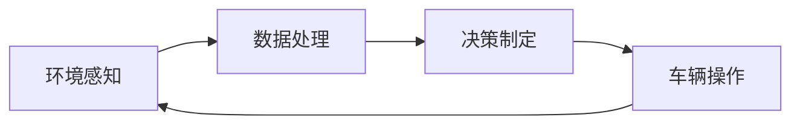

## 1.背景介绍

随着科技的进步，人工智能（AI）已经渗透到了我们生活的各个方面。其中，无人驾驶领域的应用是最具潜力和挑战性的一环。AI Agent（智能体）在无人驾驶中的应用，不仅可以实现车辆自动驾驶，还可以提高行驶安全，优化交通流量，从而极大地提升了交通系统的效率和安全性。

## 2.核心概念与联系

AI Agent是一种可以感知环境并根据环境的变化做出决策的系统。在无人驾驶中，AI Agent可以通过车载的各种传感器（如摄像头、雷达、激光雷达等）来感知周围环境，然后通过算法来决定如何操作车辆（如加速、刹车、转向等）。



## 3.核心算法原理具体操作步骤

AI Agent在无人驾驶中的应用，主要涉及到以下几个步骤：

1. **环境感知**：AI Agent通过车载的各种传感器收集环境数据，如图像、雷达信号等。
2. **数据处理**：AI Agent将收集到的数据进行处理，如图像识别、目标检测、路径规划等。
3. **决策制定**：AI Agent根据处理后的数据，使用决策算法（如深度学习、强化学习等）来制定决策，如是否需要变道、何时需要刹车等。
4. **车辆操作**：AI Agent根据决策结果，通过控制系统来操作车辆，如控制转向、加速、刹车等。

## 4.数学模型和公式详细讲解举例说明

在无人驾驶中，AI Agent的决策制定主要依赖于强化学习算法。强化学习是一种通过与环境的交互来学习最优策略的算法。其中，最重要的两个概念是状态（state）和动作（action）。

在无人驾驶中，状态可以是车辆的位置、速度、方向等信息，动作则是车辆的操作，如加速、刹车、转向等。强化学习的目标是找到一个策略，使得车辆在任何状态下，都能选择最优的动作。

强化学习的核心是Q-learning算法，其核心公式为：

$$ Q(s, a) \leftarrow Q(s, a) + \alpha [r + \gamma max_{a'} Q(s', a') - Q(s, a)] $$

其中，$s$和$a$分别代表当前的状态和动作，$s'$和$a'$分别代表下一步的状态和动作，$r$是当前的回报，$max_{a'} Q(s', a')$是在下一步状态$s'$下，选择动作$a'$能获得的最大Q值，$\alpha$是学习率，$\gamma$是折扣因子。

## 5.项目实践：代码实例和详细解释说明

以下是一个简单的Q-learning算法的Python实现：

```python
import numpy as np

class QLearningAgent:
    def __init__(self, states, actions, alpha=0.5, gamma=0.9, epsilon=0.1):
        self.states = states
        self.actions = actions
        self.Q = np.zeros((states, actions))
        self.alpha = alpha
        self.gamma = gamma
        self.epsilon = epsilon

    def choose_action(self, state):
        if np.random.uniform() < self.epsilon:
            action = np.random.choice(self.actions)
        else:
            action = np.argmax(self.Q[state, :])
        return action

    def update(self, state, action, reward, next_state):
        predict = self.Q[state, action]
        target = reward + self.gamma * np.max(self.Q[next_state, :])
        self.Q[state, action] = self.Q[state, action] + self.alpha * (target - predict)
```

## 6.实际应用场景

无人驾驶是AI Agent的重要应用场景。目前，许多科技公司，如Waymo、Tesla等，都在研发无人驾驶车辆。这些车辆通过车载的各种传感器感知环境，然后通过AI Agent来决定如何操作车辆。

## 7.工具和资源推荐

如果你对AI Agent在无人驾驶中的应用感兴趣，以下是一些推荐的学习资源：

1. **书籍**：《深度学习》（作者：Ian Goodfellow、Yoshua Bengio、Aaron Courville）
2. **在线课程**：Coursera的“Deep Learning Specialization”
3. **开源项目**：GitHub上的“Carla”项目，这是一个开源的无人驾驶模拟平台

## 8.总结：未来发展趋势与挑战

AI Agent在无人驾驶中的应用有着广阔的前景，但也面临着许多挑战。例如，如何提高AI Agent的决策准确性，如何保证AI Agent在复杂环境下的稳定性，如何处理AI Agent的道德和法律问题等。但无论如何，AI Agent在无人驾驶中的应用是人工智能发展的重要方向，值得我们持续关注和研究。

## 9.附录：常见问题与解答

1. **Q：AI Agent在无人驾驶中的应用有哪些优点？**
   
   A：AI Agent在无人驾驶中的应用，可以实现车辆自动驾驶，提高行驶安全，优化交通流量，从而极大地提升了交通系统的效率和安全性。

2. **Q：AI Agent在无人驾驶中的应用有哪些挑战？**
   
   A：AI Agent在无人驾驶中的应用，面临的挑战主要有：提高AI Agent的决策准确性，保证AI Agent在复杂环境下的稳定性，处理AI Agent的道德和法律问题等。

---

作者：禅与计算机程序设计艺术 / Zen and the Art of Computer Programming