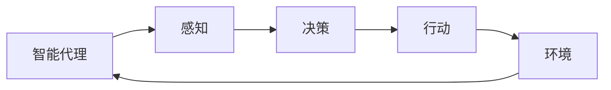

## 1. 背景介绍

在我们日常生活和工作中，流程是一种常见的抽象概念，它描述了一系列按照特定顺序执行的步骤。然而，当我们谈论AI人工智能代理工作流时，我们正在讨论的是一种更为复杂、更为动态的流程，它涉及到智能代理（AI agent）对环境的感知、对信息的处理、决策的制定和行动的执行。

## 2. 核心概念与联系

AI代理工作流涉及到许多核心概念，包括智能代理、环境、感知、决策和行动。智能代理是一个能够感知环境并根据感知结果进行决策和行动的实体。环境是智能代理所处的上下文，它可能包括其他的智能代理、物理对象、信息源等。感知是智能代理获取和处理环境信息的过程，决策是基于感知结果制定行动计划的过程，行动则是智能代理对决策结果的执行。

## 3. 核心算法原理具体操作步骤

AI代理工作流的实现涉及到许多算法和技术。在感知阶段，可能需要使用到数据采集和处理技术，如传感器技术、图像处理、自然语言处理等。在决策阶段，可能需要使用到机器学习算法，如深度学习、强化学习等。在行动阶段，可能需要使用到控制系统和执行器。

## 4. 数学模型和公式详细讲解举例说明

在AI代理工作流中，有一些关键的数学模型和公式。例如，在感知阶段，我们可能需要用到贝叶斯公式来处理不确定性信息。在决策阶段，我们可能需要用到马尔可夫决策过程（MDP）来描述代理的决策问题。在行动阶段，我们可能需要用到控制论的一些基本原理。

例如，我们可以使用贝叶斯公式来处理感知阶段的不确定性信息。贝叶斯公式如下：

$$ P(A|B) = \frac{P(B|A)P(A)}{P(B)} $$

其中，$P(A|B)$表示在给定B的条件下A的概率，$P(B|A)$表示在给定A的条件下B的概率，$P(A)$和$P(B)$分别表示A和B的概率。

## 5. 项目实践：代码实例和详细解释说明

让我们通过一个简单的项目实践来理解AI代理工作流。假设我们正在开发一个自动驾驶系统。在这个系统中，AI代理需要通过摄像头和雷达等传感器感知环境，然后根据感知结果进行决策，如调整车速、改变行驶方向等，最后通过执行器执行决策结果。

在代码实现中，我们可能需要使用Python的OpenCV库来处理摄像头的图像数据，使用TensorFlow或PyTorch等深度学习框架来实现决策算法，使用Arduino或Raspberry Pi等硬件平台来控制执行器。

## 6. 实际应用场景

AI代理工作流的应用场景非常广泛，包括但不限于自动驾驶、智能家居、机器人、金融投资、医疗诊断等。在这些应用场景中，AI代理需要通过感知环境、进行决策和执行行动，来实现各种复杂的任务。

## 7. 工具和资源推荐

以下是一些在实现AI代理工作流时可能需要的工具和资源：

- 传感器和数据采集设备：如摄像头、雷达、温度传感器等。
- 数据处理和机器学习库：如Python的NumPy、Pandas、OpenCV、TensorFlow、PyTorch等。
- 控制系统和执行器：如Arduino、Raspberry Pi、伺服电机等。
- 学习资源：如《深度学习》（Goodfellow et al.）、《强化学习》（Sutton and Barto）、《机器学习》（Mitchell）等书籍。

## 8. 总结：未来发展趋势与挑战

随着AI技术的快速发展，AI代理工作流的应用将更加广泛。然而，也面临着许多挑战，如如何处理复杂的环境信息、如何制定有效的决策、如何保证行动的安全性等。

## 9. 附录：常见问题与解答

1. 问：AI代理工作流和传统的流程有什么区别？
答：AI代理工作流是一种动态的、自适应的流程，它涉及到智能代理对环境的感知、对信息的处理、决策的制定和行动的执行。而传统的流程通常是静态的，按照预定的顺序执行一系列步骤。

2. 问：AI代理工作流需要什么样的技术支持？
答：AI代理工作流需要数据采集和处理技术、机器学习算法、控制系统和执行器等技术支持。

3. 问：AI代理工作流有哪些应用场景？
答：AI代理工作流的应用场景非常广泛，包括但不限于自动驾驶、智能家居、机器人、金融投资、医疗诊断等。

作者：禅与计算机程序设计艺术 / Zen and the Art of Computer Programming
