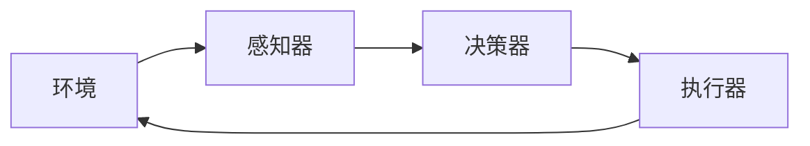
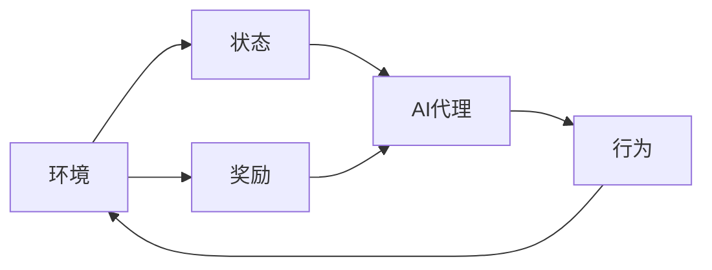

# AI人工智能代理工作流 AI Agent WorkFlow：在游戏设计中的应用

## 1.背景介绍

### 1.1 游戏设计的挑战

游戏设计是一个极具挑战性的领域,需要平衡多个复杂的因素,包括玩家体验、故事情节、游戏机制、人工智能(AI)等。其中,人工智能在现代游戏中扮演着越来越重要的角色。传统的游戏AI通常基于硬编码的规则和有限状态机,但这种方法在处理复杂情况时存在局限性。

### 1.2 AI代理工作流的兴起

随着机器学习和深度学习技术的不断发展,AI代理工作流(AI Agent Workflow)应运而生,为游戏设计带来了新的可能性。AI代理工作流是一种基于AI技术的游戏开发范式,旨在创建更加智能、自主和适应性强的游戏AI系统。

### 1.3 AI代理工作流的优势

相比传统的游戏AI方法,AI代理工作流具有以下优势:

- 更高的自主性和适应性
- 更自然的行为模式
- 更好的决策能力
- 更强的学习和进化能力
- 更灵活的系统扩展性

这些优势使得AI代理工作流在游戏设计中具有广阔的应用前景,有望为玩家带来更加身临其境和富有挑战性的游戏体验。

## 2.核心概念与联系

### 2.1 AI代理

AI代理(AI Agent)是AI代理工作流的核心概念。它是一个具有感知、决策和行为能力的软件实体,可以根据环境状态做出合理的行为决策。AI代理通常由以下几个核心组件组成:

- 感知器(Sensor):用于从环境中获取信息和数据
- 决策器(Decision Maker):基于感知器获取的信息做出行为决策
- 执行器(Actuator):执行决策器做出的行为决策

### 2.2 强化学习

强化学习(Reinforcement Learning)是AI代理工作流中常用的一种机器学习范式。它允许AI代理通过与环境的交互来学习如何做出最优决策,以maximizeize累积奖励。强化学习包括以下核心概念:

- 状态(State):描述环境的当前状态
- 行为(Action):AI代理可以采取的行为
- 奖励(Reward):对AI代理采取行为的反馈,用于指导学习过程
- 策略(Policy):AI代理根据当前状态选择行为的策略

### 2.3 深度学习

深度学习(Deep Learning)是AI代理工作流中另一种常用的技术。它使用神经网络模型来近似复杂的函数,可以从大量数据中学习特征表示和模式。在AI代理工作流中,深度学习可以用于以下任务:

- 感知器:使用卷积神经网络(CNN)从图像和视频中提取特征
- 决策器:使用递归神经网络(RNN)或深度Q网络(DQN)学习最优策略
- 模型:使用生成对抗网络(GAN)生成逼真的游戏内容

## 3.核心算法原理具体操作步骤 

### 3.1 Q-Learning算法

Q-Learning是强化学习中一种常用的无模型算法,它允许AI代理直接从环境交互中学习最优策略,而无需构建环境的显式模型。Q-Learning算法的核心思想是估计Q值函数,即在给定状态下采取某个行为所能获得的最大期望累积奖励。

Q-Learning算法的具体步骤如下:

1. 初始化Q值函数,通常将所有状态-行为对的Q值设置为0或一个较小的常数值。
2. 对于每个episode:
    a. 初始化当前状态s
    b. 重复以下步骤直到episode结束:
        i. 根据当前状态s,选择一个行为a(通常使用ε-贪婪策略)
        ii. 执行行为a,观察到下一个状态s'和即时奖励r
        iii. 更新Q值函数:
            $$Q(s,a) \leftarrow Q(s,a) + \alpha[r + \gamma\max_{a'}Q(s',a') - Q(s,a)]$$
            其中$\alpha$是学习率,$\gamma$是折扣因子。
        iv. 将s更新为s'
3. 重复步骤2,直到Q值函数收敛

通过不断更新Q值函数,AI代理最终可以学习到一个近似最优的策略,即在每个状态下选择具有最大Q值的行为。

### 3.2 Deep Q-Network (DQN)

Deep Q-Network (DQN)是结合深度学习和Q-Learning的算法,它使用神经网络来近似Q值函数,从而可以处理高维状态空间和连续动作空间。DQN算法的核心思想是使用一个卷积神经网络(CNN)从原始像素输入中提取特征,然后将这些特征输入到一个全连接网络中,输出每个可能动作的Q值。

DQN算法的具体步骤如下:

1. 初始化一个随机的Q网络和一个目标Q网络(初始时两个网络的权重相同)
2. 初始化经验回放池(Experience Replay Pool)
3. 对于每个episode:
    a. 初始化当前状态s
    b. 重复以下步骤直到episode结束:
        i. 根据当前状态s,选择一个行为a(通常使用ε-贪婪策略)
        ii. 执行行为a,观察到下一个状态s'和即时奖励r
        iii. 将转换(s,a,r,s')存储到经验回放池中
        iv. 从经验回放池中采样一个小批量的转换(s_j,a_j,r_j,s'_j)
        v. 计算目标Q值:
            $$y_j = \begin{cases}
                r_j, & \text{if episode terminates at } j+1\\
                r_j + \gamma \max_{a'} Q(s'_j, a'; \theta^-), & \text{otherwise}
            \end{cases}$$
            其中$\theta^-$是目标Q网络的权重。
        vi. 使用均方误差损失函数更新Q网络的权重$\theta$:
            $$L(\theta) = \mathbb{E}_{(s,a,r,s')\sim U(D)}[(y - Q(s,a;\theta))^2]$$
            其中$U(D)$是从经验回放池D中均匀采样的转换。
        vii. 每隔一定步骤,将Q网络的权重复制到目标Q网络
        viii. 将s更新为s'
4. 重复步骤3,直到收敛

通过使用经验回放池和目标Q网络,DQN算法可以提高训练的稳定性和收敛性。同时,CNN和全连接网络的组合使得DQN可以直接从原始像素输入中学习策略,而无需手工设计特征。

## 4.数学模型和公式详细讲解举例说明

在AI代理工作流中,数学模型和公式扮演着重要的角色,用于描述和优化AI代理的行为。以下是一些常见的数学模型和公式,以及它们在AI代理工作流中的应用。

### 4.1 马尔可夫决策过程 (MDP)

马尔可夫决策过程(Markov Decision Process, MDP)是强化学习中的一种数学框架,用于描述一个完全可观测的决策过程。MDP由以下五元组组成:

$$\langle \mathcal{S}, \mathcal{A}, \mathcal{P}, \mathcal{R}, \gamma \rangle$$

- $\mathcal{S}$是状态集合
- $\mathcal{A}$是行为集合
- $\mathcal{P}$是状态转移概率函数,定义为$\mathcal{P}_{ss'}^a = \Pr(s_{t+1}=s'|s_t=s,a_t=a)$
- $\mathcal{R}$是奖励函数,定义为$\mathcal{R}_s^a = \mathbb{E}[r_{t+1}|s_t=s,a_t=a]$
- $\gamma \in [0,1)$是折扣因子,用于权衡即时奖励和长期累积奖励

在MDP中,AI代理的目标是找到一个策略$\pi: \mathcal{S} \rightarrow \mathcal{A}$,使得期望的累积折扣奖励最大化:

$$\max_\pi \mathbb{E}_\pi \left[ \sum_{t=0}^\infty \gamma^t r_{t+1} \right]$$

MDP为强化学习算法(如Q-Learning和策略梯度)提供了理论基础,并被广泛应用于游戏AI的设计和优化。

### 4.2 贝尔曼方程

贝尔曼方程(Bellman Equation)是MDP中的一个关键方程,它将价值函数(Value Function)与即时奖励和下一步的价值函数联系起来。对于任意策略$\pi$,状态价值函数$V^\pi(s)$和行为价值函数$Q^\pi(s,a)$分别满足以下贝尔曼方程:

$$V^\pi(s) = \mathbb{E}_\pi \left[ r_t + \gamma V^\pi(s_{t+1}) | s_t = s \right]$$

$$Q^\pi(s,a) = \mathbb{E}_\pi \left[ r_t + \gamma \mathbb{E}_{s' \sim \mathcal{P}(\cdot|s,a)} \left[ V^\pi(s') \right] | s_t = s, a_t = a \right]$$

贝尔曼方程为强化学习算法提供了理论支持,并被用于推导出各种价值迭代和策略迭代算法。

### 4.3 策略梯度

策略梯度(Policy Gradient)是另一种常用的强化学习算法,它直接对策略$\pi_\theta$进行参数化,并通过梯度上升法最大化期望的累积折扣奖励:

$$\max_\theta \mathbb{E}_{\pi_\theta} \left[ \sum_{t=0}^\infty \gamma^t r_{t+1} \right]$$

策略梯度的目标函数可以写为:

$$J(\theta) = \mathbb{E}_{\pi_\theta} \left[ \sum_{t=0}^\infty \gamma^t r_{t+1} \right] = \sum_s d^\pi(s) \sum_a \pi_\theta(a|s) Q^{\pi_\theta}(s,a)$$

其中$d^\pi(s)$是在策略$\pi$下状态s的稳态分布,而$Q^{\pi_\theta}(s,a)$是行为价值函数。

通过对目标函数$J(\theta)$关于策略参数$\theta$求梯度,我们可以得到策略梯度:

$$\nabla_\theta J(\theta) = \mathbb{E}_{\pi_\theta} \left[ \nabla_\theta \log \pi_\theta(a|s) Q^{\pi_\theta}(s,a) \right]$$

策略梯度算法通过不断更新策略参数$\theta$,使得期望的累积折扣奖励最大化。相比Q-Learning,策略梯度可以直接优化策略,并且更易于处理连续动作空间和部分可观测环境。

### 4.4 蒙特卡罗树搜索 (MCTS)

蒙特卡罗树搜索(Monte Carlo Tree Search, MCTS)是一种基于采样的决策过程,常用于解决复杂的决策问题,如国际象棋、围棋等游戏。MCTS通过构建一棵搜索树来近似最优策略,其核心思想是在有限的计算资源下,通过智能采样来权衡探索和利用之间的平衡。

MCTS算法通常由四个步骤组成:

1. **选择(Selection)**:从根节点出发,按照一定策略(如UCB1)选择子节点,直到到达一个未被充分探索的节点。
2. **扩展(Expansion)**:从未被探索的节点出发,创建一个或多个子节点。
3. **模拟(Simulation)**:从新创建的节点出发,进行一次随机模拟,直到游戏结束。
4. **反向传播(Backpropagation)**:将模拟的结果反向传播到祖先节点,更新每个节点的统计信息。

通过不断重复上述步骤,MCTS算法可以逐渐构建出一棵越来越精确的搜索树,并最终找到近似最优的策略。

MCTS算法在游戏AI领域得到了广泛应用,特别是在一些信息状态较大、难以构建精确模型的游戏中,