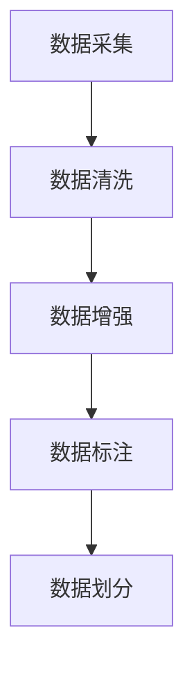
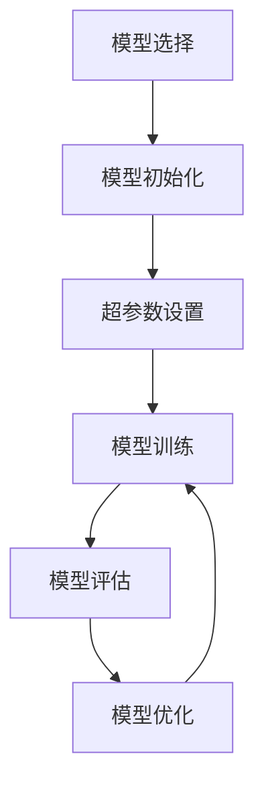
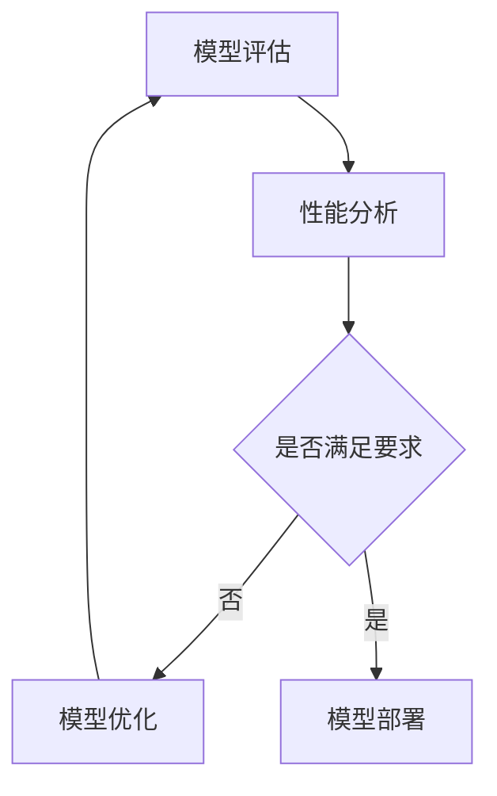
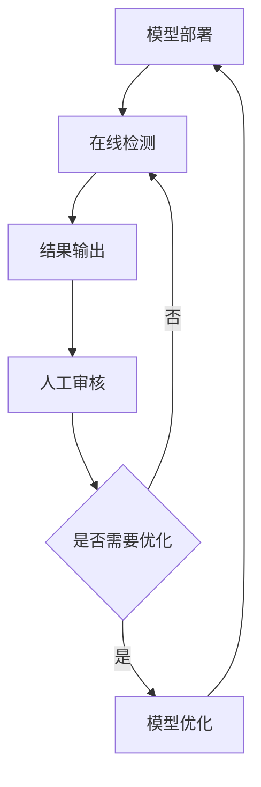
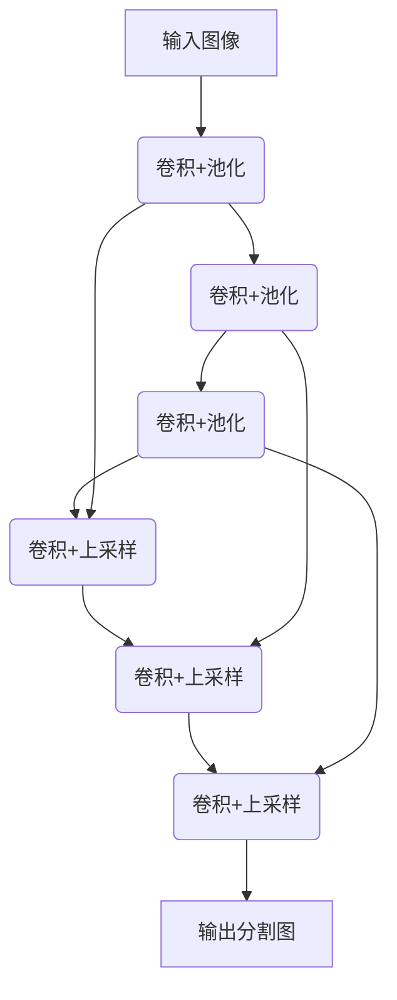
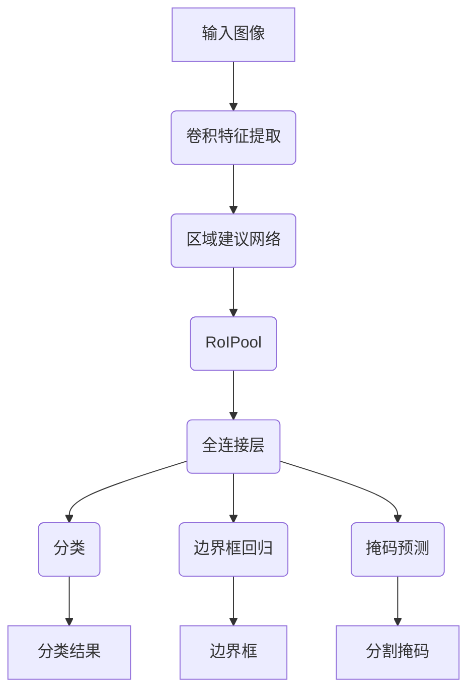

# AI人工智能深度学习算法：在缺陷检测中的应用

## 1.背景介绍

### 1.1 缺陷检测的重要性

在制造业中,产品质量是关键因素之一。缺陷产品不仅会导致经济损失,还可能对用户的安全构成威胁。因此,及时准确地检测产品缺陷对于保证产品质量、降低成本和提高客户满意度至关重要。

传统的缺陷检测方法主要依赖人工视觉检查,存在着效率低下、疲劳影响、主观性强等缺陷。随着计算机视觉和深度学习技术的不断发展,基于人工智能的自动化缺陷检测系统逐渐成为行业趋势。

### 1.2 人工智能在缺陷检测中的应用

人工智能技术,尤其是深度学习算法,为缺陷检测提供了新的解决方案。深度学习模型能够从大量数据中自动学习特征表示,并对复杂的缺陷模式进行准确识别。相比传统的机器学习方法,深度学习模型具有更强的泛化能力,可以处理更复杂、更多变的缺陷类型。

深度学习算法在缺陷检测中的应用可分为以下几个主要步骤:

1. 数据采集和预处理
2. 模型选择和训练
3. 模型评估和优化
4. 模型部署和在线检测

本文将重点介绍深度学习算法在缺陷检测中的应用,包括常用的网络模型、训练技巧、实际案例分析等内容,为读者提供全面的理解和实践指导。

## 2.核心概念与联系

### 2.1 计算机视觉基础

计算机视觉是人工智能的一个重要分支,旨在使计算机能够获取、处理和理解数字图像或视频中的信息。在缺陷检测任务中,计算机视觉技术用于从图像或视频中提取特征,并将其与已知的缺陷模式进行匹配。

常用的计算机视觉技术包括:

- 图像预处理(噪声去除、增强等)
- 特征提取(边缘检测、角点检测等)
- 图像分割(将图像分割为不同的区域)
- 模式识别(将提取的特征与已知模式进行匹配)

### 2.2 深度学习概述

深度学习是机器学习的一个新兴领域,它模仿人脑神经网络的工作原理,通过构建深层次的神经网络模型来自动从数据中学习特征表示。与传统的机器学习算法相比,深度学习模型具有以下优势:

- 自动特征学习能力
- 端到端的训练方式
- 强大的泛化能力
- 处理高维数据的能力

常用的深度学习模型包括卷积神经网络(CNN)、递归神经网络(RNN)、生成对抗网络(GAN)等。

### 2.3 深度学习在缺陷检测中的应用

将深度学习应用于缺陷检测任务,主要有以下几个优势:

1. **自动特征学习**: 深度学习模型能够自动从大量数据中学习缺陷的特征表示,而无需人工设计特征。
2. **端到端训练**: 将图像输入到模型,即可直接输出缺陷检测结果,无需分多个阶段处理。
3. **泛化能力强**: 深度学习模型具有强大的泛化能力,可以检测未见过的新类型缺陷。
4. **实时性能好**: 经过优化的深度学习模型可以实现实时的缺陷检测,满足工业生产线的要求。

常用于缺陷检测的深度学习模型包括全卷积网络(FCN)、U-Net、Mask R-CNN等。这些模型可用于对缺陷进行分类、定位、分割等任务。

## 3.核心算法原理具体操作步骤  

在缺陷检测任务中,深度学习算法的应用通常可分为以下几个步骤:

### 3.1 数据采集和预处理

1. **数据采集**: 收集包含缺陷和无缺陷样本的图像或视频数据,确保数据的多样性和代表性。
2. **数据清洗**: 对采集的原始数据进行清洗,去除噪声、模糊、遮挡等低质量数据。
3. **数据增强**: 通过旋转、翻转、裁剪等方式对现有数据进行增强,扩大数据集的规模和多样性。
4. **数据标注**: 由人工或半自动方式对数据进行标注,标记出缺陷的类型、位置和范围等信息。
5. **数据划分**: 将标注好的数据集划分为训练集、验证集和测试集,用于模型的训练、评估和测试。

### 3.2 模型选择和训练

1. **模型选择**: 根据任务类型(分类、检测、分割等)和数据特征,选择合适的深度学习模型,如全卷积网络、U-Net、Mask R-CNN等。
2. **模型初始化**: 初始化模型的结构和参数,设置输入输出维度、激活函数等。
3. **超参数设置**: 设置模型训练的超参数,如学习率、批量大小、正则化系数等。
4. **模型训练**: 使用训练集对模型进行训练,通过反向传播算法不断优化模型参数,使其能够学习到缺陷的特征表示。
5. **模型评估**: 在验证集上评估模型的性能,计算准确率、精确率、召回率等指标。
6. **模型优化**: 根据评估结果,调整模型结构、超参数或训练策略,以提高模型的性能。

### 3.3 模型评估和优化

1. **模型评估**: 在独立的测试集上评估模型的泛化性能,计算各项指标。
2. **性能分析**: 分析评估结果,找出模型的优缺点,如存在过拟合、欠拟合等问题。
3. **模型优化**: 根据性能分析结果,采取相应的优化策略,如数据增强、正则化、模型集成等。
4. **模型部署**: 如果模型性能满足要求,则将其部署到实际的生产环境中,用于在线缺陷检测。

### 3.4 模型部署和在线检测

1. **模型部署**: 将训练好的模型部署到生产环境中,如工业相机、边缘设备或云端服务器。
2. **在线检测**: 实时获取产品图像或视频数据,输入到已部署的模型中进行缺陷检测。
3. **结果输出**: 模型输出检测结果,包括缺陷的类型、位置、范围等信息。
4. **人工审核**: 人工对模型输出的结果进行审核,确保准确性。
5. **模型优化**: 如果发现模型存在较大偏差,则需要对模型进行优化,如增加训练数据、调整超参数等。

通过上述步骤,深度学习算法可以有效地应用于缺陷检测任务中,提高检测的准确性和效率。

## 4.数学模型和公式详细讲解举例说明

在深度学习算法中,数学模型和公式扮演着重要的角色。本节将介绍一些常用的数学模型和公式,并通过具体例子进行详细说明。

### 4.1 卷积神经网络(CNN)

卷积神经网络是深度学习中最成功的模型之一,广泛应用于计算机视觉任务,如图像分类、目标检测和语义分割等。CNN的核心思想是通过卷积操作自动学习图像的特征表示。

CNN的基本结构包括以下几个关键层:

1. **卷积层(Convolutional Layer)**: 通过卷积核对输入图像进行卷积操作,提取局部特征。卷积操作的数学表达式如下:

$$
y_{ij} = \sum_{m}\sum_{n}x_{m,n}w_{ij,m,n} + b_{ij}
$$

其中,$x$表示输入图像,$w$表示卷积核权重,$b$表示偏置项,$y$表示卷积后的特征图。

2. **池化层(Pooling Layer)**: 对卷积后的特征图进行下采样,减小特征图的空间维度,提高模型的计算效率和鲁棒性。常用的池化操作包括最大池化和平均池化。

3. **全连接层(Fully Connected Layer)**: 将前面层的特征图展平,并与全连接层的权重相乘,得到最终的分类或回归输出。

通过堆叠多个卷积层、池化层和全连接层,CNN可以逐层提取图像的高级语义特征,实现对图像的有效表示和处理。

### 4.2 U-Net

U-Net是一种广泛应用于图像分割任务的全卷积网络模型。它的主要特点是采用了"编码器-解码器"的对称结构,能够有效地捕获图像的上下文信息,并生成与输入图像具有相同空间维度的分割结果。

U-Net的网络结构如下图所示:

U-Net的编码器部分由多个卷积层和池化层组成,用于提取图像的特征表示。解码器部分则通过上采样操作和跳跃连接,将编码器中的特征图逐层合并,最终生成与输入图像大小相同的分割结果。

U-Net在医学图像分割、工业缺陷检测等领域表现出色,能够有效地处理不同尺度和形状的目标物体。

### 4.3 Mask R-CNN

Mask R-CNN是一种用于实例分割的深度学习模型,它在目标检测算法Faster R-CNN的基础上,增加了一个分支用于预测目标的分割掩码。

Mask R-CNN的网络结构如下图所示:

Mask R-CNN的工作流程如下:

1. 卷积特征提取网络(如ResNet)对输入图像提取特征图。
2. 区域建议网络(RPN)在特征图上生成一系列候选边界框。
3. RoIPool层对每个候选边界框进行特征提取,生成固定大小的特征向量。
4. 全连接层对特征向量进行处理,并输出三个分支:
   - 分类分支预测每个候选框内的目标类别。
   - 回归分支精细调整每个候选框的位置和大小。
   - 掩码分支预测每个候选框内目标的分割掩码。

通过以上步骤,Mask R-CNN能够同时实现目标检测和实例分割,在缺陷检测等任务中表现出色。

### 4.4 损失函数

在深度学习模型的训练过程中,损失函数扮演着至关重要的角色。它用于衡量模型预测结果与真实标签之间的差异,并作为优化目标,通过反向传播算法不断调整模型参数,使损失