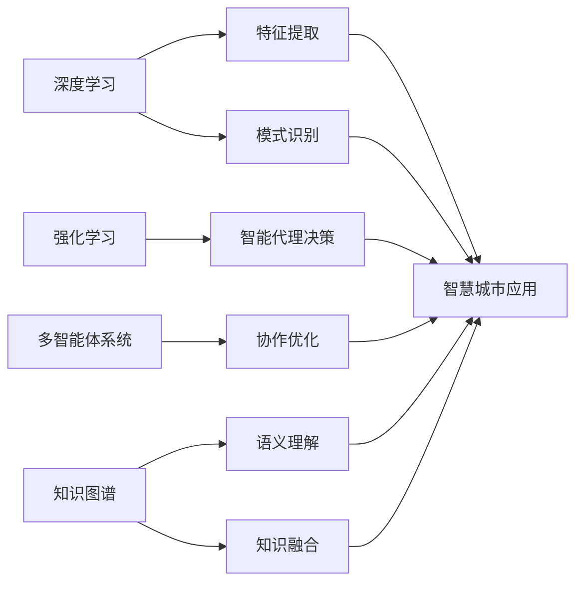

# AI人工智能深度学习算法：智能代理在智慧城市中的实践

## 1. 背景介绍
### 1.1 智慧城市的兴起
随着城市化进程的加速和人口的不断增长,传统的城市管理模式已经无法满足现代化城市的需求。智慧城市的概念应运而生,通过利用物联网、大数据、人工智能等新兴技术,实现城市的智能化管理和运营,提高城市的效率和居民的生活质量。

### 1.2 人工智能在智慧城市中的应用
人工智能作为智慧城市的核心技术之一,在城市管理、交通、安防、环保等多个领域发挥着重要作用。深度学习算法作为人工智能的重要分支,通过对海量数据的学习和训练,可以实现对复杂场景的理解和决策,为智慧城市提供智能化的解决方案。

### 1.3 智能代理的概念
智能代理是一种基于人工智能技术的自主实体,能够感知环境,根据设定的目标和规则自主地进行决策和行动。在智慧城市中,智能代理可以作为城市管理的"大脑",协调各个子系统的运作,优化资源配置,提高城市的运行效率。

## 2. 核心概念与联系
### 2.1 深度学习
深度学习是机器学习的一个分支,通过构建多层神经网络,对数据进行表示学习和特征提取,实现对复杂模式的识别和预测。深度学习算法包括卷积神经网络(CNN)、循环神经网络(RNN)、长短期记忆网络(LSTM)等。

### 2.2 强化学习
强化学习是一种通过智能体与环境的交互,通过奖励和惩罚的反馈,不断优化智能体行为策略的学习方法。强化学习在智能代理的决策和控制中发挥着重要作用。

### 2.3 多智能体系统
多智能体系统由多个智能代理组成,通过协作和竞争,实现整个系统的优化和自适应。在智慧城市中,多智能体系统可以用于交通调度、能源管理等复杂场景。

### 2.4 知识图谱
知识图谱是一种结构化的知识表示方法,通过实体、关系和属性的形式,描述领域知识。在智慧城市中,知识图谱可以用于城市数据的语义理解和融合,为智能决策提供支持。

### 2.5 核心概念之间的联系



## 3. 核心算法原理具体操作步骤
### 3.1 卷积神经网络(CNN)
- 输入数据预处理,归一化
- 卷积层提取局部特征
- 池化层降维,提取主要特征
- 全连接层进行分类或回归
- 反向传播,更新网络参数

### 3.2 循环神经网络(RNN)
- 输入序列数据
- 隐藏层循环处理序列,捕捉时序信息
- 输出层进行预测
- 反向传播,更新网络参数

### 3.3 深度Q网络(DQN)
- 输入状态,神经网络输出Q值
- 根据Q值选择动作
- 执行动作,获得奖励和下一状态
- 计算Q值的目标值,更新网络参数

### 3.4 基于Actor-Critic的深度强化学习
- Actor网络输出动作概率分布
- Critic网络评估状态的价值
- 根据动作和奖励更新两个网络
- 不断迭代,提高策略的性能

## 4. 数学模型和公式详细讲解举例说明
### 4.1 卷积神经网络
卷积层的计算公式:
$$
a^{l}_{i,j} = \sum_{m=0}^{M-1} \sum_{n=0}^{N-1} w^{l}_{m,n} x^{l-1}_{i+m,j+n} + b^{l}
$$
其中,$a^{l}_{i,j}$表示第$l$层第$(i,j)$个神经元的激活值,$w^{l}_{m,n}$表示卷积核的权重,$x^{l-1}$表示上一层的输出,$b^{l}$表示偏置项。

池化层的计算公式(以最大池化为例):
$$
a^{l}_{i,j} = \max_{m=0,n=0}^{m=s-1,n=s-1} a^{l-1}_{si+m,sj+n}
$$
其中,$s$表示池化的步长。

### 4.2 循环神经网络
基本的RNN计算公式:
$$
h_t = \sigma(W_{hh}h_{t-1} + W_{xh}x_t + b_h)
$$
$$
y_t = W_{hy}h_t + b_y
$$
其中,$h_t$表示$t$时刻的隐藏状态,$x_t$表示$t$时刻的输入,$y_t$表示$t$时刻的输出,$W$和$b$分别表示权重矩阵和偏置项,$\sigma$表示激活函数。

### 4.3 深度Q网络
Q值的更新公式(Bellman方程):
$$
Q(s,a) \leftarrow Q(s,a) + \alpha [r + \gamma \max_{a'} Q(s',a') - Q(s,a)]
$$
其中,$Q(s,a)$表示在状态$s$下采取动作$a$的Q值,$r$表示奖励,$\gamma$表示折扣因子,$\alpha$表示学习率。

### 4.4 基于Actor-Critic的深度强化学习
策略梯度定理:
$$
\nabla_\theta J(\theta) = \mathbb{E}_{\tau \sim p_\theta(\tau)} [\sum_{t=0}^T \nabla_\theta \log \pi_\theta(a_t|s_t) Q^{\pi_\theta}(s_t,a_t)]
$$
其中,$J(\theta)$表示期望回报,$\tau$表示轨迹,$p_\theta(\tau)$表示轨迹的概率分布,$\pi_\theta(a_t|s_t)$表示策略,$Q^{\pi_\theta}(s_t,a_t)$表示状态-动作值函数。

## 5. 项目实践：代码实例和详细解释说明
### 5.1 基于卷积神经网络的交通标志识别

```python
import tensorflow as tf

# 构建CNN模型
model = tf.keras.Sequential([
    tf.keras.layers.Conv2D(32, (3,3), activation='relu', input_shape=(32,32,3)),
    tf.keras.layers.MaxPooling2D((2,2)),
    tf.keras.layers.Conv2D(64, (3,3), activation='relu'),
    tf.keras.layers.MaxPooling2D((2,2)),
    tf.keras.layers.Conv2D(64, (3,3), activation='relu'),
    tf.keras.layers.Flatten(),
    tf.keras.layers.Dense(64, activation='relu'),
    tf.keras.layers.Dense(10)
])

# 编译模型
model.compile(optimizer='adam',
              loss=tf.keras.losses.SparseCategoricalCrossentropy(from_logits=True),
              metrics=['accuracy'])

# 训练模型
model.fit(train_images, train_labels, epochs=10, 
          validation_data=(test_images, test_labels))
```

上述代码使用TensorFlow构建了一个简单的CNN模型,用于交通标志的识别。模型包括卷积层、池化层和全连接层,通过Adam优化器和交叉熵损失函数进行训练,最终在测试集上评估模型的性能。

### 5.2 基于LSTM的交通流量预测

```python
import tensorflow as tf

# 构建LSTM模型
model = tf.keras.Sequential([
    tf.keras.layers.LSTM(64, input_shape=(time_steps, num_features)),
    tf.keras.layers.Dense(1)
])

# 编译模型
model.compile(optimizer=tf.keras.optimizers.RMSprop(), loss='mae')

# 训练模型
history = model.fit(train_data, train_labels, epochs=50, batch_size=72,
                    validation_data=(test_data, test_labels))
```

上述代码使用TensorFlow构建了一个基于LSTM的交通流量预测模型。模型的输入为过去一段时间的交通流量数据,输出为未来一段时间的流量预测值。通过RMSprop优化器和平均绝对误差(MAE)损失函数进行训练,最终在测试集上评估模型的性能。

### 5.3 基于DQN的智能交通信号控制

```python
import numpy as np
import tensorflow as tf

# 定义DQN模型
class DQN(tf.keras.Model):
    def __init__(self, num_actions):
        super(DQN, self).__init__()
        self.dense1 = tf.keras.layers.Dense(64, activation='relu')
        self.dense2 = tf.keras.layers.Dense(64, activation='relu')
        self.out = tf.keras.layers.Dense(num_actions)

    def call(self, x):
        x = self.dense1(x)
        x = self.dense2(x)
        q_values = self.out(x)
        return q_values

# 定义Agent
class DQNAgent:
    def __init__(self, num_actions):
        self.num_actions = num_actions
        self.model = DQN(num_actions)
        self.target_model = DQN(num_actions)
        self.optimizer = tf.keras.optimizers.Adam(learning_rate=0.001)
        self.gamma = 0.99
        self.epsilon = 1.0
        self.epsilon_min = 0.01
        self.epsilon_decay = 0.995
        self.batch_size = 64
        self.memory = []
        self.memory_size = 10000

    def act(self, state):
        if np.random.rand() <= self.epsilon:
            return np.random.randint(self.num_actions)
        else:
            q_values = self.model(np.array([state]))
            return np.argmax(q_values[0])

    def remember(self, state, action, reward, next_state, done):
        self.memory.append((state, action, reward, next_state, done))
        if len(self.memory) > self.memory_size:
            self.memory.pop(0)

    def replay(self):
        if len(self.memory) < self.batch_size:
            return
        samples = np.random.choice(len(self.memory), self.batch_size, replace=False)
        states, actions, rewards, next_states, dones = zip(*[self.memory[i] for i in samples])
        states = np.array(states)
        actions = np.array(actions)
        rewards = np.array(rewards)
        next_states = np.array(next_states)
        dones = np.array(dones)

        q_values = self.model(states)
        q_values_next = self.target_model(next_states)
        q_values_max = np.max(q_values_next, axis=1)
        targets = rewards + (1 - dones) * self.gamma * q_values_max
        targets_f = self.model(states).numpy()
        targets_f[range(self.batch_size), actions] = targets

        with tf.GradientTape() as tape:
            q_values = self.model(states)
            loss = tf.keras.losses.mean_squared_error(targets_f, q_values)
        grads = tape.gradient(loss, self.model.trainable_variables)
        self.optimizer.apply_gradients(zip(grads, self.model.trainable_variables))

        if self.epsilon > self.epsilon_min:
            self.epsilon *= self.epsilon_decay

    def update_target_model(self):
        self.target_model.set_weights(self.model.get_weights())

# 训练Agent
agent = DQNAgent(num_actions)
for episode in range(num_episodes):
    state = env.reset()
    done = False
    while not done:
        action = agent.act(state)
        next_state, reward, done, _ = env.step(action)
        agent.remember(state, action, reward, next_state, done)
        state = next_state
        agent.replay()
    agent.update_target_model()
```

上述代码实现了一个基于DQN的智能交通信号控制系统。Agent通过与环境交互,不断学习和优化信号控制策略。模型包括两个相同结构的神经网络(Q网络和目标Q网络),通过梯度下降法更新Q网络的参数,并定期将Q网络的参数复制给目标Q网络。Agent使用epsilon-greedy策略平衡探索和利用,并通过经验回放机制提高样本利用效率和训练稳定性。

## 6. 实际应用场景
### 6.1 智慧交通
- 交通流量预测与疏导
- 智能信号灯控制
- 公交车调度优化
- 自动驾驶与车路协同

### 6.2 智慧安防
- 人脸识别与跟踪
- 异常行为检测
- 智能巡逻路径规划
- 警力调度优化

### 6.3 智慧环保
- 空气质量预测与预警
- 水质