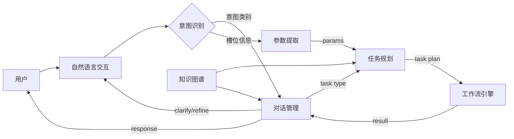
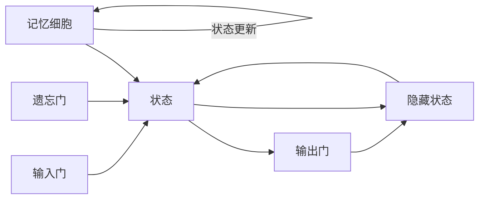

# AI人工智能深度学习算法：自然语言处理在工作流代理中的运用

## 1.背景介绍
### 1.1 人工智能与自然语言处理概述
人工智能(Artificial Intelligence, AI)是计算机科学的一个重要分支,旨在研究如何让计算机模拟人类的智能行为。自然语言处理(Natural Language Processing, NLP)则是人工智能领域的一个重要方向,致力于让计算机能够理解、生成和处理人类语言。

近年来,随着深度学习技术的快速发展,自然语言处理取得了突破性进展。深度学习模型能够从海量文本数据中自动学习语言知识和规律,大幅提升了各类NLP任务的性能,如机器翻译、情感分析、命名实体识别、文本摘要等。这为NLP技术在实际场景中的应用奠定了基础。

### 1.2 工作流代理的需求与挑战
工作流(Workflow)是一系列相互关联的任务按照特定的规则和流程进行的过程,广泛存在于企业日常运营管理中。工作流代理(Workflow Agent)则是一种智能化的系统,能够根据上下文理解用户需求,自动执行和协调工作流任务,提高工作效率。

传统的工作流系统主要依赖预定义的规则和人工干预,灵活性和智能化程度不足。引入自然语言处理技术,赋予工作流代理基于自然语言理解用户意图、对话交互、信息抽取、任务规划等能力,有望突破这一瓶颈,实现工作流的自动化和优化。

然而,将NLP应用于工作流代理也面临诸多挑战:
1. 工作流涉及领域广泛,需要处理复杂多样的自然语言指令和对话。
2. 工作流任务之间存在依赖关系和时序约束,对任务规划提出更高要求。 
3. 需要根据用户意图和工作流上下文进行推理,生成合适的应答。
4. 工作流的执行需要与外部系统对接,对系统集成提出考验。

因此,如何利用先进的NLP技术,构建高效、智能、可扩展的工作流代理系统,成为了自然语言处理和人工智能领域的一个重要课题。

## 2.核心概念与联系
### 2.1 任务型对话系统
任务型对话系统是工作流代理的核心组件之一。不同于开放域聊天系统,任务型对话旨在完成特定的目标,如信息查询、任务规划、操作执行等。其需要理解用户意图,提取关键信息,根据任务知识库进行推理和决策,生成引导用户完成任务的对话。

### 2.2 意图识别与槽位填充
意图识别和槽位填充是任务型对话系统的两个关键任务。意图识别要判断用户当前输入属于预定义的哪一类意图,如创建会议、分配任务等。槽位填充则是进一步提取意图所需的关键信息,如会议主题、时间、地点、参与人等。二者相辅相成,共同帮助系统理解用户需求。

### 2.3 工作流建模与任务规划
工作流建模是将工作流中的任务、活动、参与者、资源等以计算机可理解的形式抽象和表示。常见的建模方法有流程图、UML活动图、Petri网等。任务规划则是根据工作流模型,上下文信息,以及对话交互过程中获得的用户意图和参数,自动生成满足约束条件的任务执行方案。

### 2.4 知识图谱与推理
工作流代理需要储备足够的领域知识,用于完成任务规划、流程推进和用户问题解答。知识图谱以图的形式表示实体及其关联,是一种结构化的知识库。在此基础上,运用逻辑推理、图神经网络等技术,可以揭示隐含的关系,回答复杂问题。知识图谱与推理能力是工作流代理的重要智能化手段。

### 2.5 Mermaid流程图
下面使用Mermaid绘制工作流代理中NLP技术的关键组件及其交互:


从上图可见,工作流代理以自然语言交互为入口,通过意图识别、槽位填充等NLP任务理解用户需求,并借助知识图谱等领域知识,规划和执行工作流任务,最终以自然语言的形式将结果反馈给用户,形成一个完整的智能化闭环。

## 3.核心算法原理具体操作步骤
工作流代理中的自然语言处理涉及一系列核心算法,下面以意图识别和槽位填充为例,介绍其基本原理和操作步骤。

### 3.1 意图识别
意图识别可以看作一个文本分类问题,将用户输入划分到预定义的意图类别。主要步骤如下:
1. 构建意图标注数据集,每条数据为(用户话语,意图标签)。 
2. 对原始文本进行预处理,如切词、去除停用词、小写转换等。
3. 将文本转换为数值特征向量,常用方法有词袋模型、TF-IDF、词向量等。
4. 选择合适的分类器,如逻辑回归、SVM、CNN、RNN等,训练意图分类模型。
5. 使用训练好的模型对新输入进行意图预测。

### 3.2 槽位填充
槽位填充是一个序列标注任务,为输入序列中的每个词分配一个预定义的槽位标签(如B-time、I-time、O等),提取意图所需的关键信息。主要步骤包括:
1. 构建槽位标注数据集,每条数据为(用户话语,槽位标签序列)。
2. 进行文本预处理和特征表示,同意图识别。
3. 选择序列标注模型,如BiLSTM、CRF、BiLSTM-CRF等。
4. 训练槽位填充模型,学习标签转移和发射概率。
5. 使用训练好的模型对新输入进行槽位标注,提取关键信息。

### 3.3 深度学习方法
近年来,深度学习在意图识别和槽位填充任务上取得了显著成果。一些代表性的模型包括:
- CNN:使用卷积神经网络自动提取局部特征,并通过池化获得全局表示。
- RNN:使用循环神经网络如LSTM、GRU等建模文本序列信息。
- Seq2Seq:使用Encoder-Decoder结构,同时完成意图识别和槽位生成。
- BERT:使用预训练的双向Transformer编码器,通过fine-tune实现下游任务。

这些深度学习模型能够自动学习文本特征表示,挖掘词汇和语义之间的深层次关联,大幅提升了意图识别和槽位填充的准确率。同时,预训练模型如BERT能够充分利用大规模无监督语料,显著减少标注数据的需求。

## 4.数学模型和公式详细讲解举例说明
本节以LSTM(Long Short-Term Memory)模型为例,详细讲解其在槽位填充任务中的数学原理和公式。LSTM是一种常用于序列标注的循环神经网络,能够有效捕捉长距离依赖信息。

### 4.1 LSTM 基本结构
LSTM的基本结构如下图所示:



LSTM引入了三个门控单元:输入门、遗忘门和输出门,用于控制信息的流动。记忆细胞负责存储和更新长期状态信息。

### 4.2 前向传播公式
设第$t$时刻的输入为$x_t$,隐藏状态为$h_t$,记忆细胞状态为$c_t$。LSTM的前向传播公式为:

输入门:
$$
i_t = \sigma(W_i \cdot [h_{t-1}, x_t] + b_i)
$$

遗忘门:
$$
f_t = \sigma(W_f \cdot [h_{t-1}, x_t] + b_f) 
$$

记忆细胞候选状态:
$$
\tilde{c}_t = \tanh(W_c \cdot [h_{t-1}, x_t] + b_c)
$$

记忆细胞状态更新:
$$
c_t = f_t * c_{t-1} + i_t * \tilde{c}_t
$$

输出门:
$$
o_t = \sigma(W_o \cdot [h_{t-1}, x_t] + b_o)
$$

隐藏状态:
$$
h_t = o_t * \tanh(c_t)
$$

其中,$\sigma$为sigmoid激活函数,$\tanh$为双曲正切激活函数,$*$为按元素乘法。$W_i,W_f,W_c,W_o$为权重矩阵,$b_i,b_f,b_c,b_o$为偏置项。

### 4.3 槽位标签预测
在槽位填充任务中,可以在LSTM的隐藏状态$h_t$之上添加一个线性层和softmax层,预测每个词对应的槽位标签概率分布:

$$
y_t = \text{softmax}(W_y \cdot h_t + b_y)
$$

其中,$y_t$为第$t$个词的标签概率分布,$W_y$和$b_y$为全连接层的参数。

### 4.4 损失函数与优化
训练时,我们以交叉熵损失函数衡量预测标签与真实标签的差异:

$$
\mathcal{L} = -\sum_{t=1}^{T} \sum_{j=1}^{N} y_{t,j}^* \log y_{t,j}
$$

其中,$y_{t,j}^*$为第$t$个词真实标签的one-hot向量,$y_{t,j}$为预测概率,$T$为序列长度,$N$为标签种类数。

通过反向传播和梯度下降等优化算法,最小化损失函数,更新模型参数,直至收敛。

### 4.5 示例说明
考虑如下输入:"What is the weather in Beijing today?"

LSTM逐词处理该句子,在每个时间步输出隐藏状态。假设预测结果为:
```
What     O
is       O
the      O 
weather  O
in       O
Beijing  B-location
today    B-date
?        O
```

可见,LSTM成功地识别出了查询地点"Beijing"和日期"today"两个关键槽位信息。这些槽位将进一步传递给下游的任务规划和工作流执行模块。

## 5.项目实践：代码实例和详细解释说明
下面我们使用Python和PyTorch库,实现一个简单的基于LSTM的槽位填充模型。

### 5.1 数据准备
首先,我们定义槽位标签集合,并准备训练数据:

```python
# 槽位标签集合
tag_to_ix = {"O": 0, "B-location": 1, "I-location": 2, "B-date": 3, "I-date": 4}  

# 训练样本
training_data = [
    ("What is the weather in Beijing today?", ["O", "O", "O", "O", "O", "B-location", "B-date", "O"]),
    ("How is the weather in Shanghai tomorrow?", ["O", "O", "O", "O", "O", "B-location", "B-date", "O"]),
    # 更多训练数据......
]
```

### 5.2 模型定义
使用PyTorch定义LSTM槽位填充模型:

```python
import torch
import torch.nn as nn
import torch.nn.functional as F

class LSTMTagger(nn.Module):
    def __init__(self, embedding_dim, hidden_dim, vocab_size, tagset_size):
        super(LSTMTagger, self).__init__()
        self.hidden_dim = hidden_dim
        self.word_embeddings = nn.Embedding(vocab_size, embedding_dim)
        self.lstm = nn.LSTM(embedding_dim, hidden_dim, batch_first=True)
        self.hidden2tag = nn.Linear(hidden_dim, tagset_size)

    def forward(self, sentence):
        embeds = self.word_embeddings