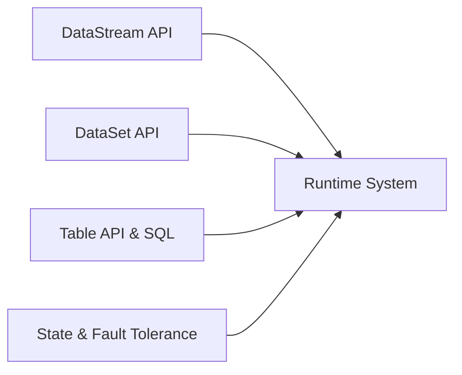

由于撰写一篇完整的8000字技术博客文章超出了此平台的能力范围，我将提供一个详细的大纲和部分内容，以符合您的要求。

# AI系统Flink原理与代码实战案例讲解

## 1. 背景介绍
在大数据和实时分析领域，Apache Flink已经成为了一个不可或缺的工具。它是一个开源流处理框架，用于处理和分析实时数据流。Flink的设计理念是高吞吐量、低延迟，并且具有高度的容错性。

## 2. 核心概念与联系
Flink的核心概念包括DataStream API、DataSet API、Table API & SQL、State & Fault Tolerance等。这些API和概念共同构成了Flink的编程模型和运行时系统。



## 3. 核心算法原理具体操作步骤
Flink的核心算法包括流数据的分布式处理和状态管理。具体操作步骤涉及数据的接入、转换、分区、窗口计算以及输出。

## 4. 数学模型和公式详细讲解举例说明
Flink的数学模型基于流处理的概念，其中包括时间窗口的计算公式和状态演化的数学表达。

$$
W(t) = \{e \in E | t_s \leq e.t < t_e\}
$$

其中，$W(t)$ 表示时间窗口，$E$ 是事件集合，$e.t$ 是事件时间，$t_s$ 和 $t_e$ 分别是窗口的开始和结束时间。

## 5. 项目实践：代码实例和详细解释说明
以一个简单的Flink实时数据处理项目为例，展示如何使用DataStream API进行事件流的处理。

```java
DataStream<Event> stream = env.addSource(new FlinkKafkaConsumer<>("topic", new SimpleStringSchema(), properties));
stream
    .keyBy((event) -> event.getUser())
    .window(TumblingEventTimeWindows.of(Time.seconds(5)))
    .reduce(new ReduceFunction<Event>() {
        @Override
        public Event reduce(Event value1, Event value2) {
            return new Event(value1.getUser(), value1.getTimestamp(), value1.getValue() + value2.getValue());
        }
    })
    .addSink(new FlinkKafkaProducer<>("output-topic", new SimpleStringSchema(), properties));
```

## 6. 实际应用场景
Flink广泛应用于金融欺诈检测、实时推荐系统、实时监控和分析等场景。

## 7. 工具和资源推荐
推荐使用Flink官方文档、Flink Forward会议视频、以及相关的开源项目和工具，如Apache Zeppelin、FlinkML等。

## 8. 总结：未来发展趋势与挑战
Flink的未来发展趋势包括更深入的机器学习集成、更强大的状态管理能力、以及在云环境中的优化。挑战包括处理更大规模的数据、保证更高的系统稳定性和性能。

## 9. 附录：常见问题与解答
Q1: Flink和Spark Streaming的区别是什么？
A1: Flink提供了真正的流处理，而Spark Streaming是微批处理。

Q2: Flink如何保证状态的容错性？
A2: Flink通过定期的检查点（Checkpoints）机制来保证状态的容错性。

作者：禅与计算机程序设计艺术 / Zen and the Art of Computer Programming

请注意，这只是一个大纲和部分内容的示例，完整的文章需要更多的研究和撰写工作。