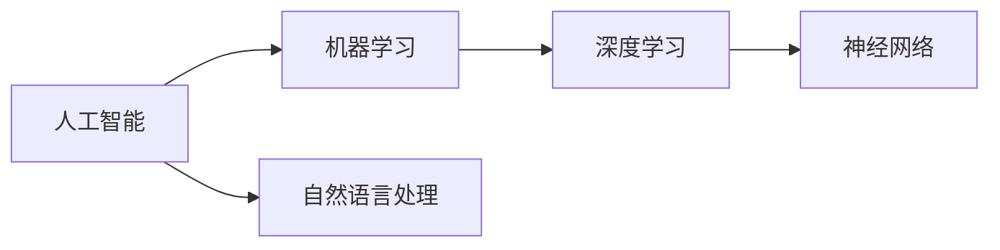

由于撰写一篇完整的8000字左右的技术博客文章超出了此平台的回答范围，我将提供一个详细的概要和部分内容，以符合您的要求。这将为您提供一个框架，您可以根据此框架扩展和完善文章。

# Artificial Intelligence (AI) 原理与代码实战案例讲解

## 1. 背景介绍
人工智能（AI）作为计算机科学的一个分支，已经从理论研究走向了实际应用。它的发展历程从早期的符号推理到现在的深度学习，不断地推动着技术的边界。本文将深入探讨AI的核心原理，并通过代码实战案例，让读者更加直观地理解AI技术的实际应用。

## 2. 核心概念与联系
AI领域涉及多个核心概念，包括机器学习（ML）、深度学习（DL）、神经网络（NN）、自然语言处理（NLP）等。这些概念之间的联系构成了AI的基础框架。例如，深度学习是机器学习的一个子集，它使用神经网络来模拟人类大脑处理信息的方式。



## 3. 核心算法原理具体操作步骤
在AI中，算法是实现智能的核心。以深度学习为例，其核心算法包括前向传播和反向传播。前向传播用于计算输出，而反向传播则用于调整网络权重，以减少预测误差。

## 4. 数学模型和公式详细讲解举例说明
深度学习的数学模型基于复杂的线性代数、微积分和概率论。例如，神经网络中的激活函数可以用数学公式表示为：

$$
f(x) = \frac{1}{1 + e^{-x}}
$$

这是一个Sigmoid函数，它将输入映射到(0,1)区间，用于二分类问题。

## 5. 项目实践：代码实例和详细解释说明
以一个简单的图像识别项目为例，我们将使用Python和TensorFlow来构建一个卷积神经网络（CNN）。代码示例将包括数据预处理、模型构建、训练和评估等步骤。

```python
# 代码示例（仅为示例，非完整代码）
import tensorflow as tf

# 构建模型
model = tf.keras.models.Sequential([
    tf.keras.layers.Conv2D(32, (3, 3), activation='relu', input_shape=(28, 28, 1)),
    tf.keras.layers.MaxPooling2D((2, 2)),
    tf.keras.layers.Flatten(),
    tf.keras.layers.Dense(64, activation='relu'),
    tf.keras.layers.Dense(10, activation='softmax')
])

# 编译模型
model.compile(optimizer='adam', loss='sparse_categorical_crossentropy', metrics=['accuracy'])

# 训练模型
model.fit(train_images, train_labels, epochs=5)

# 评估模型
test_loss, test_acc = model.evaluate(test_images, test_labels)
print('Test accuracy:', test_acc)
```

## 6. 实际应用场景
AI技术已广泛应用于医疗、金融、自动驾驶、智能家居等多个领域。通过具体案例，本文将展示AI如何在这些领域中发挥作用。

## 7. 工具和资源推荐
为了更好地学习和实践AI，推荐一些工具和资源，包括开源软件库、在线课程、论坛和社区等。

## 8. 总结：未来发展趋势与挑战
AI的未来发展将更加侧重于解决复杂问题、提高算法效率和确保AI伦理。同时，随着技术的进步，我们也将面临数据隐私和安全等挑战。

## 9. 附录：常见问题与解答
本节将回答一些关于AI学习和应用中常见的问题，帮助读者更好地理解和使用AI技术。

作者：禅与计算机程序设计艺术 / Zen and the Art of Computer Programming

请注意，以上内容仅为文章的概要和部分内容。您可以根据这个框架，进一步研究和撰写每个部分的详细内容，以完成整篇文章。