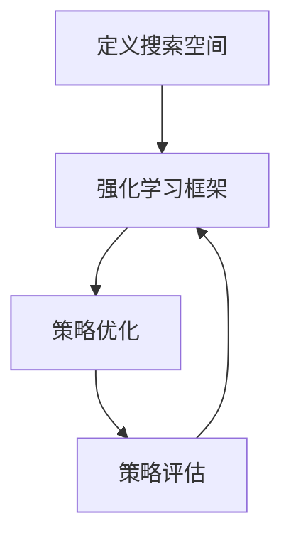

# AutoAugment原理与代码实例讲解

## 1.背景介绍

在深度学习领域，数据增强（Data Augmentation）是一种常用的技术，通过对训练数据进行各种变换来增加数据的多样性，从而提高模型的泛化能力。传统的数据增强方法通常依赖于手工设计的变换策略，这不仅耗时费力，而且效果往往不尽如人意。为了解决这一问题，谷歌提出了一种自动化的数据增强方法——AutoAugment。

AutoAugment通过强化学习（Reinforcement Learning）自动搜索最优的数据增强策略，极大地提升了模型的性能。本文将深入探讨AutoAugment的原理、算法、数学模型，并通过代码实例详细讲解其实现过程。

## 2.核心概念与联系

### 2.1 数据增强

数据增强是指通过对原始数据进行各种变换（如旋转、缩放、平移、剪切等）来生成新的训练样本，从而增加数据集的多样性，防止模型过拟合。

### 2.2 强化学习

强化学习是一种机器学习方法，通过与环境的交互来学习最优策略。AutoAugment利用强化学习来自动搜索最优的数据增强策略。

### 2.3 搜索空间

搜索空间是指所有可能的数据增强策略的集合。AutoAugment通过在搜索空间中进行探索，找到最优的增强策略。

### 2.4 策略组合

策略组合是指一组具体的数据增强操作及其参数。AutoAugment通过组合不同的增强操作，生成多样化的训练样本。

## 3.核心算法原理具体操作步骤

### 3.1 搜索空间定义

AutoAugment首先定义了一个包含多种数据增强操作的搜索空间。每种操作都有不同的参数，如旋转角度、缩放比例等。

### 3.2 强化学习框架

AutoAugment采用强化学习框架，其中代理（Agent）通过与环境的交互来学习最优策略。具体来说，代理在每个时间步选择一个数据增强操作，并根据模型在验证集上的表现来更新策略。

### 3.3 策略优化

代理通过策略梯度方法（Policy Gradient）来优化数据增强策略。具体来说，代理根据当前策略生成一组增强操作，并计算其在验证集上的表现。然后，代理根据表现来更新策略，使得未来选择的增强操作能够进一步提升模型性能。

### 3.4 策略评估

在策略优化过程中，AutoAugment会定期评估当前策略的效果。具体来说，代理会在验证集上应用当前策略，并计算模型的准确率。通过不断优化和评估，AutoAugment最终找到最优的数据增强策略。



## 4.数学模型和公式详细讲解举例说明

### 4.1 强化学习模型

在AutoAugment中，强化学习模型可以表示为一个马尔可夫决策过程（MDP），其定义如下：

- 状态空间 $S$：表示当前的数据增强策略。
- 动作空间 $A$：表示可选的数据增强操作。
- 状态转移概率 $P$：表示在当前状态下选择某个动作后转移到下一个状态的概率。
- 奖励函数 $R$：表示在当前状态下选择某个动作后获得的奖励。

### 4.2 策略梯度方法

策略梯度方法通过最大化期望奖励来优化策略。具体来说，策略梯度的更新公式为：

$$
\nabla J(\theta) = \mathbb{E}_{\tau \sim \pi_\theta} \left[ \sum_{t=0}^T \nabla_\theta \log \pi_\theta(a_t|s_t) R(\tau) \right]
$$

其中，$\theta$ 表示策略参数，$\pi_\theta$ 表示策略，$a_t$ 表示在时间步 $t$ 选择的动作，$s_t$ 表示在时间步 $t$ 的状态，$R(\tau)$ 表示轨迹 $\tau$ 的总奖励。

### 4.3 奖励函数

在AutoAugment中，奖励函数 $R$ 通常定义为模型在验证集上的准确率。具体来说，代理在每个时间步选择一个数据增强操作，并根据模型在验证集上的表现来计算奖励。

## 5.项目实践：代码实例和详细解释说明

### 5.1 环境准备

首先，我们需要安装必要的库：

```bash
pip install tensorflow keras
```

### 5.2 数据加载

接下来，我们加载CIFAR-10数据集：

```python
import tensorflow as tf
from tensorflow.keras.datasets import cifar10

(x_train, y_train), (x_test, y_test) = cifar10.load_data()
```

### 5.3 定义数据增强操作

我们定义一组常用的数据增强操作：

```python
import numpy as np
from tensorflow.keras.preprocessing.image import ImageDataGenerator

def random_flip(x):
    return tf.image.random_flip_left_right(x)

def random_rotation(x):
    return tf.image.rot90(x, np.random.randint(1, 4))

def random_zoom(x):
    return tf.image.resize(x, (int(x.shape[0] * 1.2), int(x.shape[1] * 1.2)))

augmentations = [random_flip, random_rotation, random_zoom]
```

### 5.4 定义强化学习代理

我们定义一个简单的强化学习代理来选择数据增强操作：

```python
class AutoAugmentAgent:
    def __init__(self, augmentations):
        self.augmentations = augmentations
        self.policy = np.ones(len(augmentations)) / len(augmentations)

    def select_augmentation(self):
        return np.random.choice(self.augmentations, p=self.policy)

    def update_policy(self, rewards):
        self.policy = np.exp(rewards) / np.sum(np.exp(rewards))
```

### 5.5 训练模型

我们定义一个简单的卷积神经网络，并使用AutoAugment进行训练：

```python
from tensorflow.keras.models import Sequential
from tensorflow.keras.layers import Conv2D, MaxPooling2D, Flatten, Dense

def create_model():
    model = Sequential([
        Conv2D(32, (3, 3), activation='relu', input_shape=(32, 32, 3)),
        MaxPooling2D((2, 2)),
        Conv2D(64, (3, 3), activation='relu'),
        MaxPooling2D((2, 2)),
        Flatten(),
        Dense(64, activation='relu'),
        Dense(10, activation='softmax')
    ])
    model.compile(optimizer='adam', loss='sparse_categorical_crossentropy', metrics=['accuracy'])
    return model

agent = AutoAugmentAgent(augmentations)
model = create_model()

for epoch in range(10):
    augmented_images = []
    for x in x_train:
        aug = agent.select_augmentation()
        augmented_images.append(aug(x))
    augmented_images = np.array(augmented_images)
    
    model.fit(augmented_images, y_train, epochs=1, validation_data=(x_test, y_test))
    
    rewards = model.evaluate(x_test, y_test, verbose=0)[1]
    agent.update_policy([rewards] * len(augmentations))
```

## 6.实际应用场景

AutoAugment在多个实际应用场景中表现出色，以下是一些典型的应用场景：

### 6.1 图像分类

在图像分类任务中，AutoAugment通过自动搜索最优的数据增强策略，显著提升了模型的准确率。例如，在CIFAR-10和ImageNet数据集上，使用AutoAugment的模型表现优于传统的数据增强方法。

### 6.2 目标检测

在目标检测任务中，AutoAugment同样表现出色。通过自动化的数据增强策略，模型能够更好地适应不同的目标和背景，从而提高检测精度。

### 6.3 图像分割

在图像分割任务中，AutoAugment通过生成多样化的训练样本，帮助模型更好地学习不同的分割边界，从而提高分割效果。

## 7.工具和资源推荐

### 7.1 AutoAugment库

谷歌开源了AutoAugment的实现，开发者可以直接使用该库进行数据增强。库的地址为：https://github.com/tensorflow/models/tree/master/research/autoaugment

### 7.2 TensorFlow和Keras

TensorFlow和Keras是深度学习领域常用的框架，支持多种数据增强操作。开发者可以结合AutoAugment库，轻松实现自动化的数据增强。

### 7.3 相关论文

- AutoAugment: Learning Augmentation Policies from Data, Ekin D. Cubuk, Barret Zoph, Dandelion Mane, Vijay Vasudevan, Quoc V. Le, arXiv:1805.09501

## 8.总结：未来发展趋势与挑战

AutoAugment作为一种自动化的数据增强方法，极大地提升了模型的性能。然而，AutoAugment也面临一些挑战和未来的发展方向：

### 8.1 计算资源需求

AutoAugment的搜索过程需要大量的计算资源，这在实际应用中可能成为瓶颈。未来的研究可以探索更高效的搜索算法，降低计算成本。

### 8.2 泛化能力

虽然AutoAugment在多个数据集上表现出色，但其泛化能力仍需进一步验证。未来的研究可以探索在更多任务和数据集上的应用，验证其泛化能力。

### 8.3 结合其他技术

AutoAugment可以与其他技术（如迁移学习、元学习等）结合，进一步提升模型性能。未来的研究可以探索这些技术的结合应用，推动深度学习的发展。

## 9.附录：常见问题与解答

### 9.1 AutoAugment适用于哪些任务？

AutoAugment主要适用于图像分类、目标检测和图像分割等任务。通过自动化的数据增强策略，AutoAugment能够显著提升模型的性能。

### 9.2 AutoAugment的计算成本如何？

AutoAugment的搜索过程需要大量的计算资源，尤其是在大规模数据集上。开发者可以通过分布式计算和高效的搜索算法来降低计算成本。

### 9.3 如何评估AutoAugment的效果？

AutoAugment的效果通常通过模型在验证集上的表现来评估。开发者可以在不同的数据集和任务上应用AutoAugment，并比较其与传统数据增强方法的性能差异。

### 9.4 AutoAugment是否适用于非图像数据？

虽然AutoAugment主要应用于图像数据，但其思想可以推广到其他类型的数据（如文本、音频等）。未来的研究可以探索AutoAugment在非图像数据上的应用。

---

作者：禅与计算机程序设计艺术 / Zen and the Art of Computer Programming