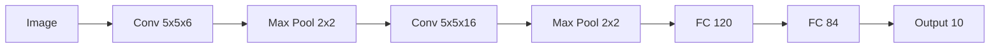
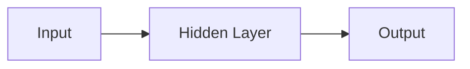

# Computer Vision 原理与代码实战案例讲解

## 1. 背景介绍
### 1.1 计算机视觉的定义与发展历程
计算机视觉(Computer Vision)是一门研究如何使计算机能够"看懂"数字图像或视频的科学。它旨在通过算法和数学模型，让计算机能像人类一样理解、分析和处理视觉信息。计算机视觉经历了从早期的模式识别到如今的深度学习的发展历程，取得了巨大的进步。

### 1.2 计算机视觉的主要任务与挑战
计算机视觉的主要任务包括：
- 图像分类：判断一幅图像所属的类别
- 目标检测：找出图像中感兴趣的目标及其位置
- 语义分割：对图像的每个像素进行分类
- 实例分割：检测出图像中的每个目标实例并分割
- 人脸识别：识别图像或视频中的人脸身份

这些任务面临的主要挑战有：
- 视角、尺度、光照等因素的变化
- 目标的遮挡、形变
- 背景的复杂多变
- 类内差异和类间相似性

### 1.3 计算机视觉的应用领域
计算机视觉已广泛应用于各个领域，如：
- 智能安防：人脸识别、行为分析等
- 无人驾驶：道路和障碍物识别
- 医学影像：辅助诊断疾病
- 工业视觉：缺陷检测、质量控制
- 零售：货架商品识别、无人结算
- 娱乐互动：人机交互、AR/VR

## 2. 核心概念与关联
### 2.1 数字图像
数字图像是计算机视觉的基本处理对象。图像可以看作是一个 H×W×C 的多维数组，H、W、C分别表示图像的高度、宽度和通道数。常见的图像有二值图像、灰度图像和彩色图像。图像中的每个元素称为像素，像素值表示该点的亮度或颜色。

### 2.2 图像特征
图像特征是图像中对完成某个视觉任务有判别性的信息，常见的特征有：
- 颜色特征：直方图、颜色矩等
- 纹理特征：LBP、Gabor 滤波等  
- 形状特征：HOG、SIFT、SURF 等
- 深度特征：CNN 学习到的特征

特征表示将原始的图像像素转化为更加抽象和鲁棒的表示，可用于后续的分类、检测等任务。

### 2.3 机器学习
机器学习是计算机视觉的重要工具。给定一组带标签的训练数据，机器学习算法可以学习到数据的内在模式和规律，并用于预测新的未知数据。常用的机器学习算法有 SVM、决策树、KNN 等。深度学习是机器学习的一个分支，使用多层神经网络对数据进行建模，在图像识别等任务上取得了突破性进展。

### 2.4 卷积神经网络 
卷积神经网络(CNN)是深度学习中最主要的模型架构之一，特别适合处理网格拓扑结构的数据如图像。CNN 的基本组成单元是卷积层和池化层：
- 卷积层对图像进行卷积操作，提取局部特征
- 池化层对特征图下采样，增加感受野并提供平移不变性

CNN 通过交替使用这两种层，逐层将图像像素抽象为高层语义特征，再用全连接层对特征进行分类或回归。著名的 CNN 网络有 LeNet、AlexNet、VGGNet、GoogLeNet、ResNet 等。

### 2.5 目标检测
目标检测就是定位出图像中感兴趣的目标（如人脸、汽车等）并判断其类别。主要方法分为两大类：
- Two-stage 检测器：如 RCNN 系列，先提取候选区域再进行分类和回归
- One-stage 检测器：如 YOLO、SSD，直接在图像的多个位置进行分类和回归

One-stage 检测器速度更快，而 Two-stage 检测器准确率更高。目标检测是很多视觉应用的基础。

### 2.6 语义分割
语义分割是对图像的每个像素进行分类，预测它们属于哪个语义类别（如人、车、背景等）。主要方法有：
- 全卷积网络(FCN)：将 CNN 的全连接层改为卷积层，实现端到端、像素到像素的分割
- U-Net：编码器-解码器结构，用skip connection 结合浅层和深层特征
- DeepLab 系列：采用空洞卷积增大感受野，使用 CRF 后处理提高分割边界质量

语义分割赋予了图像中每个像素语义标签，是场景理解的重要技术。

### 2.7 实例分割
实例分割是检测出图像中的每个目标实例（如每个人）并对其进行分割，相当于目标检测和语义分割的结合。代表方法有：
- Mask R-CNN：在 Faster R-CNN 的基础上添加一个并行的分割分支
- YOLACT：实时单阶段的实例分割方法，并行地生成原型掩码再用系数组合

实例分割是比语义分割更精细的图像理解，在需要定位每个个体的场合非常有用。

## 3. 核心算法原理与步骤
本节以图像分类任务为例，介绍卷积神经网络的核心原理和训练步骤。

### 3.1 卷积层
卷积层使用若干个卷积核对输入的特征图进行卷积操作，得到输出的特征图。设输入特征图为 $x$，卷积核为 $w$，卷积的数学定义为：

$$y(i,j) = \sum_{a}\sum_{b} x(i+a,j+b)w(a,b)$$

其中 $(i,j)$ 为输出像素的坐标，$(a,b)$ 为卷积核内的相对坐标。卷积的物理意义是用卷积核提取输入特征图的局部特征。

卷积层的前向传播步骤如下：
1. 用多个卷积核分别对输入特征图做卷积，得到多个输出特征图
2. 对输出特征图加上偏置项
3. 对输出特征图应用激活函数，如 ReLU

反向传播时，根据链式法则计算损失对卷积核的梯度，并用梯度下降等优化算法更新卷积核参数。

### 3.2 池化层
池化层对输入特征图进行下采样，减小特征图的尺寸。常用的池化操作有最大池化和平均池化，以 2x2 最大池化为例：

$$y(i,j) = \max_{0 \leq a,b \leq 1} x(2i+a, 2j+b)$$

即取 2x2 邻域内的最大值作为输出像素值。池化的作用是增大感受野、减少参数、提供平移不变性。

池化层的前向传播步骤如下：
1. 将输入特征图划分为若干个不重叠的 2x2 区域
2. 对每个区域取最大值（最大池化）或平均值（平均池化）
3. 将这些值组成输出特征图

池化层没有需要学习的参数。反向传播时，根据输出像素来自哪个输入像素，将梯度传到相应的输入像素。

### 3.3 训练 CNN 的步骤
训练 CNN 进行图像分类的主要步骤如下：
1. 准备图像数据集，并划分为训练集和测试集
2. 定义 CNN 的网络结构，如 LeNet-5：

3. 初始化 CNN 的参数，如随机初始化
4. 循环执行以下步骤，直到模型性能不再提升：
   - 从训练集中抽取一个批次(batch)的图像输入 CNN
   - 前向传播计算模型的输出
   - 计算输出和真实标签的损失函数，如交叉熵损失
   - 反向传播计算损失对各参数的梯度
   - 用优化算法如 SGD 更新参数以最小化损失
5. 在测试集上评估模型的性能，如准确率

以上是 CNN 图像分类的基本原理和训练步骤，实际应用中的模型结构会更加复杂，训练技巧也在不断进步。

## 4. 数学模型与公式推导
本节介绍与 CNN 相关的几个关键数学模型与公式。

### 4.1 交叉熵损失函数
交叉熵损失函数常用于多分类问题。设模型的输出向量为 $\boldsymbol{y}$，真实标签的 one-hot 向量为 $\boldsymbol{t}$，则交叉熵损失定义为：

$$L(\boldsymbol{y}, \boldsymbol{t}) = -\sum_{i} t_i \log y_i$$

直观理解是，交叉熵刻画了模型输出的概率分布与真实分布的差异。训练的目标就是最小化这个差异。

假设模型的输出向量是 $[0.1, 0.2, 0.7]$，真实标签为第三类，则 $\boldsymbol{t} = [0, 0, 1]$，带入公式得：

$$L = -[0\log 0.1 + 0\log 0.2 + 1\log 0.7] = -\log 0.7 = 0.36$$

可见交叉熵损失函数鼓励模型对正确类别输出更高的概率。

### 4.2 反向传播算法
反向传播是训练神经网络的核心算法，用于高效计算损失函数对每个参数的梯度。以一个三层网络为例：

反向传播遵循链式法则。设 $L$ 为损失，$\boldsymbol{z}^{(l)}$ 为第 $l$ 层的加权输入，$\boldsymbol{a}^{(l)}$ 为第 $l$ 层的激活值，$W^{(l)}$ 为第 $l$ 层的权重矩阵，则有：

$$\frac{\partial L}{\partial W^{(2)}} = \frac{\partial L}{\partial \boldsymbol{a}^{(3)}} \frac{\partial \boldsymbol{a}^{(3)}}{\partial \boldsymbol{z}^{(3)}} \frac{\partial \boldsymbol{z}^{(3)}}{\partial W^{(2)}} = (\boldsymbol{a}^{(3)} - \boldsymbol{t}) \odot \sigma'(\boldsymbol{z}^{(3)})\boldsymbol{a}^{(2)T}$$

$$\frac{\partial L}{\partial W^{(1)}} = \frac{\partial L}{\partial \boldsymbol{a}^{(3)}} \frac{\partial \boldsymbol{a}^{(3)}}{\partial \boldsymbol{z}^{(3)}} \frac{\partial \boldsymbol{z}^{(3)}}{\partial \boldsymbol{a}^{(2)}} \frac{\partial \boldsymbol{a}^{(2)}}{\partial \boldsymbol{z}^{(2)}} \frac{\partial \boldsymbol{z}^{(2)}}{\partial W^{(1)}} \\ 
= W^{(2)T}[(\boldsymbol{a}^{(3)} - \boldsymbol{t}) \odot \sigma'(\boldsymbol{z}^{(3)})] \odot \sigma'(\boldsymbol{z}^{(2)})\boldsymbol{a}^{(1)T}$$

其中 $\odot$ 表示 Hadamard 积，$\sigma$ 为激活函数。可以看出，反向传播从输出层开始，逐层向前计算梯度，避免了逐个参数计算偏导的低效。

### 4.3 BatchNorm
Batch Normalization (BN) 是一种加速网络训练、提高泛化性能的技术。BN 在卷积层或全连接层后添加，对每个小批量(mini-batch)内的激活值做归一化：

$$\hat{x}_i = \frac{x_i - \mu_B}{\sqrt{\sigma_B^2 + \epsilon}}$$
$$y_i = \gamma \hat{x}_i + \beta$$

其中 $\mu_B$ 和 $\sigma_B^2$ 是 mini-batch 内的均值和方差，$\epsilon$ 是个小常数，$\gamma$ 和 $\