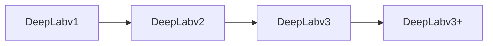

# DeepLab系列原理与代码实例讲解

## 1. 背景介绍

### 1.1 语义分割的重要性

语义分割是计算机视觉领域的一个重要任务,旨在为图像中的每个像素分配一个语义标签。它在自动驾驶、医学影像分析、虚拟现实等诸多领域有着广泛的应用前景。

### 1.2 DeepLab系列的发展历程

DeepLab是Google提出的一系列用于语义分割的深度学习模型。从2014年的DeepLabv1到2018年的DeepLabv3+,DeepLab系列在语义分割任务上取得了state-of-the-art的表现,推动了该领域的发展。

### 1.3 本文的主要内容

本文将详细介绍DeepLab系列的原理,包括其核心概念、算法步骤、数学模型等。同时,我们还将通过代码实例来演示如何使用DeepLab进行语义分割,并探讨其实际应用场景和未来的发展方向。

## 2. 核心概念与联系

### 2.1 全卷积网络(FCN)

DeepLab系列是建立在全卷积网络(Fully Convolutional Network, FCN)基础上的。FCN将传统CNN中的全连接层替换为卷积层,使得网络可以接受任意大小的输入图像,并输出与输入尺寸相对应的分割结果。

### 2.2 空洞卷积(Atrous Convolution)

空洞卷积(又称扩张卷积)是DeepLab的一个关键组件。与普通卷积相比,空洞卷积通过在卷积核内插入"空洞"(即零),在不增加参数量和计算量的情况下扩大了感受野,有助于捕捉多尺度的上下文信息。

### 2.3 空间金字塔池化(ASPP)

空间金字塔池化(Atrous Spatial Pyramid Pooling, ASPP)是DeepLabv2引入的一种多尺度上下文聚合策略。它并行地使用不同膨胀率的空洞卷积,可以有效地捕获不同尺度下的特征。

### 2.4 条件随机场(CRF)

DeepLab将深度CNN学习到的特征图输入到条件随机场(Conditional Random Field, CRF)中进行后处理,以优化分割结果的边界。CRF考虑了像素之间的空间关系,可以有效地消除分割图中的噪声和不连续性。

### 2.5 编码器-解码器结构

DeepLabv3+采用了编码器-解码器(Encoder-Decoder)的结构。编码器负责提取多尺度的特征表示,解码器则将低分辨率的特征图上采样到原始图像的分辨率,以获得精细的分割结果。

### 2.6 DeepLab系列的演进

下图展示了DeepLab系列的演进过程:



## 3. 核心算法原理具体操作步骤

### 3.1 DeepLabv1

1. 使用带有空洞卷积的VGG-16作为骨干网络提取特征
2. 对特征图进行双线性插值上采样到原始图像尺寸
3. 使用全连接的CRF对上采样的结果进行后处理,优化目标边界

### 3.2 DeepLabv2 

1. 使用ResNet作为骨干网络,并用空洞卷积替换最后几个下采样层
2. 在网络的最后阶段引入ASPP模块,并行地使用不同膨胀率的空洞卷积捕获多尺度信息
3. 对ASPP的输出进行双线性插值上采样
4. 使用全连接的CRF进行后处理

### 3.3 DeepLabv3

1. 使用更深的ResNet(如ResNet-101)作为骨干网络
2. 在主干网络的多个阶段(如res4,res5)使用级联的ASPP模块
3. 移除了全连接的CRF后处理,转而使用简单的双线性上采样

### 3.4 DeepLabv3+

1. 采用编码器-解码器结构,编码器使用DeepLabv3作为骨干网络
2. 在编码器的输出上添加一个1x1卷积,然后进行4倍上采样
3. 将低层特征与上采样结果拼接,再次进行一系列卷积和上采样
4. 输出与原始图像分辨率相同的分割结果

## 4. 数学模型和公式详细讲解举例说明

### 4.1 空洞卷积

传统的卷积操作可以表示为:

$y[i]=\sum_{k=1}^{K}x[i+k]w[k]$

其中,$x$是输入信号,$w$是卷积核,$K$是卷积核的大小。

空洞卷积在卷积核内引入了一个扩张率$r$,可以表示为:

$y[i]=\sum_{k=1}^{K}x[i+r\cdot k]w[k]$

当$r=1$时,空洞卷积退化为普通卷积。通过调整$r$的值,我们可以在不增加参数量的情况下扩大感受野。

### 4.2 条件随机场

CRF常用于序列标注问题,其目标是最大化如下条件概率:

$P(Y|X)=\frac{1}{Z(X)}\exp\left(\sum_{i}\psi_u(y_i,X)+\sum_{i<j}\psi_p(y_i,y_j,X)\right)$

其中,$X$是输入序列,$Y$是对应的标签序列,$\psi_u$是一元势函数,$\psi_p$是二元势函数,$Z(X)$是归一化因子。

在DeepLab中,一元势函数衡量了像素与其标签的相容性,二元势函数则鼓励相邻像素拥有相同的标签。通过最大化该条件概率,可以得到更加平滑和连续的分割结果。

## 5. 项目实践：代码实例和详细解释说明

下面我们将使用PyTorch和torchvision来实现一个基于DeepLabv3+的语义分割模型。

### 5.1 导入必要的库

```python
import torch
import torch.nn as nn
import torch.nn.functional as F
from torchvision.models import resnet50
```

### 5.2 定义ASPP模块

```python
class ASPP(nn.Module):
    def __init__(self, in_channels, out_channels, atrous_rates):
        super(ASPP, self).__init__()

        modules = []
        modules.append(nn.Sequential(
            nn.Conv2d(in_channels, out_channels, 1, bias=False),
            nn.BatchNorm2d(out_channels),
            nn.ReLU(inplace=True)))

        for rate in atrous_rates:
            modules.append(nn.Sequential(
                nn.Conv2d(in_channels, out_channels, 3, padding=rate, dilation=rate, bias=False),
                nn.BatchNorm2d(out_channels),
                nn.ReLU(inplace=True)))

        modules.append(nn.Sequential(
            nn.AdaptiveAvgPool2d(1),
            nn.Conv2d(in_channels, out_channels, 1, bias=False),
            nn.BatchNorm2d(out_channels),
            nn.ReLU(inplace=True)))

        self.convs = nn.ModuleList(modules)

        self.project = nn.Sequential(
            nn.Conv2d(len(self.convs) * out_channels, out_channels, 1, bias=False),
            nn.BatchNorm2d(out_channels),
            nn.ReLU(inplace=True),
            nn.Dropout(0.5))

    def forward(self, x):
        res = []
        for conv in self.convs:
            res.append(conv(x))
        res = torch.cat(res, dim=1)
        return self.project(res)
```

ASPP模块使用不同膨胀率的空洞卷积并行地处理输入特征图,然后将结果拼接并投影到指定的通道数。

### 5.3 定义DeepLabv3+模型

```python
class DeepLabV3Plus(nn.Module):
    def __init__(self, num_classes, backbone='resnet50', output_stride=16, freeze_bn=False):
        super(DeepLabV3Plus, self).__init__()

        if backbone == 'resnet50':
            self.backbone = resnet50(pretrained=True, replace_stride_with_dilation=[False, True, True])
            low_level_channels = 256
        else:
            raise NotImplementedError

        self.aspp = ASPP(2048, 256, [6, 12, 18])

        self.low_level_conv = nn.Sequential(
            nn.Conv2d(low_level_channels, 48, 1, bias=False),
            nn.BatchNorm2d(48),
            nn.ReLU(inplace=True))

        self.classifier = nn.Sequential(
            nn.Conv2d(256 + 48, 256, 3, padding=1, bias=False),
            nn.BatchNorm2d(256),
            nn.ReLU(inplace=True),
            nn.Conv2d(256, 256, 3, padding=1, bias=False),
            nn.BatchNorm2d(256),
            nn.ReLU(inplace=True),
            nn.Conv2d(256, num_classes, 1))

        if freeze_bn:
            self.freeze_bn()

    def forward(self, x):
        h, w = x.size(2), x.size(3)

        feat = self.backbone.conv1(x)
        feat = self.backbone.bn1(feat)
        feat = self.backbone.relu(feat)
        feat = self.backbone.maxpool(feat)

        feat = self.backbone.layer1(feat)
        low_level_feat = feat
        feat = self.backbone.layer2(feat)
        feat = self.backbone.layer3(feat)
        feat = self.backbone.layer4(feat)

        feat = self.aspp(feat)
        feat = F.interpolate(feat, size=(int(h / 4), int(w / 4)), mode='bilinear', align_corners=True)

        low_level_feat = self.low_level_conv(low_level_feat)
        feat = torch.cat([feat, low_level_feat], dim=1)

        feat = self.classifier(feat)
        feat = F.interpolate(feat, size=(h, w), mode='bilinear', align_corners=True)

        return feat

    def freeze_bn(self):
        for m in self.modules():
            if isinstance(m, nn.BatchNorm2d):
                m.eval()
```

DeepLabv3+使用ResNet50作为骨干网络,并在其输出上应用ASPP模块。然后,将ASPP的输出上采样并与低层特征拼接,再次进行卷积和上采样,得到与原图分辨率相同的分割结果。

### 5.4 训练和评估

```python
# 定义损失函数和优化器
criterion = nn.CrossEntropyLoss()
optimizer = torch.optim.Adam(model.parameters(), lr=1e-4)

# 训练
for epoch in range(num_epochs):
    for images, targets in train_loader:
        images, targets = images.to(device), targets.to(device)
        
        optimizer.zero_grad()
        outputs = model(images)
        loss = criterion(outputs, targets)
        loss.backward()
        optimizer.step()

# 评估        
with torch.no_grad():
    for images, targets in val_loader:
        images, targets = images.to(device), targets.to(device)
        outputs = model(images)
        # 计算mIoU等指标
```

在训练过程中,我们使用交叉熵损失函数和Adam优化器来更新模型参数。在评估时,我们计算模型在验证集上的mIoU(mean Intersection over Union)等指标来衡量其性能。

## 6. 实际应用场景

DeepLab系列模型可以应用于以下场景:

- 自动驾驶:对道路场景进行语义分割,识别道路、车辆、行人等不同的对象
- 医学影像分析:对医学图像(如CT、MRI)进行器官、肿瘤等结构的分割
- 遥感图像分析:对卫星或航拍图像进行土地利用分类,如建筑、道路、植被等
- 虚拟/增强现实:对真实场景进行语义理解,实现虚拟物体与真实环境的无缝融合

## 7. 工具和资源推荐

- PyTorch:流行的深度学习框架,DeepLab的官方实现即基于PyTorch
- TensorFlow:另一个广泛使用的深度学习框架,也有DeepLab的第三方实现
- MMSegmentation:基于PyTorch的语义分割工具箱,集成了DeepLab等多种SOTA模型
- 官方模型库:Google Research发布的预训练DeepLab模型
- 数据集:PASCAL VOC, Cityscapes, ADE20K等常用的语义分割数据集

## 8. 总结：未来发展趋势与挑战

### 8.1 轻量化模型

为了在资源受限的设备(如移动端、嵌入式设备)上实现实时语义分割,需要设计更加轻量和高效的分割模型。可以探索模型剪枝、知识蒸馏、神经网络架构搜索等技术,在保持性能的同时减小模型的大小