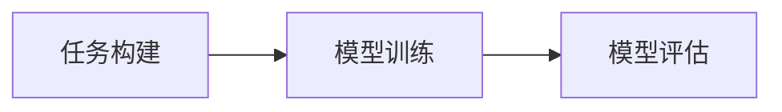

# Few-shot Learning原理与代码实战案例讲解

## 1. 背景介绍
在人工智能领域，机器学习模型的训练通常需要大量的数据。然而，在现实世界中，我们往往面临数据稀缺的问题，尤其是在某些特定领域，如医学影像分析、生物识别等。Few-shot Learning（小样本学习）应运而生，它旨在让模型能够在只有少量样本的情况下也能进行有效的学习。

## 2. 核心概念与联系
Few-shot Learning的核心在于如何利用有限的数据来训练出泛化能力强的模型。这涉及到几个关键概念：元学习（Meta-learning）、模型泛化（Model Generalization）、数据增强（Data Augmentation）等。这些概念相互联系，共同构成了Few-shot Learning的理论基础。

## 3. 核心算法原理具体操作步骤
Few-shot Learning的核心算法可以分为三个步骤：任务构建、模型训练和模型评估。任务构建是指如何从有限的数据中构建训练任务，模型训练是指如何让模型学习到任务的特征，模型评估则是验证模型在新任务上的泛化能力。



## 4. 数学模型和公式详细讲解举例说明
Few-shot Learning的数学模型通常涉及到损失函数的设计、优化算法的选择等。例如，我们可以使用交叉熵损失函数来评估模型的预测准确性，并通过梯度下降算法来优化模型的参数。

$$ L(\theta) = -\sum_{i=1}^{N} y_i \log(p_i) $$

其中，$L(\theta)$ 是损失函数，$y_i$ 是真实标签，$p_i$ 是模型预测的概率，$\theta$ 是模型参数。

## 5. 项目实践：代码实例和详细解释说明
在实际项目中，我们可以使用Python编程语言和PyTorch框架来实现Few-shot Learning。以下是一个简单的代码示例，展示了如何构建一个Few-shot Learning任务，并使用神经网络进行训练。

```python
# 导入必要的库
import torch
import torch.nn as nn
import torch.optim as optim

# 定义模型
class FewShotModel(nn.Module):
    def __init__(self):
        super(FewShotModel, self).__init__()
        # 定义网络结构
        # ...

    def forward(self, x):
        # 定义前向传播
        # ...
        return x

# 实例化模型和优化器
model = FewShotModel()
optimizer = optim.Adam(model.parameters(), lr=0.001)

# 构建Few-shot Learning任务
# ...

# 训练模型
for epoch in range(num_epochs):
    # 前向传播
    outputs = model(inputs)
    loss = criterion(outputs, labels)
    
    # 反向传播和优化
    optimizer.zero_grad()
    loss.backward()
    optimizer.step()
```

## 6. 实际应用场景
Few-shot Learning在许多实际应用场景中都有广泛的应用，如面部识别、语音识别、自然语言处理等。在这些场景中，Few-shot Learning能够帮助模型在只有少量标注数据的情况下也能进行有效的学习和预测。

## 7. 工具和资源推荐
对于想要深入学习Few-shot Learning的读者，以下是一些推荐的工具和资源：
- PyTorch：一个开源的机器学习框架，适合于快速原型设计和研究。
- TensorFlow：谷歌开发的另一个强大的机器学习库。
- Meta-Dataset：一个大规模的Few-shot Learning基准数据集。
- ArXiv和Google Scholar：用于查找最新的Few-shot Learning研究论文。

## 8. 总结：未来发展趋势与挑战
Few-shot Learning作为一种新兴的学习范式，未来有着广阔的发展前景。随着算法的不断优化和计算资源的增加，Few-shot Learning有望在更多领域得到应用。然而，如何进一步提高模型的泛化能力、减少对数据的依赖仍然是该领域面临的主要挑战。

## 9. 附录：常见问题与解答
Q1: Few-shot Learning和传统机器学习有什么区别？
A1: Few-shot Learning关注于如何在只有少量数据的情况下训练模型，而传统机器学习通常需要大量数据。

Q2: 如何评估Few-shot Learning模型的性能？
A2: 可以通过在新任务上的预测准确率来评估模型的泛化能力。

Q3: Few-shot Learning在工业界的应用前景如何？
A3: Few-shot Learning在工业界有着广泛的应用前景，尤其是在数据获取成本高或数据难以收集的领域。

作者：禅与计算机程序设计艺术 / Zen and the Art of Computer Programming