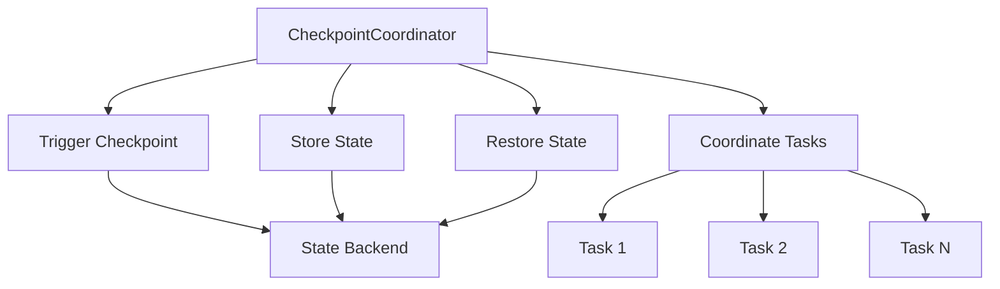

# Flink CheckpointCoordinator原理与代码实例讲解

## 1.背景介绍

Apache Flink 是一个分布式流处理框架，广泛应用于实时数据处理领域。为了保证数据处理的准确性和一致性，Flink 提供了强大的状态管理和容错机制，其中 Checkpoint 是关键技术之一。CheckpointCoordinator 是 Flink 中负责管理 Checkpoint 的核心组件。本文将深入探讨 CheckpointCoordinator 的原理、算法、实现细节，并通过代码实例帮助读者更好地理解其工作机制。

## 2.核心概念与联系

### 2.1 Checkpoint

Checkpoint 是 Flink 用于保存作业状态的机制。通过定期创建 Checkpoint，Flink 可以在作业失败时从最近的 Checkpoint 恢复，从而保证数据处理的准确性和一致性。

### 2.2 CheckpointCoordinator

CheckpointCoordinator 是 Flink 中负责管理 Checkpoint 的核心组件。它负责触发 Checkpoint、协调各个 Task 的状态保存、以及在作业恢复时从 Checkpoint 恢复状态。

### 2.3 State Backend

State Backend 是 Flink 用于存储状态的组件。常见的 State Backend 包括 MemoryStateBackend、FsStateBackend 和 RocksDBStateBackend。CheckpointCoordinator 通过 State Backend 存储和恢复状态。

### 2.4 Barrier

Barrier 是 Flink 用于标识 Checkpoint 边界的特殊记录。Barrier 在数据流中传播，确保所有 Task 在同一时间点保存状态。

### 2.5 关系图



## 3.核心算法原理具体操作步骤

### 3.1 Checkpoint 触发

CheckpointCoordinator 定期触发 Checkpoint。触发过程包括以下步骤：

1. 生成 Checkpoint ID 和时间戳。
2. 向所有 Source Task 发送 Barrier。
3. 记录 Barrier 发送时间。

### 3.2 Barrier 传播

Barrier 在数据流中传播，确保所有 Task 在同一时间点保存状态。传播过程包括以下步骤：

1. Source Task 接收到 Barrier 后，保存当前状态并将 Barrier 发送到下游 Task。
2. 中间 Task 接收到 Barrier 后，保存当前状态并将 Barrier 发送到下游 Task。
3. Sink Task 接收到 Barrier 后，保存当前状态并通知 CheckpointCoordinator。

### 3.3 状态保存

各个 Task 在接收到 Barrier 后，保存当前状态到 State Backend。保存过程包括以下步骤：

1. 获取当前状态。
2. 将状态序列化并存储到 State Backend。
3. 记录状态存储位置。

### 3.4 状态恢复

在作业失败时，CheckpointCoordinator 从最近的 Checkpoint 恢复状态。恢复过程包括以下步骤：

1. 从 State Backend 获取最近的 Checkpoint。
2. 将状态反序列化并分发给各个 Task。
3. 各个 Task 恢复状态并继续处理数据。

## 4.数学模型和公式详细讲解举例说明

### 4.1 Checkpoint 触发间隔

假设 Checkpoint 触发间隔为 $T$，则在时间 $t$ 时刻触发的 Checkpoint ID 为：

$$
\text{Checkpoint ID} = \left\lfloor \frac{t}{T} \right\rfloor
$$

### 4.2 Barrier 传播延迟

假设 Barrier 在数据流中的传播延迟为 $\Delta t$，则从 Source Task 到 Sink Task 的传播时间为：

$$
\Delta t = \sum_{i=1}^{N} \delta_i
$$

其中，$\delta_i$ 为第 $i$ 个 Task 的处理延迟，$N$ 为 Task 的数量。

### 4.3 状态保存时间

假设状态保存时间为 $S$，则总的状态保存时间为：

$$
S = \sum_{i=1}^{N} s_i
$$

其中，$s_i$ 为第 $i$ 个 Task 的状态保存时间，$N$ 为 Task 的数量。

### 4.4 状态恢复时间

假设状态恢复时间为 $R$，则总的状态恢复时间为：

$$
R = \sum_{i=1}^{N} r_i
$$

其中，$r_i$ 为第 $i$ 个 Task 的状态恢复时间，$N$ 为 Task 的数量。

## 5.项目实践：代码实例和详细解释说明

### 5.1 环境配置

首先，确保已经安装了 Apache Flink，并配置好开发环境。可以参考官方文档进行安装和配置。

### 5.2 示例代码

以下是一个简单的 Flink 作业示例，展示了如何使用 Checkpoint 和 CheckpointCoordinator：

```java
import org.apache.flink.api.common.functions.MapFunction;
import org.apache.flink.streaming.api.environment.StreamExecutionEnvironment;
import org.apache.flink.streaming.api.checkpoint.CheckpointedFunction;
import org.apache.flink.streaming.api.checkpoint.ListCheckpointed;

import java.util.Collections;
import java.util.List;

public class CheckpointExample {

    public static void main(String[] args) throws Exception {
        StreamExecutionEnvironment env = StreamExecutionEnvironment.getExecutionEnvironment();
        env.enableCheckpointing(10000); // 每 10 秒触发一次 Checkpoint

        env.fromElements(1, 2, 3, 4, 5)
            .map(new StatefulMapFunction())
            .print();

        env.execute("Checkpoint Example");
    }

    public static class StatefulMapFunction implements MapFunction<Integer, Integer>, CheckpointedFunction {

        private int count = 0;

        @Override
        public Integer map(Integer value) throws Exception {
            count += value;
            return count;
        }

        @Override
        public void snapshotState(FunctionSnapshotContext context) throws Exception {
            // 保存状态
        }

        @Override
        public void initializeState(FunctionInitializationContext context) throws Exception {
            // 恢复状态
        }
    }
}
```

### 5.3 代码解释

1. `StreamExecutionEnvironment`：创建 Flink 流执行环境。
2. `enableCheckpointing`：启用 Checkpoint，并设置触发间隔为 10 秒。
3. `StatefulMapFunction`：自定义 MapFunction，实现 CheckpointedFunction 接口，用于保存和恢复状态。

### 5.4 运行结果

运行上述代码，可以看到每 10 秒触发一次 Checkpoint，并在作业失败时从最近的 Checkpoint 恢复状态。

## 6.实际应用场景

### 6.1 实时数据处理

在实时数据处理场景中，Flink 的 Checkpoint 机制可以保证数据处理的准确性和一致性。例如，在金融交易系统中，Checkpoint 可以确保交易数据的准确处理和存储。

### 6.2 数据流分析

在数据流分析场景中，Flink 的 Checkpoint 机制可以保证分析结果的准确性。例如，在社交媒体数据分析中，Checkpoint 可以确保用户行为数据的准确分析和存储。

### 6.3 机器学习

在机器学习场景中，Flink 的 Checkpoint 机制可以保证模型训练的准确性和一致性。例如，在实时推荐系统中，Checkpoint 可以确保推荐模型的准确训练和更新。

## 7.工具和资源推荐

### 7.1 官方文档

Flink 官方文档是学习和了解 Flink 的最佳资源。可以从中获取详细的技术文档和示例代码。

### 7.2 社区论坛

Flink 社区论坛是与其他开发者交流和讨论技术问题的好地方。可以在论坛中提问和解答问题，获取技术支持。

### 7.3 开源项目

可以参考一些开源项目，了解 Flink 在实际应用中的使用场景和最佳实践。例如，Apache Bahir 提供了多个 Flink 连接器，可以用于集成不同的数据源和目标。

## 8.总结：未来发展趋势与挑战

Flink 的 Checkpoint 机制在保证数据处理的准确性和一致性方面发挥了重要作用。未来，随着数据处理需求的不断增加，Flink 的 Checkpoint 机制将面临更多的挑战和机遇。例如，如何提高 Checkpoint 的性能和效率，如何在大规模分布式系统中实现高效的状态管理，都是需要进一步研究和解决的问题。

## 9.附录：常见问题与解答

### 9.1 如何配置 Checkpoint 的存储位置？

可以通过配置 State Backend 来指定 Checkpoint 的存储位置。例如，可以使用 FsStateBackend 将 Checkpoint 存储到文件系统中。

### 9.2 如何处理 Checkpoint 失败？

可以通过配置 Checkpoint 的重试策略来处理 Checkpoint 失败。例如，可以设置重试次数和重试间隔，以确保 Checkpoint 的成功执行。

### 9.3 如何优化 Checkpoint 性能？

可以通过优化状态存储和恢复的效率来提高 Checkpoint 性能。例如，可以使用 RocksDBStateBackend 来提高状态存储和恢复的效率。

### 9.4 Checkpoint 和 Savepoint 有何区别？

Checkpoint 是自动触发的，用于保证作业的容错性。Savepoint 是手动触发的，用于保存作业的状态快照，便于作业的升级和迁移。

### 9.5 如何监控 Checkpoint 的执行情况？

可以通过 Flink 的 Web UI 监控 Checkpoint 的执行情况。Web UI 提供了详细的 Checkpoint 信息，包括触发时间、状态大小、执行时间等。

---

作者：禅与计算机程序设计艺术 / Zen and the Art of Computer Programming